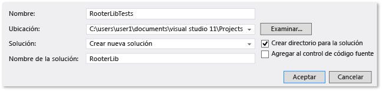
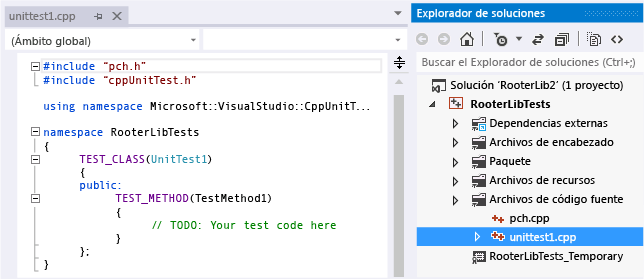
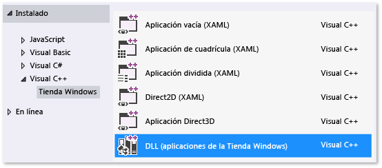
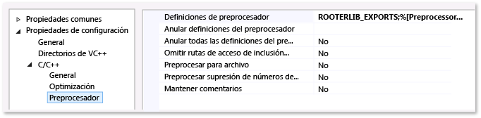

# <a name="how-to-test-a-c-dll"></a>Prueba de un archivo DLL de C++

En este tema se describe una manera de crear pruebas unitarias para un archivo DLL de C++ para aplicaciones de Plataforma universal de Windows (UWP) con el marco de pruebas de Microsoft para C++. El archivo DLL de RooterLib muestra las memorias imprecisas de teoría límite del cálculo mediante la implementación de una función que calcula una estimación de raíz cuadrada de un número determinado. Es posible que, después, el archivo DLL se incluya en una aplicación para UWP que muestre a los usuarios cosas interesantes que se pueden hacer con las matemáticas.

En este tema se muestra cómo usar las pruebas unitarias como el primer paso del desarrollo. En este enfoque, primero tienes que escribir un método de prueba que compruebe un comportamiento concreto en el sistema que estés probando y, después, escribir el código que tenga que superar la prueba. Mediante la realización de cambios en el orden de los procedimientos siguientes, puedes invertir esta estrategia para escribir primero el código que deseas probar y escribe después las pruebas unitarias.

En este tema también se crea una solución única de Visual Studio y proyectos independientes para las pruebas unitarias y el DLL que desees probar. También puede incluir las pruebas unitarias directamente en el proyecto DLL o puede crear soluciones independientes para las pruebas unitarias y el archivo .DLL. Consulte [Agregar pruebas unitarias a aplicaciones C++ existentes](../test/how-to-use-microsoft-test-framework-for-cpp.md) para obtener sugerencias sobre qué estructura usar.

## <a name="Create_the_solution_and_the_unit_test_project"></a> Crear la solución y el proyecto de prueba unitaria

::: moniker range="vs-2019"

Empiece por crear un proyecto de prueba. En el menú **Archivo**, elija **Nuevo** > **Proyecto**. En el cuadro de diálogo **Crear un proyecto nuevo** escriba "prueba" en el cuadro de búsqueda y después establezca el valor de **Lenguaje** en C++. Después elija **Unit Test Library (Universal Windows)** (Biblioteca de pruebas unitarias [Windows Universal]) en la lista de plantillas de proyecto.

   

::: moniker-end

::: moniker range="vs-2017"

Empiece por crear un proyecto de prueba. En el menú **Archivo**, elija **Nuevo** > **Proyecto**. En el cuadro de diálogo **Nuevo proyecto**, expanda **Instalado** > **Visual C++** y elija **Windows Universal**. Después elija **Unit Test Library (Universal Windows)** (Biblioteca de pruebas unitarias [Windows Universal]) en la lista de plantillas de proyecto.

::: moniker-end

1. En el cuadro de diálogo Nuevo proyecto, expanda **Instalado** > **Visual C++** y elija **Windows Universal**. Después elija **Unit Test Library (Universal Windows)** (Biblioteca de pruebas unitarias [Windows Universal]) en la lista de plantillas de proyecto.

2. Asigne al proyecto el nombre `RooterLibTests`, especifique la ubicación, asigne a la solución el nombre `RooterLib` y asegúrese de que esté activada la opción **Crear directorio para la solución**.

     

3. En el nuevo proyecto, abra **unittest1.cpp**.

     

     Ten en cuenta lo siguiente:

    - Cada prueba se define mediante `TEST_METHOD(YourTestName){...}`.

         No es necesario escribir una firma de función convencional. La firma se crea mediante la macro TEST_METHOD. La macro genera una función de la instancia que devuelve void. También genera una función estática que devuelve información sobre el método de prueba. Esta información permite al Explorador de pruebas encontrar el método.

    - Los métodos de prueba se agrupan en clases mediante el uso de `TEST_CLASS(YourClassName){...}`.

         Cuando se ejecutan las pruebas, se crea una instancia de cada clase de prueba. Se llama a los métodos de prueba en un orden no especificado. Puede definir métodos especiales que se invocan antes y después de cada módulo, clase o método. Para obtener más información, vea [Usar Microsoft.VisualStudio.TestTools.CppUnitTestFramework](how-to-use-microsoft-test-framework-for-cpp.md).

## <a name="Verify_that_the_tests_run_in_Test_Explorer"></a> Compruebe que las pruebas se ejecutan en el Explorador de pruebas

1. Inserte código de prueba:

    ```cpp
    TEST_METHOD(TestMethod1)
    {
        Assert::AreEqual(1,1);
    }
    ```

     Tenga en cuenta que la clase `Assert` proporciona varios métodos estáticos que puede usar para comprobar los resultados de los métodos de prueba.

2. En el menú **Prueba**, elija **Ejecutar** y después **Ejecutar todas**.

     El proyecto de prueba se compila y ejecuta. Aparece la ventana **Explorador de pruebas** y la prueba se muestra debajo de **Pruebas superadas**. En el panel **Resumen** de la parte inferior de la ventana se proporcionan detalles adicionales sobre la prueba seleccionada.

     

## <a name="Add_the_DLL_project_to_the_solution"></a> Agregar el proyecto DLL a la solución

::: moniker range="vs-2019"

En el **Explorador de soluciones**, elija el nombre de la solución. En el menú contextual, elija **Agregar** y después **Nuevo proyecto**. En el cuadro de diálogo **Agregar un proyecto nuevo** establezca el valor de **Lenguaje** en C++ y escriba "DLL" en el cuadro de búsqueda. En la lista de resultados, elija **Aplicación de pruebas unitarias (Universal Windows - C++/CX)** .


::: moniker-end

::: moniker range="vs-2017"
En el **Explorador de soluciones**, elija el nombre de la solución. En el menú contextual, elija **Agregar** y después **Nuevo proyecto**.



::: moniker-end

1. En el cuadro de diálogo **Agregar nuevo proyecto**, elija **DLL (aplicaciones para UWP)** .

2. Agregue el siguiente código al archivo *RooterLib.h*:

    ```cpp
    // The following ifdef block is the standard way of creating macros which make exporting
    // from a DLL simpler. All files within this DLL are compiled with the ROOTERLIB_EXPORTS
    // symbol defined on the command line. This symbol should not be defined on any project
    // that uses this DLL. This way any other project whose source files include this file see
    // ROOTERLIB_API functions as being imported from a DLL, whereas this DLL sees symbols
    // defined with this macro as being exported.
    #ifdef ROOTERLIB_EXPORTS
    #define ROOTERLIB_API  __declspec(dllexport)
    #else
    #define ROOTERLIB_API __declspec(dllimport)
    #endif //ROOTERLIB_EXPORTS

    class ROOTERLIB_API CRooterLib {
    public:
        CRooterLib(void);
        double SquareRoot(double v);
    };
    ```

     Los comentarios explican el bloque ifdef no solo para el desarrollador de la DLL, sino también para cualquier persona que haga referencia a la DLL en su proyecto. Puede agregar el símbolo ROOTERLIB_EXPORTS a la línea de comandos mediante las propiedades del proyecto del archivo DLL.

     La clase `CRooterLib` declara un constructor y el método de perito de `SqareRoot`.

3. Agregue el símbolo ROOTERLIB_EXPORTS a la línea de comandos.

    1. En el **Explorador de soluciones**, seleccione el proyecto **RooterLib** y elija **Propiedades** en el menú contextual.

         

    2. En el cuadro de diálogo **Página de propiedades de RooterLib**, expanda **Propiedades de configuración**, después expanda **C++** y seleccione **Preprocesador**.

    3. Seleccione **\<Editar...>** en la lista **Definiciones de preprocesador** y agregue `ROOTERLIB_EXPORTS` en el cuadro de diálogo **Definiciones de preprocesador**.

4. Agregue las implementaciones mínimas de las funciones declaradas. Abra *RooterLib.cpp* y agregue el siguiente código:

    ```cpp
    // constructor
    CRooterLib::CRooterLib()
    {
    }

    // Find the square root of a number.
    double CRooterLib::SquareRoot(double v)
    {
        return 0.0;
    }

    ```

## <a name="make_the_dll_functions_visible_to_the_test_code"></a>Hacer visibles las funciones DLL para el código de prueba

1. Agregue RooterLib al proyecto RooterLibTests.

   1. En el **Explorador de soluciones**, seleccione el proyecto **RooterLibTests** y elija **Agregar** > **Referencia** en el menú contextual.

   1. En el cuadro de diálogo **Agregar referencia**, elija **Proyectos**. Después, seleccione el elemento **RouterLib**.

2. Incluya el archivo de encabezado RooterLib en *unittest1.cpp*.

   1. Abra *unittest1.cpp*.

   2. Agregue este código debajo de la línea `#include "CppUnitTest.h"`:

       ```cpp
       #include "..\RooterLib\RooterLib.h"
       ```

3. Agregue una prueba que use la función importada. Agregue el siguiente código a *unittest1.cpp*:

   ```cpp
   TEST_METHOD(BasicTest)
   {
       CRooterLib rooter;
       Assert::AreEqual(
           // Expected value:
           0.0,
           // Actual value:
           rooter.SquareRoot(0.0),
           // Tolerance:
           0.01,
           // Message:
           L"Basic test failed",
           // Line number - used if there is no PDB file:
           LINE_INFO());
   }
   ```

4. Compile la solución.

    La nueva prueba aparece en el **Explorador de pruebas** en el nodo **Pruebas no ejecutadas**.

5. En el **Explorador de pruebas**, elija **Ejecutar todo**.

    

   Ha configurado la prueba y los proyectos de código, y ha verificado que puede ejecutar las pruebas que ejecutan funciones en el proyecto de código. Ahora puede empezar a escribir pruebas y código reales.

## <a name="Iteratively_augment_the_tests_and_make_them_pass"></a> Aumentar las pruebas de forma interactiva y comprobar si se superan

1. Agregue una nueva prueba:

    ```cpp
    TEST_METHOD(RangeTest)
    {
        CRooterLib rooter;
        for (double v = 1e-6; v < 1e6; v = v * 3.2)
        {
            double expected = v;
            double actual = rooter.SquareRoot(v*v);
            double tolerance = expected/1000;
            Assert::AreEqual(expected, actual, tolerance);
        }
    };
    ```

    > [!TIP]
    > Se recomienda no cambiar las pruebas superadas. En vez de ello, agregue una nueva prueba, actualice el código para que la prueba se supere, después agregue otra prueba y así sucesivamente.
    >
    > Cuando los usuarios cambien los requisitos, deshabilite las pruebas que ya no son correctas. Escriba nuevas pruebas y hágalas funcionar una a una de la misma manera incremental.

2. En el **Explorador de pruebas**, elija **Ejecutar todo**.

3. La prueba sufre un error.

     

    > [!TIP]
    > Compruebe que todas las pruebas producen un error inmediatamente después de escribirlas. Esto ayuda a evitar el error habitual de escribir una prueba que nunca falla.

4. Mejora el código objeto de prueba para que la nueva prueba se supere. Agregue lo siguiente a *RooterLib.cpp*:

    ```cpp
    #include <math.h>
    ...
    // Find the square root of a number.
    double CRooterLib::SquareRoot(double v)
    {
        double result = v;
        double diff = v;
        while (diff > result/1000)
        {
            double oldResult = result;
            result = result - (result*result - v)/(2*result);
            diff = abs (oldResult - result);
        }
        return result;
    }

    ```

5. Compile la solución y, en el **Explorador de pruebas**, elija **Ejecutar todo**.

     Ambas pruebas quedan superadas.

> [!TIP]
> Desarrolle código agregando pruebas una a una. Asegúrese de que se pasan todas las pruebas después de cada iteración.

## <a name="Debug_a_failing_test"></a> Depurar una prueba fallida

1. Agregue otra prueba a *unittest1.cpp*:

   ```cpp
   // Verify that negative inputs throw an exception.
    TEST_METHOD(NegativeRangeTest)
    {
      wchar_t message[200];
      CRooterLib rooter;
      for (double v = -0.1; v > -3.0; v = v - 0.5)
      {
        try
        {
          // Should raise an exception:
          double result = rooter.SquareRoot(v);

          swprintf_s(message, L"No exception for input %g", v);
          Assert::Fail(message, LINE_INFO());
        }
        catch (std::out_of_range ex)
        {
          continue; // Correct exception.
        }
        catch (...)
        {
          swprintf_s(message, L"Incorrect exception for %g", v);
          Assert::Fail(message, LINE_INFO());
        }
      }
   };
   ```

2. En el **Explorador de pruebas**, elija **Ejecutar todo**.

    La prueba sufre un error. Elige el nombre de la prueba en el **Explorador de pruebas**. Se resalta el error de aserción. El mensaje de error es visible en el panel de detalles del **Explorador de pruebas**.

    

3. Para ver por qué se produce el error, revise la función:

   1. Establece un punto de interrupción al principio de la función `SquareRoot`.

   2. En el menú contextual de la prueba no superada, elija **Depurar pruebas seleccionadas**.

        Cuando la ejecución se detiene en el punto de interrupción, revise paso a paso el código.

   3. Agregue código a *RooterLib.cpp* para capturar la excepción:

       ```cpp
       #include <stdexcept>
       ...
       double CRooterLib::SquareRoot(double v)
       {
           //Validate the input parameter:
           if (v < 0.0)
           {
             throw std::out_of_range("Can't do square roots of negatives");
           }
       ...

       ```

   1. En el **Explorador de pruebas**, elija **Ejecutar todas** para probar el método corregido y asegúrese de que no se haya introducido una regresión.

   Ahora, todas las pruebas pasan.

   

## <a name="Refactor_the_code_without_changing_tests"></a> Refactorizar el código sin cambiar las pruebas

1. Simplifique el cálculo central de la función `SquareRoot`:

    ```csharp
    // old code
    //result = result - (result*result - v)/(2*result);
    // new code
    result = (result + v/result) / 2.0;
    ```

2. Elija **Ejecutar todas** para probar el método refactorizado y asegúrese de que no haya introducido una regresión.

    > [!TIP]
    > Un conjunto estable de pruebas unitarias correctas proporciona la confianza de que no se han introducido errores al cambiar el código.
    >
    > Mantenga la refactorización separada de los demás cambios.
