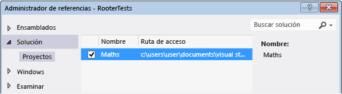
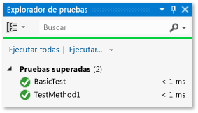
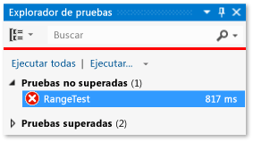

# <a name="unit-test-c-code"></a>Código de C# de pruebas unitarias

En este artículo se describe una forma de crear pruebas unitarias para una clase de C# en una aplicación para UWP.

La clase **Rooter**, que es la clase en pruebas, implementa una función que calcula una estimación de la raíz cuadrada de un número determinado.

En este artículo se muestra el *desarrollo basado en pruebas*. En este enfoque, primero se escribe una prueba que confirma un comportamiento concreto en el sistema que está probando y, después, se escribe el código que supera la prueba.

## <a name="create-the-solution-and-the-unit-test-project"></a>Crear la solución y el proyecto de prueba unitaria

1. En el menú **Archivo**, seleccione **Nuevo** > **Proyecto**.

2. Busque la plantilla de proyecto **Aplicación vacía (Windows universal)** y selecciónela.

3. Asigne al proyecto el nombre **Matemáticas**.

4. En el **Explorador de soluciones**, haga clic con el botón derecho en la solución y elija **Agregar** > **Nuevo proyecto**.

5. Busque la plantilla de proyecto **Aplicación de prueba unitaria (Windows universal)** y selecciónela.

6. Asigne al proyecto de prueba el nombre **RooterTests**.

## <a name="verify-that-the-tests-run-in-test-explorer"></a>Comprobar que las pruebas se ejecutan en el Explorador de pruebas

1. Inserte código de prueba en **TestMethod1** en el archivo *UnitTest.cs*:

   ```csharp
   [TestMethod]
   public void TestMethod1()
   {
       Assert.AreEqual(0, 0);
   }
   ```

   La clase <xref:Microsoft.VisualStudio.TestTools.UnitTesting.Assert> proporciona varios métodos estáticos que puede usar para comprobar los resultados de los métodos de prueba.

::: moniker range="vs-2017"

2. En el menú **Prueba**, elija **Ejecutar** > **Todas las pruebas**.

::: moniker-end

::: moniker range=">=vs-2019"

2. En el menú **Prueba**, elija **Ejecutar todas las pruebas**.

::: moniker-end

   El proyecto de prueba se compila y ejecuta. Tenga paciencia, ya que la operación puede tardar un rato. Aparece la ventana **Explorador de pruebas** y la prueba se muestra debajo de **Pruebas superadas**. En el panel **Resumen** de la parte inferior de la ventana se proporcionan detalles adicionales sobre la prueba seleccionada.

## <a name="add-the-rooter-class-to-the-maths-project"></a>Agregar la clase Rooter al proyecto Matemáticas

1. En el **Explorador de soluciones**, haga clic con el botón derecho en el proyecto **Matemáticas** y, luego, elija **Agregar** > **Clase**.

2. Dé un nombre al archivo de clase *Rooter.cs*.

3. Agregue el código siguiente al archivo **Rooter.cs** de la clase *Rooter*:

   ```csharp
   public Rooter()
   {
   }

   // estimate the square root of a number
   public double SquareRoot(double x)
   {
       return 0.0;
   }
   ```

   La clase **Rooter** declara un constructor y el método de estimación **SquareRoot**. El método **SquareRoot** es solo una implementación mínima, lo suficiente para probar la estructura básica de la configuración de pruebas.

4. Agregue la palabra clave `public` a la declaración de clase **Rooter**, de forma que el código de prueba pueda acceder a ella.

   ```csharp
   public class Rooter
   ```

## <a name="add-a-project-reference"></a>Agregar una referencia de proyecto

1. Agregue una referencia del proyecto RooterTests a la aplicación Matemáticas.

    1. En el **Explorador de soluciones**, haga clic con el botón derecho en el proyecto **RooterTests** y, luego, elija **Agregar** > **Referencia**.

    2. En el cuadro de diálogo **Agregar referencia: RooterTests**, expanda **Solución** y elija **Proyectos**. Seleccione el proyecto **Matemáticas**.

        

2. Agregue una instrucción `using` al archivo *UnitTest.cs*:

    1. Abra *UnitTest.cs*.

    2. Agrega este código debajo de la línea `using Microsoft.VisualStudio.TestTools.UnitTesting;`:

       ```csharp
       using Maths;
       ```

3. Agregue una prueba que use la función **Rooter**. Agregue el código siguiente a *UnitTest.cs*.

   ```csharp
   [TestMethod]
   public void BasicTest()
   {
       Maths.Rooter rooter = new Rooter();
       double expected = 0.0;
       double actual = rooter.SquareRoot(expected * expected);
       double tolerance = .001;
       Assert.AreEqual(expected, actual, tolerance);
   }
   ```

   La nueva prueba aparece en el **Explorador de pruebas** en el nodo **Pruebas no ejecutadas**.

4. Para evitar el error "La carga contiene dos o más archivos con la misma ruta de acceso de destino", en el **Explorador de soluciones**, expanda el nodo **Propiedades** en el proyecto **Matemáticas** y, luego, elimine el archivo *Default.rd.xml*.

::: moniker range="vs-2017"

6. En el **Explorador de pruebas**, elija **Ejecutar todo**.

   Se compila la solución y se ejecutan y superan las pruebas.

   

::: moniker-end

::: moniker range=">=vs-2019"

6. En el **Explorador de pruebas**, elija **Ejecutar todas las pruebas**.

   Se compila la solución y se ejecutan y superan las pruebas.

   

::: moniker-end

Ha configurado los proyectos de aplicación y prueba y ha comprobado que puede ejecutar pruebas que llaman a funciones en el proyecto de aplicación. Ahora puede empezar a escribir pruebas y código reales.

## <a name="iteratively-augment-the-tests-and-make-them-pass"></a>Aumentar las pruebas de forma iterativa y comprobar si se superan

1. Agregue una nueva prueba llamada **RangeTest**:

   ```csharp
   [TestMethod]
   public void RangeTest()
   {
       Rooter rooter = new Rooter();
       for (double v = 1e-6; v < 1e6; v = v * 3.2)
       {
           double expected = v;
           double actual = rooter.SquareRoot(v*v);
           double tolerance = expected/1000;
           Assert.AreEqual(expected, actual, tolerance);
       }
   }
   ```

   > [!TIP]
   > Se recomienda no cambiar las pruebas superadas. En su lugar, agregue una nueva prueba.

2. Ejecute la prueba **RangeTest** y confirme que genera un error.

   

   > [!TIP]
   > Inmediatamente después de escribir una prueba, ejecútela para comprobar que se produce un error. Esto ayuda a evitar el error habitual de escribir una prueba que nunca falla.

3. Mejora el código objeto de prueba para que la nueva prueba se supere. Cambie la función **SquareRoot** de *Rooter.cs* por lo siguiente:

   ```csharp
   public double SquareRoot(double x)
   {
       double estimate = x;
       double diff = x;
       while (diff > estimate / 1000)
       {
           double previousEstimate = estimate;
           estimate = estimate - (estimate * estimate - x) / (2 * estimate);
           diff = Math.Abs(previousEstimate - estimate);
       }
       return estimate;
   }
   ```

::: moniker range="vs-2017"

4. En el **Explorador de pruebas**, elija **Ejecutar todo**.

::: moniker-end

::: moniker range=">=vs-2019"

4. En el **Explorador de pruebas**, elija **Ejecutar todas las pruebas**.

::: moniker-end

   Ahora se superan las tres pruebas.

> [!TIP]
> Desarrolle código agregando pruebas una a una. Asegúrese de que se pasan todas las pruebas después de cada iteración.

## <a name="refactor-the-code"></a>Refactorizar el código

En esta sección, refactorizará tanto el código de aplicación como el de prueba y volverá a ejecutar las pruebas para asegurarse de que todavía se superan.

### <a name="simplify-the-square-root-estimation"></a>Simplificación de la estimación de la raíz cuadrada

1. Simplifique el cálculo central de la función **SquareRoot** mediante la modificación de una línea de código, como se indica a continuación:

    ```csharp
    // Old code
    //estimate = estimate - (estimate * estimate - x) / (2 * estimate);

    // New code
    estimate = (estimate + x/estimate) / 2.0;
    ```

2. Ejecute todas las pruebas para asegurarse de que no ha introducido una regresión. Se superarán todas.

> [!TIP]
> Un conjunto estable de pruebas unitarias correctas proporciona la confianza de que no se han introducido errores al cambiar el código.

### <a name="eliminate-duplicated-code"></a>Eliminación del código duplicado

El método **RangeTest** codifica de forma rígida el denominador de la variable *tolerance* que se pasa al método <xref:Microsoft.VisualStudio.TestTools.UnitTesting.Assert>. Si tiene pensado agregar otras pruebas que utilizan el mismo cálculo de tolerancia, el uso de un valor codificado de forma rígida en varias ubicaciones hace que el código sea más difícil de mantener.

1. Agregue un método auxiliar privado a la clase **UnitTest1** para calcular el valor de tolerancia y, después, llame a ese método desde **RangeTest**.

    ```csharp
    private double ToleranceHelper(double expected)
    {
        return expected / 1000;
    }

    ...

    [TestMethod]
    public void RangeTest()
    {
        ...
        // Old code
        // double tolerance = expected/1000;

        // New code
        double tolerance = ToleranceHelper(expected);
    }
    ...
    ```

2. Ejecute **RangeTest** para asegurarse de que aún se supera.

> [!TIP]
> Si agrega un método auxiliar a una clase de prueba que no desea que aparezca en el **Explorador de pruebas**, no agregue el atributo <xref:Microsoft.VisualStudio.TestTools.UnitTesting.TestMethodAttribute> al método.

## <a name="see-also"></a>Vea también

- [Tutorial: Desarrollo controlado por pruebas con el Explorador de pruebas](quick-start-test-driven-development-with-test-explorer.md)
