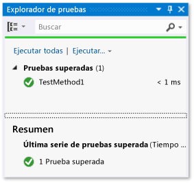
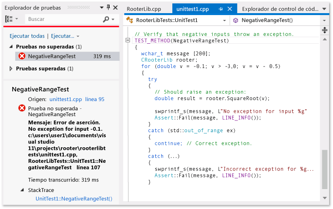
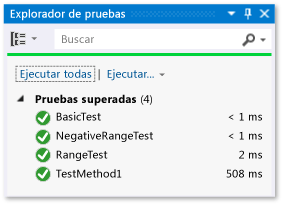

# <a name="unit-testing-visual-c-code"></a>Pruebas unitarias de código de Visual C#

En este tema se describe una forma de crear pruebas unitarias para una clase de Visual C# en una aplicación para UWP. La clase Rooter muestra las memorias imprecisas de teoría límite del cálculo mediante la implementación de una función que calcula una estimación de raíz cuadrada de un número determinado. La aplicación Maths puede utilizar esta función para mostrar a un usuario las cosas divertidas que se pueden realizar con las matemáticas.

En este tema se muestra cómo se utilizan las pruebas unitarias como primer paso en el desarrollo. En este enfoque, primero tienes que escribir un método de prueba que compruebe un comportamiento concreto en el sistema que estés probando y, después, escribir el código que tenga que superar la prueba. Mediante la realización de cambios en el orden de los procedimientos siguientes, puedes invertir esta estrategia para escribir primero el código que deseas probar y escribe después las pruebas unitarias.

En este tema también se crea una solución única de Visual Studio y proyectos independientes para las pruebas unitarias y el DLL que desees probar. También puedes incluir las pruebas unitarias directamente en el proyecto DLL, o crear soluciones independientes para las pruebas unitarias y el DLL.

## <a name="create-the-solution-and-the-unit-test-project"></a>Crear la solución y el proyecto de prueba unitaria

1. En el menú **Archivo**, elija **Nuevo** > **Proyecto...**.

2. En el cuadro de diálogo **Nuevo proyecto**, expanda **Instalado** > **Visual C#** y seleccione **Windows Universal**. Después, elija **Aplicación vacía** en la lista de plantillas de proyecto.

3. Asigne al proyecto el nombre `Maths` y asegúrese de que esté seleccionado **Crear directorio para la solución**.

4. En el Explorador de soluciones, seleccione el nombre de la solución, **Agregar** en el menú contextual y **Nuevo proyecto**.

5. En el cuadro de diálogo **Nuevo proyecto**, expanda **Instalado**, **Visual C#** y seleccione **Windows Universal**. Después elija **Unit Test Library (Universal Windows)** (Biblioteca de pruebas unitarias [Windows Universal]) en la lista de plantillas de proyecto.

6. Abra *UnitTest1.cs* en el editor de Visual Studio.

   ```csharp
   using System;
   using System.Collections.Generic;
   using System.Linq;
   using System.Text;
   using Microsoft.VisualStudio.TestTools.UnitTesting;
   using Maths;

   namespace RooterTests
   {
       [TestClass]
       public class UnitTest1

           [TestMethod]
           public void TestMethod1()
           {

           }
   ```

   Ten en cuenta lo siguiente:

   - Cada prueba se define utilizando el atributo <xref:Microsoft.VisualStudio.TestTools.UnitTesting.TestMethodAttribute>. Un método de prueba debe devolver void y no puede tener parámetros.

   - Los métodos de prueba deben estar en una clase decorada con el atributo <xref:Microsoft.VisualStudio.TestTools.UnitTesting.TestClassAttribute>.

        Cuando se ejecutan las pruebas, se crea una instancia de cada clase de prueba. Se llama a los métodos de prueba en un orden no especificado.

   - Puede definir métodos especiales que se invocan antes y después de cada módulo, clase o método. Para obtener más información, consulte [Usar miembros de Microsoft.VisualStudio.TestTools.UnitTesting en pruebas unitarias](../test/using-microsoft-visualstudio-testtools-unittesting-members-in-unit-tests.md).

## <a name="verify-that-the-tests-run-in-test-explorer"></a>Comprobar que las pruebas se ejecutan en el Explorador de pruebas

1. Inserte código de prueba en TestMethod1, en el archivo **TestMethod1.cs**:

   ```csharp
   [TestMethod]
   public void TestMethod1()
   {
       Assert.AreEqual(0, 0);
   }
   ```

   Tenga en cuenta que la clase <xref:Microsoft.VisualStudio.TestTools.UnitTesting.Assert> proporciona varios métodos estáticos que puede usar para comprobar los resultados de los métodos de prueba.

2. En el menú **Prueba**, elija **Ejecutar** y después **Ejecutar todas**.

   El proyecto de prueba se compila y ejecuta. Aparece la ventana Explorador de pruebas y la prueba se muestra debajo de **Pruebas superadas**. El panel Resumen de la parte inferior de la ventana proporciona detalles adicionales sobre la prueba seleccionada.

   

## <a name="add-the-rooter-class-to-the-maths-project"></a>Agregar la clase Rooter al proyecto Matemáticas

1. En el Explorador de soluciones, seleccione el nombre del proyecto **Maths**. En el menú contextual, elija **Agregar** y **Clase**.

2. Dé un nombre al archivo de clase *Rooter.cs*.

3. Agregue el código siguiente al archivo *Rooter.cs* de la clase Rooter:

   ```csharp
   public Rooter()
   {
   }

   // estimate the square root of a number
   public double SquareRoot(double x)
   {
       return 0.0;
   }
   ```

   La clase `Rooter` declara un constructor y el método de perito de `SquareRoot`.

4. El método `SquareRoot` es solo una implementación mínima, suficiente para probar la estructura básica de la configuración de pruebas.

## <a name="couple-the-test-project-to-the-app-project"></a>Acoplar el proyecto de prueba al proyecto de la aplicación

1. Agrega una referencia a la aplicación Maths en el proyecto RooterTests.

    1. En el Explorador de soluciones, seleccione el proyecto **RooterTests** y **Agregar referencia** en el menú contextual.

    2. En el cuadro de diálogo **Agregar referencia: RooterTests**, expanda **Solución** y elija **Proyectos**. Después, seleccione el elemento **Maths**.

        

2. Agregue una instrucción Using al archivo *UnitTest1.cs*:

    1. Abra *UnitTest1.cs*.

    2. Agrega este código debajo de la línea `using Microsoft.VisualStudio.TestTools.UnitTesting;`:

       ```csharp
       using Maths;
       ```

3. Agrega una prueba que use la función Rooter. Agregue el siguiente código a *UnitTest1.cs*:

   ```csharp
   [TestMethod]
   public void BasicTest()
   {
       Maths.Rooter rooter = new Rooter();
       double expected = 0.0;
       double actual = rooter.SquareRoot(expected * expected);
       double tolerance = .001;
       Assert.AreEqual(expected, actual, tolerance);
   }
   ```

4. Compile la solución.

   La nueva prueba aparece en el Explorador de pruebas en el nodo **Pruebas no ejecutadas**.

5. En el Explorador de pruebas, elija **Ejecutar todas**.

   

Ha configurado la prueba y los proyectos de código, y ha verificado que puede ejecutar las pruebas que ejecutan funciones en el proyecto de código. Ahora puede empezar a escribir pruebas y código reales.

## <a name="iteratively-augment-the-tests-and-make-them-pass"></a>Aumentar las pruebas de forma iterativa y comprobar si se superan

1. Agregue una nueva prueba:

   ```csharp
   [TestMethod]
   public void RangeTest()
   {
       Rooter rooter = new Rooter();
       for (double v = 1e-6; v < 1e6; v = v * 3.2)
       {
           double expected = v;
           double actual = rooter.SquareRoot(v*v);
           double tolerance = ToleranceHelper(expected);
           Assert.AreEqual(expected, actual, tolerance);
       }
   }
   ```

   > [!TIP]
   > Se recomienda no cambiar las pruebas superadas. En vez de ello, agregue una nueva prueba, actualice el código para que la prueba se supere, después agregue otra prueba y así sucesivamente.
   >
   > Cuando los usuarios cambien los requisitos, deshabilite las pruebas que ya no son correctas. Escriba nuevas pruebas y hágalas funcionar una a una de la misma manera incremental.

2. En el Explorador de pruebas, elija **Ejecutar todas**.

3. La prueba sufre un error.

   

   > [!TIP]
   > Inmediatamente después de haberla escrito, comprueba que cada prueba sufre un error. Esto ayuda a evitar el error habitual de escribir una prueba que nunca falla.

4. Mejora el código objeto de prueba para que la nueva prueba se supere. Cambie la función `SquareRoot` de *Rooter.cs* a lo siguiente:

   ```csharp
   public double SquareRoot(double x)
   {
       double estimate = x;
       double diff = x;
       while (diff > estimate / 1000)
       {
           double previousEstimate = estimate;
           estimate = estimate - (estimate * estimate - x) / (2 * estimate);
           diff = Math.Abs(previousEstimate - estimate);
       }
       return estimate;
   }
   ```

5. Compile la solución y, en el **Explorador de pruebas**, elija **Ejecutar todo**.

   Ahora se superan las tres pruebas.

> [!TIP]
> Desarrolle código agregando pruebas una a una. Asegúrese de que se pasan todas las pruebas después de cada iteración.

## <a name="debug-a-failing-test"></a>Depurar una prueba fallida

1. Agregue otra prueba a *UnitTest1.cs*:

    ```csharp
    // Verify that negative inputs throw an exception.
    [TestMethod]
    public void NegativeRangeTest()
    {
        string message;
        Rooter rooter = new Rooter();
        for (double v = -0.1; v > -3.0; v = v - 0.5)
        {
            try
            {
                // Should raise an exception:
                double actual = rooter.SquareRoot(v);

                message = String.Format("No exception for input {0}", v);
                Assert.Fail(message);
            }
            catch (ArgumentOutOfRangeException ex)
            {
                continue; // Correct exception.
            }
            catch (Exception e)
            {
                message = String.Format("Incorrect exception for {0}", v);
                Assert.Fail(message);
            }
        }
    }
    ```

2. En el **Explorador de pruebas**, elija **Ejecutar todo**.

   La prueba sufre un error. Elige el nombre de la prueba en el **Explorador de pruebas**. Se resalta el error de aserción. El mensaje de error es visible en el panel de detalles del **Explorador de pruebas**.

   

3. Para ver por qué se produce el error, revise la función:

    1. Establece un punto de interrupción al principio de la función `SquareRoot`.

    2. En el menú contextual de la prueba no superada, elija **Depurar pruebas seleccionadas**.

        Cuando la ejecución se detiene en el punto de interrupción, revise paso a paso el código.

    3. Agrega código al método Rooter para detectar la excepción:

        ```csharp
        public double SquareRoot(double x)
        {
            if (x < 0.0)
            {
                throw new ArgumentOutOfRangeException();
        }
        ```

4. En el Explorador de pruebas, elija **Ejecutar todas** para probar el método corregido y asegúrese de que no se haya introducido una regresión.

Ahora, todas las pruebas pasan.



## <a name="refactor-the-code"></a>Refactorizar el código

**Simplifique el cálculo central en la función SquareRoot.**

1. Cambia la implementación del resultado.

    ```csharp
    // old code
    //result = result - (result*result - v)/(2*result);
    // new code
    result = (result + v/result) / 2.0;
    ```

2. Elija **Ejecutar todas** para probar el método refactorizado y asegúrese de que no haya introducido una regresión.

> [!TIP]
> Un conjunto estable de pruebas unitarias correctas proporciona la confianza de que no se han introducido errores al cambiar el código.

**Refactorice el código de prueba para eliminar código duplicado.**

Observe que el método `RangeTest` codifica de forma rígida el denominador de la variable `tolerance` que se utiliza en el método <xref:Microsoft.VisualStudio.TestTools.UnitTesting.Assert>. Si tienes la intención de agregar otras pruebas que utilizan el mismo cálculo de tolerancia, el uso de un valor codificado de forma rígida en varias ubicaciones puede provocar errores.

1. Agregue un método privado a la clase Unit1Test para calcular el valor de tolerancia y, después, llame a ese método en su lugar.

    ```csharp
    private double ToleranceHelper(double expected)
    {
        return expected / 1000;
    }

    ...

    [TestMethod]
    public void RangeTest()
    {
        ...
        // old code
        // double tolerance = expected/1000;
        // new code
        double tolerance = ToleranceHelper(expected);
        Assert.AreEqual(expected, actual, tolerance);
    }
    ...
    ```

2. Seleccione **Ejecutar todas** para probar el método refactorizado y asegúrese de que no ha introducido un error.

> [!NOTE]
> Si agrega un método auxiliar a una clase de prueba que no desea que aparezca en el **Explorador de pruebas**, no agregue el atributo <xref:Microsoft.VisualStudio.TestTools.UnitTesting.TestMethodAttribute> al método.
