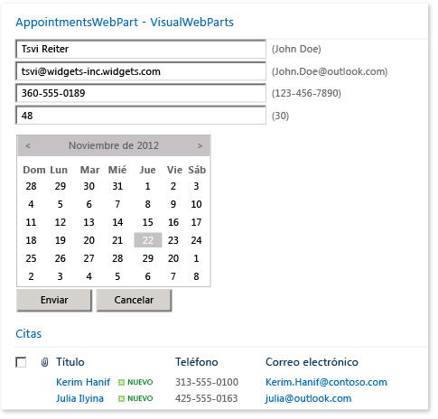
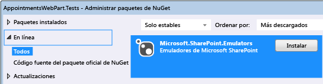
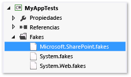
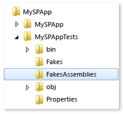

# <a name="using-emulators-to-isolate-unit-tests-for-sharepoint-2010-applications"></a>Usar emuladores para aislar las pruebas unitarias para las aplicaciones de SharePoint 2010
El paquete de Microsoft.SharePoint.Emulators proporciona un conjunto de bibliotecas que facilitan la creación de pruebas unitarias aisladas para las aplicaciones de Microsoft SharePoint 2010. Los emuladores usan [correcciones de compatibilidad (shim)](../test/using-shims-to-isolate-your-application-from-other-assemblies-for-unit-testing.md) desde el marco de aislamiento de [Microsoft Fakes](../test/isolating-code-under-test-with-microsoft-fakes.md) para crear objetos ligeros en memoria que se comportan como los objetos y métodos más comunes de la API de SharePoint. Cuando no se emule un método de SharePoint, o cuando quiera cambiar el comportamiento predeterminado de un emulador, puede crear correcciones de compatibilidad (shims) de Fakes para proporcionar los resultados que quiera.  
  
 Las clases y los métodos de prueba existentes se pueden convertir fácilmente para iniciarse en el contexto del emulador. Esta capacidad permite crear pruebas de doble uso. Una prueba de doble uso puede alternar entre las pruebas de integración con la API de SharePoint real y las pruebas unitarias aisladas que usan los emuladores.  
  
##  <a name="BKMK_In_this_topic"></a> En este tema  
 [Requisitos](#BKMK_Requirements)  
  
 [El ejemplo AppointmentsWebPart](#BKMK_The_AppointmentsWebPart_example)  
  
 [Convertir una prueba existente](#BKMK_Converting_an_existing_test)  
  
-   [Agregar el paquete Emulators a un proyecto de prueba](#BKMK_Adding_the_Emulators_package_to_a_test_project)  
  
-   [Ejecutar un método de prueba con emulación](#BKMK__Running_a_test_method_in_the_emulation_context)  
  
 [Crear clases y métodos de doble uso](#BKMK_Creating_dual_use_classes_and_methods)  
  
 [Usar los atributos TestInitialize y TestCleanup para crear una clase de prueba de doble uso](#BKMK_Using_TestInitialize_and_TestCleanup_attributes_to_create_a_dual_use_test_class)  
  
 [Controlar métodos no emulados de SharePoint](#BKMK_Handling_non_emulated_SharePoint_methods)  
  
 [Escribir pruebas de emulación desde cero y un resumen](#BKMK_Writing_emulation_tests_from_scratch__and_a_summary)  
  
 [Ejemplo](#BKMK_Example)  
  
 [Tipos emulados de SharePoint](#BKMK_Emulated_SharePoint_types)  
  
##  <a name="BKMK_Requirements"></a> Requisitos  
  
-   Microsoft SharePoint 2010 (SharePoint 2010 Server o SharePoint 2010 Foundation)  
  
-   Microsoft Visual Studio Enterprise  
  
-   Paquete NuGet de emuladores de Microsoft SharePoint  
  
 También debe estar familiarizado con los [conceptos básicos de las pruebas unitarias de Visual Studio](../test/unit-test-basics.md) y tener ciertos conocimientos de [Microsoft Fakes](../test/isolating-code-under-test-with-microsoft-fakes.md).  
  
##  <a name="BKMK_The_AppointmentsWebPart_example"></a> El ejemplo AppointmentsWebPart  
 El ejemplo AppointmentsWebPart permite ver y administrar una lista de SharePoint de sus citas.  
  
   
  
 En este ejemplo, probaremos dos métodos del elemento web:  
  
-   El método `ScheduleAppointment` valida los valores de elemento de lista pasados al método y crea una nueva entrada en una lista de un sitio web de SharePoint especificado.  
  
-   El método `GetAppointmentsForToday` devuelve los detalles de las citas de hoy.  
  
 [En este tema](#BKMK_In_this_topic)  
  
##  <a name="BKMK_Converting_an_existing_test"></a> Convertir una prueba existente  
 En una prueba normal de un método en un componente de SharePoint, el método de prueba crea un sitio temporal en SharePoint Foundation y agrega los componentes de SharePoint al sitio que requiera el código sometido a prueba. Después, el método de prueba crea y ejercita una instancia del componente. Al final de la prueba, se cierra el sitio.  
  
 Probablemente el método `ScheduleAppointment` de nuestro código sometido a prueba es uno de los primeros métodos escritos para el componente:  
  
```  
// method under test  
public bool ScheduleAppointment(SPWeb web, string listName, string name,   
    string phone, string email, string age, DateTime date, out string errorMsg)  
{  
    errorMsg = string.Empty;  
    var badFormat = this.checkInput(name, phone, email, age);  
    if (badFormat)  
    {  
        errorMsg = "Bad Format";  
        return false;  
    }  
    var exists = this.CheckDuplicate(listName, web, name, phone, email, age, date);  
    if (exists)  
    {  
        errorMsg = "Item already exists";  
        return false;  
    }  
    SPListItemCollection items = web.Lists[listName].Items;  
    // create item and populate fields  
    SPListItem item = items.Add();  
    item["Name"] = name;  
    item["Phone"] = phone;  
    item["Email"] = email;  
    item["Age"] = age;  
    item["Date"] = date.ToString("D");  
    item.Update();  
    return true;  
}  
  
```  
  
 La primera prueba de las funciones del método `ScheduleAppointment` tendrá este aspecto:  
  
```csharp  
  
[TestMethod]  
public void ScheduleAppointmentReturnsTrueWhenNewAppointmentIsCreated()  
{  
    using( var site = new SPSite("http://localhost"))  
    using (var webPart = new BookAnAppointmentWebPart())  
    {  
        // Arrange  
        string errorMsg = string.Empty;  
        DateTime date = DateTime.Now;  
        SPList list = AddListToSiteHelper(site);  
  
        // Act  
        bool success = webPart.ScheduleAppointment(site.RootWeb, list.Title,  
            "Raisa Pokrovskaya", "425-555-0163", "raisa@outlook.com", "55", date,   
            out errorMsg);  
        list.Delete();  
  
        // Assert  
        Assert.IsTrue(success);  
    }  
}  
```  
  
 Aunque este método de prueba comprueba que el método `ScheduleAppointment` agrega correctamente una nueva entrada a la lista, es más una prueba de integración del elemento web que una prueba del comportamiento específico de su código. Las dependencias externas con respecto a SharePoint y a la API de SharePoint pueden causar que la prueba genere un error por algún motivo que no sea el código de usuario del método `ScheduleAppointment`. La sobrecarga que supone crear y destruir el sitio de SharePoint puede hacer que la prueba sea demasiado lenta para que se inicie como parte del proceso de codificación. Llevar a cabo la instalación y la destrucción del sitio para cada método de prueba solo agrava el problema de crear pruebas unitarias de desarrollador eficaces.  
  
 Los emuladores de Microsoft SharePoint proporcionan un conjunto de pares de objeto y método que imitan el comportamiento de las API de SharePoint más comunes. Los métodos emulados son implementaciones ligeras de la API de SharePoint que no requieren que SharePoint se inicie. Al usar Microsoft Fakes para desviar las llamadas a la API de SharePoint para las dobles del método de emuladores de SharePoint, aísle las pruebas y asegúrese de que está probando el código que quiere. Al llamar a métodos de SharePoint que no se simulan, puede usar Fakes directamente para crear el comportamiento deseado.  
  
 [En este tema](#BKMK_In_this_topic)  
  
###  <a name="BKMK_Adding_the_Emulators_package_to_a_test_project"></a> Agregar el paquete Emulators a un proyecto de prueba  
 Para agregar los emuladores de SharePoint a un proyecto de prueba:  
  
1.  Seleccione el proyecto en el Explorador de soluciones.  
  
2.  Seleccione **Administrar paquetes NuGet…** en el menú contextual.  
  
3.  Busque la categoría **En línea** para `Microsoft.SharePoint.Emulators` y haga clic en **Instalar**.  
  
   
  
 [En este tema](#BKMK_In_this_topic)  
  
###  <a name="BKMK__Running_a_test_method_in_the_emulation_context"></a> Ejecutar un método de prueba con emulación  
 Instalar el paquete agrega referencias a las bibliotecas necesarias para los proyectos. Para que sea fácil usar los emuladores en una clase de prueba existente, agregue los espacios de nombres `Microsoft.SharePoint.Emulators` y `Microsoft.QualityTools.Testing.Emulators`.  
  
 Para habilitar la emulación en los métodos de prueba, ajuste el cuerpo del método en una instrucción `using` que crea un objeto `SharePointEmulationScope`. Por ejemplo:  
  
```csharp  
  
[TestMethod]  
public void ScheduleAppointmentReturnsTrueWhenNewAppointmentIsCreated()  
{  
    // create the emulation scope with a using statement  
    using (new SharePointEmulationScope())  
    using( var site = new SPSite("http://localhost"))  
    using (var webPart = new BookAnAppointmentWebPart())  
    {  
        // Arrange  
        string errorMsg = string.Empty;  
        DateTime date = DateTime.Now;  
        SPList list = AddListToSiteHelper(site);  
  
        // Act  
        bool success = webPart.ScheduleAppointment(site.RootWeb, list.Title,  
            "Raisa Pokrovskaya", "425-555-0163", "raisa@outlook.com", "55", date,   
            out errorMsg);  
        list.Delete();  
  
        // Assert  
        Assert.IsTrue(success);  
    }  
}  
  
```  
  
 Cuando se inicia el método de prueba, el tiempo de ejecución del emulador llama a Microsoft Fakes, que inserta código dinámicamente en los métodos de SharePoint para desviar las llamadas a estos métodos para los delegados que se declaran en Microsoft.SharePoint.Fakes.dll. Microsoft.SharePoint.Emulators.dll implementa los delegados para los métodos emulados, prácticamente imitando el comportamiento real de SharePoint. Cuando el método de prueba o el componente en prueba llama a un método de SharePoint, el comportamiento resultante es el de la emulación.  
  
   
  
 [En este tema](#BKMK_In_this_topic)  
  
##  <a name="BKMK_Creating_dual_use_classes_and_methods"></a> Crear clases y métodos de doble uso  
 Para crear métodos que puedan usarse tanto para las pruebas de integración con la API de SharePoint real como para las pruebas unitarias aisladas que usan emuladores, utilice el constructor sobrecargado `SharePointEmulationScope(EmulationMode)` para encapsular el código del método de prueba. Los dos valores de la enumeración `EmulationMode` especifican si el ámbito usa emuladores (`EmulationMode.Enabled`) o si el ámbito usa la API de SharePoint (`EmulationMode.Passthrough`).  
  
 Por ejemplo, aquí indicamos cómo puede modificar la prueba anterior para que sea de doble uso:  
  
```csharp  
  
// class level field specifies emulation mode  
private const EmulationMode emulatorMode = EmulationMode.Enabled;  
  
[TestMethod]  
public void ScheduleAppointmentReturnsTrueWhenNewAppointmentIsCreated()  
{  
    // emulation scope determined by emulatorMode  
    using( SharePointEmulationScope(emulatorMode))  
    using( var site = new SPSite("http://localhost"))  
    using (var webPart = new BookAnAppointmentWebPart())  
    {  
        // Arrange  
        string errorMsg = string.Empty;  
        DateTime date = DateTime.Now;  
        SPList list = AddListToSiteHelper(site);  
  
        // Act  
        bool success = webPart.ScheduleAppointment(site.RootWeb, list.Title,  
            "Raisa Pokrovskaya", "425-555-0163", "raisa@outlook.com", "55", date,   
            out errorMsg);  
        list.Delete();  
  
        // Assert  
        Assert.IsTrue(success);  
    }  
}  
```  
  
 [En este tema](#BKMK_In_this_topic)  
  
##  <a name="BKMK_Using_TestInitialize_and_TestCleanup_attributes_to_create_a_dual_use_test_class"></a> Usar los atributos TestInitialize y TestCleanup para crear una clase de prueba de doble uso  
 Si ejecuta todas o la mayoría de las pruebas en una clase con `SharePointEmulationScope`, puede aprovechar las técnicas de nivel de clase para establecer el modo de emulación.  
  
-   Los métodos de clase de prueba con los atributos <xref:Microsoft.VisualStudio.TestTools.UnitTesting.TestInitializeAttribute> y <xref:Microsoft.VisualStudio.TestTools.UnitTesting.TestCleanupAttribute> pueden crear y destruir el ámbito.  
  
-   Establecer el `EmulationMode` en el nivel de clase le puede permitir automatizar el cambio de modo entre `EmulationMode.Enabled` y `EmulationMode.Passthrough`.  
  
 Un método de clase que tiene el atributo `[TestInitialize]` se inicia al principio de cada método de prueba y un método que tiene el atributo `[TestCleanup]` se inicia al final de cada método de prueba. Puede declarar un campo privado para el objeto `SharePointEmulationScope` en el nivel de clase, inicializarlo en el método con atributo `TestInitialize` y, después, eliminar el objeto en el método con atributo `TestCleanup`.  
  
 Puede usar cualquier método que elija para automatizar la selección de `EmulationMode`. Una manera es comprobar la existencia de un símbolo con las directivas de preprocesador. Por ejemplo, para iniciar los métodos de prueba en una clase usando emuladores, puede definir un símbolo como `USE_EMULATION` en el archivo de proyecto de prueba o en la línea de comandos de compilación. Si el símbolo está definido, se declara una constante de nivel de clase `EmulationMode` y se establece en `Enabled`. De lo contrario, la constante se establece en `Passthrough`.  
  
 Este es un ejemplo de la clase de prueba que muestra cómo usar las directivas de preprocesador y los métodos con atributo `TestInitialize` y `TestCleanup` para establecer el modo de emulación.  
  
```csharp  
//namespace declarations  
...  
  
namspace MySPAppTests   
{  
    [TestClass]  
    public class BookAnAppointmentWebPartTests  
    {  
  
        // emulationScope is a class level field  
        private SharePointEmulationScope emulationScope;  
  
        // preprocessor directives determine the value of emulatorMode  
        #if USE_EMULATIONprivate const EmulationMode emulatorMode = EmulationMode.Enabled;#elseprivate const EmulationMode emulatorMode = EmulationMode.Passthrough;#endif  
  
        // InitializeTest sets the emulation scope at the beginning of each test method  
        [TestInitialize]public void InitializeTest(){this.emulationScope = new SharePointEmulationScope(emulatorMode);}  
  
        // CleanupTest disposes the emulation scope at the end of each test method  
        [TestCleanup]public void CleanupTest(){this.emulationScope.Dispose();}  
  
        [TestMethod]  
        public void ScheduleAppointmentReturnsTrueWhenNewAppointmentIsCreated()  
        {  
            // remove the SharePointEmulationScope using statement from the method  
            using( var site = new SPSite("http://localhost"))  
            using (var webPart = new BookAnAppointmentWebPart())  
            {  
                // Arrange  
                string errorMsg = string.Empty;  
                DateTime date = DateTime.Now;  
                SPList list = AddListToSiteHelper(site);  
  
                // Act  
                bool success = webPart.ScheduleAppointment(site.RootWeb, list.Title,  
                    "Raisa Pokrovskaya", "425-555-0163", "raisa@outlook.com", "55", date,   
                    out errorMsg);  
                list.Delete()  
  
                // Assert  
                Assert.IsTrue(success);  
            }  
        }  
  
        ...// More tests  
  
    }  
}  
  
```  
  
 [En este tema](#BKMK_In_this_topic)  
  
##  <a name="BKMK_Handling_non_emulated_SharePoint_methods"></a> Controlar métodos no emulados de SharePoint  
 No se emulan todos los tipos de SharePoint ni todos los métodos de algunos tipos emulados. Si el código en pruebas llama a un método de SharePoint que no se emula, el método produce una excepción `NotSupportedException`. Si se produce una excepción, agregue una corrección de compatibilidad (shim) de Fakes para el método de SharePoint.  
  
 **Configurar Fakes para Sharepoint**  
  
 Para llamar explícitamente a las correcciones de compatibilidad (shim) de Microsoft Fakes:  
  
1.  Si quiere corregir la compatibilidad de una clase de SharePoint que no se emula, edite el archivo Microsoft.SharePoint.fakes y agregue la clase a la lista de clases de correcciones de compatibilidad (shim). Vea la sección sobre cómo [configurar la generación de código auxiliar y correcciones de compatibilidad (shim)](http://msdn.microsoft.com/library/hh708916.aspx#bkmk_configuring_code_generation_of_stubs) de [Generación de código, compilación y convenciones de nomenclatura en Microsoft Fakes](../test/code-generation-compilation-and-naming-conventions-in-microsoft-fakes.md).  
  
       
  
2.  Vuelva a generar el proyecto de prueba al menos una vez después de instalar el paquete de emuladores de Microsoft SharePoint y si ha editado el archivo Microsoft.SharePoint.Fakes. La compilación del proyecto crea y rellena una carpeta **FakesAssembly** en la carpeta raíz del proyecto en el disco.  
  
       
  
3.  Agregue una referencia al ensamblado **Microsoft.SharePoint.14.0.0.0.Fakes.dll** que se encuentra en la carpeta **FakesAssembly**.  
  
4.  (Opcional) Agregue una directiva de espacio de nombres para la clase de prueba para `Microsoft.QualityTools.Testing.Fakes`, `Microsoft.SharePoint.Fakes` y cualquier espacio de nombres anidado `Microsoft.SharePoint.Fakes` que quiera usar.  
  
 **Implementar el delegado de correcciones de compatibilidad (shim) para un método de SharePoint**  
  
 En el proyecto de ejemplo, el método `GetAppointmentsForToday` llama al método de la API de SharePoint [SPList.GetItems(SPQuery)](http://msdn.microsoft.com/library/ms457534.aspx).  
  
```csharp  
// method under test  
public string GetAppointmentsForToday(string listName, SPWeb web)  
{  
    SPList list = web.Lists[listName];  
    DateTime today = DateTime.Now;  
    var listQuery = new SPQuery{Query = String.Format("<Where><Eq><FieldRef Name='Date'/>" +"<Value Type='Text'>{0}</Value>" +"</Eq></Where>", today.ToString("D"))};  
    var result = new System.Text.StringBuilder();  
    foreach (SPListItem item in list.GetItems(listQuery))  
    {  
        result.AppendFormat("Name: {0}, Phone: {1}, Email: {2}, Age: {3}, Date: {4}\n",   
            item["Name"], item["Phone"], item["Email"], item["Age"], item["Date"]);  
    }  
    return result.ToString();  
}  
  
```  
  
 La versión `SPList.GetItems(SPQuery)` del método sobrecargado `GetItems` no se emula. Por lo tanto, se producirá un error solo con ajustar una prueba existente para `GetAppointmentsForToday` en `SharePoint.Emulation.Scope`. Para crear una prueba de trabajo, escriba una implementación del delegado de Fakes `ShimSPList.GetItemsSPQuery` que devuelva los resultados de pruebas.  
  
 Debajo se indica una modificación de un método de prueba existente, `GetAppointmentsForTodayReturnsOnlyTodaysAppointments`, que implementa un delegado de Fakes. Los cambios necesarios se mencionan en los comentarios:  
  
> [!IMPORTANT]
>  Los métodos de prueba que crean explícitamente correcciones de compatibilidad (shim) de Fakes producen una excepción `ShimNotSupported` cuando se ejecuta la prueba en el contexto `EmulationMode.Passthrough`. Para evitar este problema, use una variable para establecer el valor `EmulationMode` y ajustar cualquier código de Fakes a una instrucción `if` que prueba el valor.  
  
```csharp  
// class level field to set emulation mode  
private const EmulationMode emulatorMode = EmulationMode.Enabled  
  
[TestMethod]  
public void GetAppointmentsForTodayReturnsOnlyTodaysAppointments()  
{  
  
    // create the emulation scope with a using statement  
    using (var emulationScope = new SharePointEmulationScope(emulatorMode))  
    using( var site = new SPSite("http://localhost"))  
    using (var webPart = new BookAnAppointmentWebPart())  
    {  
        // Arrange  
        DateTime date = DateTime.Now;  
        SPList list = AddListToSiteHelper(site);  
        // insert 2 items into list  
        AddItemsToListHelper(list, new string[] {"Raisa Pokrovskaya", "425-555-0163",  
            "raisa@outlook.com", "55", date.ToString("D") });  
        AddItemsToListHelper(list, new string[] {"Francis Totten", "313-555-0100",  
            "francis@contoso.com", "42", date.AddDays(1).ToString("D") });  
  
        // use Fakes shims only if emulation is enabled  
        if (emulatorMode == EmulationMode.Enabled){var sList = new ShimSPList(list);sList.GetItemsSPQuery = (query) =>{var shim = new ShimSPListItemCollection();shim.Bind(new[] { list.Items[0] });return shim.Instance;}}  
  
        // Act  
        string result = webPart.GetAppointmentsForToday(list.Title, site.RootWeb);  
        list.Delete();  
  
        // Assert  
        Assert.IsTrue(result.Contains(String.Format(  
            "Name: Raisa Pokrovskaya, Phone: 425-555-0163, Email: raisa@outlook.com," +  
            "Age: 55, Date: {0}", date.ToString("D"))));  
        Assert.IsFalse(result.Contains("Name: Francis Totten"));  
    }  
}  
  
```  
  
 En este método, primero comprobamos que la emulación esté habilitada. Si es así, creamos un objeto de correcciones de compatibilidad (shim) de Fakes para nuestra lista `SPList` y, después, creamos y asignamos un método para su delegado `GetItemsSPQuery`. El delegado usa el método `Bind` de Fakes para agregar el elemento de lista correcto a la `ShimSPListItemCollection` que se devuelve al llamador.  
  
 [En este tema](#BKMK_In_this_topic)  
  
##  <a name="BKMK_Writing_emulation_tests_from_scratch__and_a_summary"></a> Escribir pruebas de emulación desde cero y un resumen  
 Aunque las técnicas para crear la emulación y las pruebas de doble uso que se describen en las secciones anteriores suponen que está convirtiendo las pruebas existentes, también puede usarlas para escribir pruebas de cero. En las lista siguiente se resumen estas técnicas:  
  
-   Para usar los emuladores en un proyecto de prueba, agregue el paquete de Microsoft.SharePoint.Emulators NuGet al proyecto.  
  
-   Para usar los emuladores en un método de prueba, cree un objeto `SharePointEmulationScope` al principio del método. Todas las API de SharePoint compatibles se emulan hasta que se elimina el ámbito.  
  
-   Escriba el código de prueba como si estuviera escribiéndolo para la API de SharePoint real. El contexto de emulación desvía automáticamente las llamadas a métodos de SharePoint hacia los emuladores.  
  
-   No se emulan todos los tipos de SharePoint ni todos los métodos de algunos tipos emulados. Se produce una excepción `NotSupportedException` cuando se usa un objeto o método no emulados. Cuando esto ocurre, cree explícitamente un delegado de correcciones de compatibilidad (shim) de Fakes para que el método devuelva el comportamiento requerido.  
  
-   Para crear pruebas de doble uso, use el constructor `SharePointEmulationScope(EmulationMode)` para crear el objeto de ámbito de emulación. El valor `EmulationMode` especifica si las llamadas de SharePoint se emulan o se inician en un sitio de SharePoint real.  
  
-   Si todos o la mayoría de los métodos de prueba de una clase de prueba se inician en el contexto de emulación, puede usar un método con atributo `TestInitialize` de nivel de clase para crear el objeto `SharePointEmulationScope` y un campo de nivel de clase para establecer el modo de emulación. Esto le ayudará a automatizar los cambios en el modo de emulación. Después, use un método con atributo `TestCleanup` para eliminar el objeto de ámbito.  
  
 [En este tema](#BKMK_In_this_topic)  
  
##  <a name="BKMK_Example"></a> Ejemplo  
 Este es un ejemplo final que incorpora las técnicas de emulador de SharePoint descritas anteriormente:  
  
```csharp  
using System;   
//other namespace declarations  
...   
// code under test  
using MySPApps;  
using Microsoft.SharePoint;  
// unit testing and emulators  
using Microsoft.VisualStudio.TestTools.UnitTesting;  
using Microsoft.QualityTools.Testing.Emulators;  
using Microsoft.SharePoint.Emulators;  
// explicit Fakes shims  
using Microsoft.QualityTools.Testing.Fakes;  
using Microsoft.SharePoint.Fakes  
  
namspace MySPAppTests   
{  
    [TestClass]  
    public class BookAnAppointmentWebPartTests  
    {  
  
        // emulationScope is a class level field  
        private SharePointEmulationScope emulationScope;  
  
        // preprocessor directives determine the value of emulatorMode  
        #if USE_EMULATION  
            private const EmulationMode emulatorMode = EmulationMode.Enabled;  
        #else  
            private const EmulationMode emulatorMode = EmulationMode.Passthrough;  
        #endif  
  
        // InitializeTest sets the emulation scope at the beginning of each test method  
        [TestInitialize]  
        public void InitializeTest()  
        {  
            this.emulationScope = new SharePointEmulationScope(emulatorMode);  
        }  
  
        // CleanupTest disposes the emulation scope at the end of each test method  
        [TestCleanup]  
        public void Cleanup()  
        {  
            this.emulationScope.Dispose();  
        }  
  
        [TestMethod]  
        public void ScheduleAppointmentReturnsTrueWhenNewAppointmentIsCreated()  
        {  
            // remove the SharePointEmulationScope using statement from the method  
            using( var site = new SPSite("http://localhost"))  
            using (var webPart = new BookAnAppointmentWebPart())  
            {  
                // Arrange  
                string errorMsg = string.Empty;  
                DateTime date = DateTime.Now;  
                SPList list = AddListToSiteHelper(site);  
  
                // Act  
                bool success = webPart.ScheduleAppointment(site.RootWeb, list.Title,  
                    "Raisa Pokrovskaya", "425-555-0163", "raisa@outlook.com", "55", date,   
                    out errorMsg);  
                list.Delete()  
  
                // Assert  
                Assert.IsTrue(success);  
            }  
        }  
  
        [TestMethod]  
        public void GetAppointmentsForTodayReturnsOnlyTodaysAppointments()  
        {  
  
            // remove the SharePointEmulationScope using statement from the method  
            using( var site = new SPSite("http://localhost"))  
            using (var webPart = new BookAnAppointmentWebPart())  
            {  
                // Arrange  
                DateTime date = DateTime.Now;  
                SPList list = AddListToSiteHelper(site);  
                // insert 2 items into list  
                AddItemsToListHelper(list, new string[] {"Raisa Pokrovskaya", "425-555-0163",  
                    "raisa@outlook.com", "55", date.ToString("D") });  
                AddItemsToListHelper(list, new string[] {"Francis Totten", "313-555-0100",  
                    "francis@contoso.com", "42", date.AddDays(1).ToString("D") });  
  
                // use Fakes shims only if emulation is enabled  
                if (emulatorMode == EmulationMode.Enabled)  
                {  
                    var sList = new ShimSPList(list);  
  
                    sList.GetItemsSPQuery = (query) =>  
                    {  
                        var shim = new ShimSPListItemCollection();  
                        shim.Bind(new[] { list.Items[0] });  
                        return shim.Instance;  
                    }  
                }  
  
                // Act  
                string result = webPart.GetAppointmentsForToday(list.Title, site.RootWeb);  
                list.Delete();  
  
                // Assert  
                Assert.IsTrue(result.Contains(String.Format(  
                    "Name: Raisa Pokrovskaya, Phone: 425-555-0163, Email: raisa@outlook.com," +  
                    "Age: 55, Date: {0}", date.ToString("D"))));  
                Assert.IsFalse(result.Contains("Name: Francis Totten"));  
            }  
        }  
  
        ...// More tests  
  
    }  
}  
  
```  
  
##  <a name="BKMK_Emulated_SharePoint_types"></a> Tipos emulados de SharePoint  
 [Microsoft.SharePoint.SPField](http://msdn.microsoft.com/library/Microsoft.SharePoint.SPField)  
  
 [Microsoft.SharePoint.SPFieldIndex](http://msdn.microsoft.com/library/Microsoft.SharePoint.SPFieldIndex)  
  
 [Microsoft.SharePoint.SPFieldIndexCollection](http://msdn.microsoft.com/library/Microsoft.SharePoint.SPFieldIndexCollection)  
  
 [Microsoft.SharePoint.SPFieldLink](http://msdn.microsoft.com/library/Microsoft.SharePoint.SPFieldLink)  
  
 [Microsoft.SharePoint.SPFieldLinkCollection](http://msdn.microsoft.com/library/Microsoft.SharePoint.SPFieldLinkCollection)  
  
 [Microsoft.SharePoint.SPFieldUrlValue](http://msdn.microsoft.com/library/Microsoft.SharePoint.SPFieldUrlValue)  
  
 [Microsoft.SharePoint.SPFile](http://msdn.microsoft.com/library/Microsoft.SharePoint.SPFile)  
  
 [Microsoft.SharePoint.SPFileCollection](http://msdn.microsoft.com/library/Microsoft.SharePoint.SPFileCollection)  
  
 [Microsoft.SharePoint.SPFolder](http://msdn.microsoft.com/library/Microsoft.SharePoint.SPFolder)  
  
 [Microsoft.SharePoint.SPFolderCollection](http://msdn.microsoft.com/library/Microsoft.SharePoint.SPFolderCollection)  
  
 [Microsoft.SharePoint.SPItem](http://msdn.microsoft.com/library/Microsoft.SharePoint.SPItem)  
  
 [Microsoft.SharePoint.SPItemEventDataCollection](http://msdn.microsoft.com/library/Microsoft.SharePoint.SPItemEventDataCollection)  
  
 [Microsoft.SharePoint.SPItemEventProperties](http://msdn.microsoft.com/library/Microsoft.SharePoint.SPItemEventProperties)  
  
 [Microsoft.SharePoint.SPList](http://msdn.microsoft.com/library/Microsoft.SharePoint.SPList)  
  
 [Microsoft.SharePoint.SPListCollection](http://msdn.microsoft.com/library/Microsoft.SharePoint.SPListCollection)  
  
 [Microsoft.SharePoint.SPListEventProperties](http://msdn.microsoft.com/library/Microsoft.SharePoint.SPListEventProperties)  
  
 [Microsoft.SharePoint.SPListItem](http://msdn.microsoft.com/library/Microsoft.SharePoint.SPListItem)  
  
 [Microsoft.SharePoint.SPListItemCollection](http://msdn.microsoft.com/library/Microsoft.SharePoint.SPListItemCollection)  
  
 [Microsoft.SharePoint.SPQuery](http://msdn.microsoft.com/library/Microsoft.SharePoint.SPQuery)  
  
 [Microsoft.SharePoint.SPRoleAssignment](http://msdn.microsoft.com/library/Microsoft.SharePoint.SPRoleAssignment)  
  
 [Microsoft.SharePoint.SPRoleAssignmentCollection](http://msdn.microsoft.com/library/Microsoft.SharePoint.SPRoleAssignmentCollection)  
  
 [Microsoft.SharePoint.SPSecurableObject](http://msdn.microsoft.com/library/Microsoft.SharePoint.SPSecurableObject)  
  
 [Microsoft.SharePoint.SPSecurity](http://msdn.microsoft.com/library/Microsoft.SharePoint.SPSecurity)  
  
 [Microsoft.SharePoint.SPSite](http://msdn.microsoft.com/library/Microsoft.SharePoint.SPSite)  
  
 [Microsoft.SharePoint.SPUser](http://msdn.microsoft.com/library/Microsoft.SharePoint.SPUser)  
  
 [Microsoft.SharePoint.SPUserCollection](http://msdn.microsoft.com/library/Microsoft.SharePoint.SPUserCollection)  
  
 [Microsoft.SharePoint.SPView](http://msdn.microsoft.com/library/Microsoft.SharePoint.SPView)  
  
 [Microsoft.SharePoint.SPViewCollection](http://msdn.microsoft.com/library/Microsoft.SharePoint.SPViewCollection)  
  
 [Microsoft.SharePoint.SPViewContext](http://msdn.microsoft.com/library/Microsoft.SharePoint.SPViewContext)  
  
 [Microsoft.SharePoint.SPWeb](http://msdn.microsoft.com/library/Microsoft.SharePoint.SPWeb)  
  
 [Microsoft.SharePoint.SPWebCollection](http://msdn.microsoft.com/library/Microsoft.SharePoint.SPWebCollection)  
  
 [En este tema](#BKMK_In_this_topic)  
  
## <a name="see-also"></a>Vea también  

[Haga una prueba unitaria de su código](../test/unit-test-your-code.md)  
[Probar aplicaciones de SharePoint 2010 con pruebas de IU codificadas](../test/testing-sharepoint-2010-applications-with-coded-ui-tests.md)  
[Desarrollar soluciones de SharePoint](/office-dev/office-dev/developing-sharepoint-solutions)
