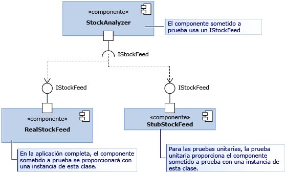

# <a name="use-stubs-to-isolate-parts-of-your-application-from-each-other-for-unit-testing"></a>Usar código auxiliar para aislar partes de la aplicación entre sí para las pruebas unitarias

Los *tipos de código auxiliar* son una de las dos tecnologías que el marco Microsoft Fakes proporciona para permitir aislar fácilmente un componente que se está probando desde otros componentes a los que llama. El código auxiliar es un fragmento de código que ocupa el lugar de otro componente durante las pruebas. La ventaja de utilizar código auxiliar es que devuelve resultados coherentes, haciendo que la prueba sea más fácil de escribir. Y se pueden ejecutar pruebas aun cuando los otros componentes no estén funcionando todavía.

Para obtener una visión general y una guía de inicio rápido de Fakes, vea [Aislar el código probado con Microsoft Fakes](../test/isolating-code-under-test-with-microsoft-fakes.md).

Para utilizar código auxiliar, tiene que escribir el componente de modo que solo utilice interfaces, no clases, para hacer referencia a otras partes de la aplicación. Se trata de una práctica de diseño recomendada, porque reduce las probabilidades de que los cambios en una parte requieran cambios en otra. Para las pruebas, permite sustituir código auxiliar por un componente real.

En el diagrama, el componente StockAnalyzer es el que deseamos probar. Utiliza normalmente otro componente, RealStockFeed. Pero RealStockFeed devuelve resultados diferentes cada vez que se llama a sus métodos, lo que hace que sea difícil probar StockAnalyzer.  Durante la prueba, se reemplaza con otra clase, StubStockFeed.



Dado que el código auxiliar depende de la capacidad de estructurar el código de esta manera, normalmente se utiliza código auxiliar para aislar una parte de la aplicación de otra. Para aislarla de otros ensamblados que no están bajo su control, como *System.dll*, utilizaría normalmente correcciones de compatibilidad (shims). Vea [Usar correcciones de compatibilidad (shim) para aislar la aplicación de otros ensamblados para pruebas unitarias](../test/using-shims-to-isolate-your-application-from-other-assemblies-for-unit-testing.md).

## <a name="how-to-use-stubs"></a>Usar códigos auxiliares

### <a name="design-for-dependency-injection"></a>Diseñar para la inyección de dependencia

Para utilizar código auxiliar, la aplicación se tiene que diseñar de modo que no exista ninguna dependencia entre los distintos componentes, sino que solo dependan de definiciones de interfaz. En lugar de acoplarse en tiempo de compilación, los componentes se conectan en tiempo de ejecución. Este patrón ayuda a crear software eficaz y fácil de actualizar, porque los cambios no tienden a propagarse más allá de los límites de los componentes. Se recomienda su seguimiento aunque no se use código auxiliar. Si está escribiendo código nuevo, es fácil seguir el patrón de [inyección de dependencia](http://en.wikipedia.org/wiki/Dependency_injection). Si está escribiendo pruebas para software existente, quizás tenga que refactorizarlo. Si considera que no sería práctico, podría utilizar correcciones de compatibilidad (shims) en su lugar.

Comencemos la explicación con un ejemplo motivador, el del diagrama. La clase StockAnalyzer lee el precio de las acciones y genera algunos resultados interesantes. Tiene algunos métodos públicos, que deseamos probar. Para que sea más sencillo, centrémonos en uno de esos métodos, uno muy simple que notifica el precio actual de una acción determinada. Deseamos escribir una prueba unitaria de ese método. A continuación se muestra un primer borrador de la prueba:

```csharp
[TestMethod]
public void TestMethod1()
{
    // Arrange:
    var analyzer = new StockAnalyzer();
    // Act:
    var result = analyzer.GetContosoPrice();
    // Assert:
    Assert.AreEqual(123, result); // Why 123?
}
```

```vb
<TestMethod()> Public Sub TestMethod1()
    ' Arrange:
    Dim analyzer = New StockAnalyzer()
    ' Act:
    Dim result = analyzer.GetContosoPrice()
    ' Assert:
    Assert.AreEqual(123, result) ' Why 123?
End Sub
```

El problema de esta prueba está claro a primera vista: los precios de las acciones varían, por lo que la aserción producirá un error general.

Otro problema podría ser que el componente StockFeed, que StockAnalyzer utiliza, todavía está en desarrollo. A continuación se muestra el primer borrador del código del método en pruebas:

```csharp
public int GetContosoPrice()
{
    var stockFeed = new StockFeed(); // NOT RECOMMENDED
    return stockFeed.GetSharePrice("COOO");
}
```

```vb
Public Function GetContosoPrice()
    Dim stockFeed = New StockFeed() ' NOT RECOMMENDED
    Return stockFeed.GetSharePrice("COOO")
End Function
```

Tal y como están las cosas, este método podría no compilarse o podría producir una excepción porque el trabajo en la clase StockFeed todavía no se ha completado. La inyección de interfaz soluciona ambos problemas. La inyección de interfaz aplica la regla siguiente:

El código de cualquier componente de la aplicación nunca debe hacer referencia explícita a una clase de otro componente, ya sea en una declaración o en una instrucción `new`. En su lugar, las variables y los parámetros se deben declarar con interfaces. Solo el contenedor del componente debe crear las instancias del componente.

- "componente" es una clase o un grupo de clases que se desarrollan y actualizan juntas. Normalmente, un componente es el código en un proyecto de Visual Studio. Es menos importante desacoplar las clases de un componente, porque se actualizan al mismo tiempo.

- Tampoco es tan importante desacoplar componentes de las clases de una plataforma relativamente estable como *System.dll*. Escribir interfaces para todas estas clases podría abarrotar el código.

Puede desacoplar el código de StockAnalyzer de StockFeed mediante una interfaz como esta:

```csharp
public interface IStockFeed
{
    int GetSharePrice(string company);
}

public class StockAnalyzer
{
    private IStockFeed stockFeed;
    public StockAnalyzer(IStockFeed feed)
    {
        stockFeed = feed;
    }
    public int GetContosoPrice()
    {
        return stockFeed.GetSharePrice("COOO");
    }
}
```

```vb
Public Interface IStockFeed
    Function GetSharePrice(company As String) As Integer
End Interface

Public Class StockAnalyzer
    ' StockAnalyzer can be connected to any IStockFeed:
    Private stockFeed As IStockFeed
    Public Sub New(feed As IStockFeed)
        stockFeed = feed
    End Sub
    Public Function GetContosoPrice()
        Return stockFeed.GetSharePrice("COOO")
    End Function
End Class
```

En este ejemplo, se pasa a StockAnalyzer una implementación de IStockFeed cuando se construye. En la aplicación completa, el código de inicialización efectuaría la conexión:

```csharp
analyzer = new StockAnalyzer(new StockFeed());
```

Hay maneras más flexibles de realizar esta conexión. Por ejemplo, StockAnalyzer podría aceptar un objeto generador que puede crear instancias de distintas implementaciones de IStockFeed en condiciones diferentes.

### <a name="generate-stubs"></a>Generar códigos auxiliares

Ha desacoplado la clase que quiere probar de los componentes que usa. Además de conseguir que la aplicación sea más sólida y flexible, el desacoplamiento permite conectar el componente en prueba a las implementaciones de código auxiliar de las interfaces con fines de evaluación.

Simplemente podría escribir el código auxiliar como clases de la forma habitual. Sin embargo, Microsoft Fakes proporciona una manera más dinámica de crear el código auxiliar más adecuado para cada prueba.

Para utilizar código auxiliar, primero debe generar tipos de código auxiliar a partir de las definiciones de interfaz.

#### <a name="add-a-fakes-assembly"></a>Incorporación de un ensamblado de Fakes

1. En el **Explorador de soluciones**, expanda **Referencias** en el proyecto de prueba unitaria.

   Si está trabajando en Visual Basic, debe seleccionar **Mostrar todos los archivos** en la barra de herramientas del **Explorador de soluciones** para ver el nodo **Referencias**.

2. Seleccione el ensamblado que contiene las definiciones de interfaz para las que desea crear código auxiliar.

3. En el menú contextual, seleccione **Agregar ensamblado de Fakes**.

### <a name="write-your-test-with-stubs"></a>Escribir la prueba con códigos auxiliares

```csharp
[TestClass]
class TestStockAnalyzer
{
    [TestMethod]
    public void TestContosoStockPrice()
    {
      // Arrange:

        // Create the fake stockFeed:
        IStockFeed stockFeed =
             new StockAnalysis.Fakes.StubIStockFeed() // Generated by Fakes.
                 {
                     // Define each method:
                     // Name is original name + parameter types:
                     GetSharePriceString = (company) => { return 1234; }
                 };

        // In the completed application, stockFeed would be a real one:
        var componentUnderTest = new StockAnalyzer(stockFeed);

        // Act:
        int actualValue = componentUnderTest.GetContosoPrice();

        // Assert:
        Assert.AreEqual(1234, actualValue);
    }
    ...
}
```

```vb
<TestClass()> _
Class TestStockAnalyzer

    <TestMethod()> _
    Public Sub TestContosoStockPrice()
        ' Arrange:
        ' Create the fake stockFeed:
        Dim stockFeed As New StockAnalysis.Fakes.StubIStockFeed
        With stockFeed
            .GetSharePriceString = Function(company)
                                       Return 1234
                                   End Function
        End With
        ' In the completed application, stockFeed would be a real one:
        Dim componentUnderTest As New StockAnalyzer(stockFeed)
        ' Act:
        Dim actualValue As Integer = componentUnderTest.GetContosoPrice
        ' Assert:
        Assert.AreEqual(1234, actualValue)
    End Sub
End Class
```

El toque mágico aquí lo pone la clase `StubIStockFeed`. Para cada tipo público del ensamblado al que se hace referencia, el mecanismo de Microsoft Fakes genera una clase de código auxiliar. El nombre de la clase de código auxiliar se deriva del nombre de la interfaz, con "`Fakes.Stub`" como prefijo y los nombres de los tipos de parámetros anexados.

El código auxiliar también se genera para captadores y establecedores de propiedades, para los eventos y para métodos genéricos.

### <a name="verify-parameter-values"></a>Comprobación de los valores de parámetros

Puede comprobar que, cuando el componente realiza una llamada a otro componente, pase los valores correctos. Puede colocar una aserción en el código auxiliar o almacenar el valor y comprobarlo en el cuerpo principal de la prueba. Por ejemplo:

```csharp
[TestClass]
class TestMyComponent
{
    [TestMethod]
    public void TestVariableContosoPrice()
    {
        // Arrange:
        int priceToReturn;
        string companyCodeUsed;
        var componentUnderTest = new StockAnalyzer(new StubIStockFeed()
            {
               GetSharePriceString = (company) =>
                  {
                     // Store the parameter value:
                     companyCodeUsed = company;
                     // Return the value prescribed by this test:
                     return priceToReturn;
                  };
            };
        // Set the value that will be returned by the stub:
        priceToReturn = 345;

        // Act:
        int actualResult = componentUnderTest.GetContosoPrice();

        // Assert:
        // Verify the correct result in the usual way:
        Assert.AreEqual(priceToReturn, actualResult);

        // Verify that the component made the correct call:
        Assert.AreEqual("COOO", companyCodeUsed);
    }
...
}
```

```vb
<TestClass()> _
Class TestMyComponent
    <TestMethod()> _
    Public Sub TestVariableContosoPrice()
        ' Arrange:
        Dim priceToReturn As Integer
        Dim companyCodeUsed As String = ""
        Dim stockFeed As New StockAnalysis.Fakes.StubIStockFeed()
        With stockFeed
            ' Implement the interface's method:
            .GetSharePriceString = _
                Function(company)
                    ' Store the parameter value:
                    companyCodeUsed = company
                    ' Return a fixed result:
                    Return priceToReturn
                End Function
        End With
        ' Create an object to test:
        Dim componentUnderTest As New StockAnalyzer(stockFeed)
        ' Set the value that will be returned by the stub:
        priceToReturn = 345

        ' Act:
        Dim actualResult As Integer = componentUnderTest.GetContosoPrice()

        ' Assert:
        ' Verify the correct result in the usual way:
        Assert.AreEqual(priceToReturn, actualResult)
        ' Verify that the component made the correct call:
        Assert.AreEqual("COOO", companyCodeUsed)
    End Sub
...
End Class
```

## <a name="stubs-for-different-kinds-of-type-members"></a>Códigos auxiliares para las diferentes clases de miembros de tipo

### <a name="methods"></a>Métodos

Como se describe en el ejemplo, los métodos se pueden procesar con stub asociando un delegado a una instancia de la clase de código auxiliar. El nombre del tipo de código auxiliar se deriva de los nombres del método y los parámetros. Por ejemplo, dada la siguiente interfaz `IMyInterface` y el método `MyMethod`:

```csharp
// application under test
interface IMyInterface
{
    int MyMethod(string value);
}
```

Adjuntamos código auxiliar a `MyMethod` que devuelve siempre 1:

```csharp
// unit test code
var stub = new StubIMyInterface ();
stub.MyMethodString = (value) => 1;
```

Si no proporciona código auxiliar para una función, Fakes genera una función que devuelve el valor predeterminado del tipo de valor devuelto. Para los números el valor predeterminado es 0 y para los tipos de clase es `null` (C#) o `Nothing` (Visual Basic).

### <a name="properties"></a>Propiedades

Los captadores y establecedores de propiedad se exponen como delegados independientes, y pueden procesarse con stub por separado. Por ejemplo, considere la propiedad `Value` de `IMyInterface`:

```csharp
// code under test
interface IMyInterface
{
    int Value { get; set; }
}
```

Adjuntamos delegados en los métodos captadores y establecedores de `Value` para simular una autopropiedad:

```csharp
// unit test code
int i = 5;
var stub = new StubIMyInterface();
stub.ValueGet = () => i;
stub.ValueSet = (value) => i = value;
```

Si no proporciona métodos de código auxiliar para el establecedor o captador de una propiedad, Fakes genera código auxiliar que almacena valores, de modo que la propiedad de código auxiliar funcione como una variable simple.

### <a name="events"></a>Eventos

Los eventos se exponen como campos de delegado. Como resultado, cualquier evento procesado con stub se puede generar simplemente mediante una invocación al campo de respaldo de eventos. Veamos la interfaz siguiente que se procesa con stub:

```csharp
// code under test
interface IWithEvents
{
    event EventHandler Changed;
}
```

Para generar el evento `Changed`, invocamos simplemente el delegado de respaldo:

```csharp
// unit test code
  var withEvents = new StubIWithEvents();
  // raising Changed
  withEvents.ChangedEvent(withEvents, EventArgs.Empty);
```

### <a name="generic-methods"></a>Métodos genéricos

Es posible procesar con stub métodos genéricos si se proporciona un delegado para cada instancia deseada del método. Por ejemplo, dada la siguiente interfaz que contiene un método genérico:

```csharp
// code under test
interface IGenericMethod
{
    T GetValue<T>();
}
```

Se puede escribir una prueba que procese con stub las instancias de `GetValue<int>`:

```csharp
// unit test code
[TestMethod]
public void TestGetValue()
{
    var stub = new StubIGenericMethod();
    stub.GetValueOf1<int>(() => 5);

    IGenericMethod target = stub;
    Assert.AreEqual(5, target.GetValue<int>());
}
```

Si el código llamase a `GetValue<T>` con cualquier otra instancia, el código auxiliar llamaría simplemente al comportamiento.

### <a name="stubs-of-virtual-classes"></a>Códigos auxiliares de clases virtuales

En los ejemplos anteriores, el código auxiliar se han generado a partir de interfaces. También puede generar código auxiliar desde una clase que tenga miembros virtuales o abstractos. Por ejemplo:

```csharp
// Base class in application under test
    public abstract class MyClass
    {
        public abstract void DoAbstract(string x);
        public virtual int DoVirtual(int n)
        { return n + 42; }
        public int DoConcrete()
        { return 1; }
    }
```

En el código auxiliar generado a partir de esta clase, puede establecer métodos delegados para DoAbstract() y DoVirtual(), pero no DoConcrete().

```csharp
// unit test
  var stub = new Fakes.MyClass();
  stub.DoAbstractString = (x) => { Assert.IsTrue(x>0); };
  stub.DoVirtualInt32 = (n) => 10 ;
```

Si no proporciona un delegado para un método virtual, Fakes puede proporcionar el comportamiento predeterminado o puede llamar al método en la clase base. Para hacer que se llame al método base, establezca la propiedad `CallBase`:

```csharp
// unit test code
var stub = new Fakes.MyClass();
stub.CallBase = false;
// No delegate set - default delegate:
Assert.AreEqual(0, stub.DoVirtual(1));

stub.CallBase = true;
// No delegate set - calls the base:
Assert.AreEqual(43,stub.DoVirtual(1));
```

## <a name="debug-stubs"></a>Depuración del código auxiliar

Los tipos de código auxiliar se diseñan para proporcionar una depuración fluida. De forma predeterminada, el depurador pasa por alto cualquier código generado, por lo que se debe pasar directamente a las implementaciones personalizadas del miembro que estaban asociadas al código auxiliar.

## <a name="stub-limitations"></a>Limitaciones del código auxiliar

1. No se admiten las firmas de método con punteros.

2. Las clases o métodos estáticos sellados no pueden procesarse con stub porque los tipos de código auxiliar dependen del envío del método virtual. En estos casos, use los tipos de correcciones de compatibilidad (shim) como se describe en [Usar correcciones de compatibilidad (shim) para aislar la aplicación de otros ensamblados para la prueba unitaria](../test/using-shims-to-isolate-your-application-from-other-assemblies-for-unit-testing.md).

## <a name="change-the-default-behavior-of-stubs"></a>Cambio del comportamiento predeterminado del código auxiliar

Cada tipo de código auxiliar generado contiene una instancia de la interfaz `IStubBehavior` (mediante la propiedad `IStub.InstanceBehavior`). Se llama al comportamiento cuando un cliente llama a un miembro sin ningún delegado personalizado asociado. Si el comportamiento no se ha establecido, se utiliza la instancia devuelta por la propiedad `StubsBehaviors.Current`. De forma predeterminada, esta propiedad devuelve un comportamiento que genera una excepción `NotImplementedException`.

El comportamiento se puede cambiar en cualquier momento estableciendo la propiedad `InstanceBehavior` en cualquier instancia de código auxiliar. Por ejemplo, el siguiente fragmento cambia un comportamiento que no hace nada o devuelve el valor predeterminado del tipo de valor devuelto `default(T)`:

```csharp
// unit test code
var stub = new StubIFileSystem();
// return default(T) or do nothing
stub.InstanceBehavior = StubsBehaviors.DefaultValue;
```

El comportamiento también se puede cambiar globalmente para todos los objetos de código auxiliar para los que el comportamiento no se ha establecido mediante la propiedad `StubsBehaviors.Current`:

```csharp
// Change default behavior for all stub instances
// where the behavior has not been set.
StubBehaviors.Current = BehavedBehaviors.DefaultValue;
```

## <a name="see-also"></a>Vea también

- [Aislar el código sometido a prueba con Microsoft Fakes](../test/isolating-code-under-test-with-microsoft-fakes.md)