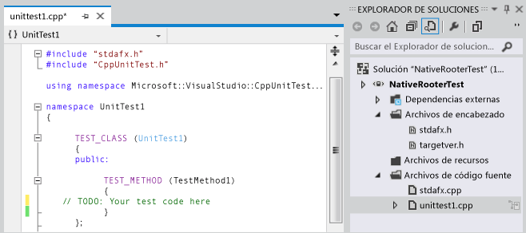
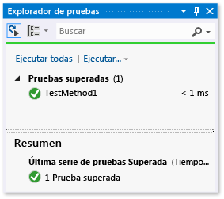
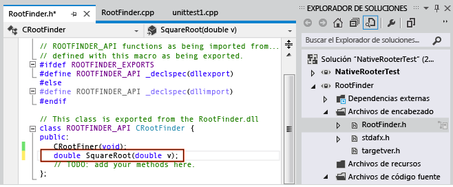
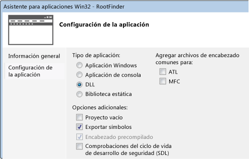
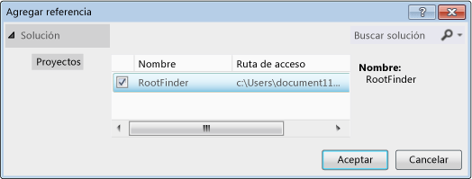
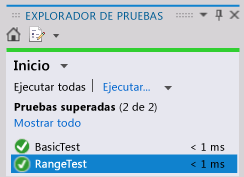

# <a name="how-to-write-unit-tests-for-c-dlls"></a>Cómo escribir pruebas unitarias de DLL de C++

En este tutorial se describe cómo desarrollar una DLL de C++ nativa creando antes una prueba. Los pasos básicos son los siguientes:

1. [Crear un proyecto de prueba nativo](#create_test_project). El proyecto de prueba está en la misma solución que el proyecto de DLL.

2. [Crear un proyecto DLL](#create_dll_project). Este tutorial crea un nuevo archivo DLL, pero el procedimiento para probar una DLL existente es similar.

3. [Hacer visibles para las pruebas las funciones DLL](#make_functions_visible).

4. [Aumentar de forma iterativa las pruebas](#iterate). Recomendamos un ciclo "rojo-verde-refactorizar" en el que el desarrollo del código lo dirigen las pruebas.

5. [Depurar errores de las pruebas](#debug). Puede ejecutar pruebas en modo de depuración.

6. [Refactorizar mientras mantiene las pruebas sin cambios](#refactor). Refactorizar significa mejorar la estructura del código sin cambiar su comportamiento externo. Puede hacerlo para mejorar el rendimiento, la extensibilidad o la legibilidad del código. Dado que la intención es no cambiar el comportamiento, no cambie las pruebas al realizar un cambio de refactorización en el código. Las pruebas le permiten asegurarse de que no crea nuevos errores mientras realiza la tarea de refactorizar.

7. [Comprobar cobertura](using-code-coverage-to-determine-how-much-code-is-being-tested.md). Las pruebas unitarias son más útiles cuanto más código ponen a prueba. Puede detectar qué partes del código han utilizado las pruebas.

8. [Aislar las unidades de los recursos externos](using-stubs-to-isolate-parts-of-your-application-from-each-other-for-unit-testing.md). Normalmente, un archivo DLL depende de otros componentes del sistema que está desarrollando, como otros archivos DLL, bases de datos o subsistemas remotos. Es útil probar cada unidad aislada de sus dependencias. Los componentes externos pueden ralentizar las pruebas. Durante el desarrollo, los demás componentes podrían no estar completos.

## <a name="create-a-native-unit-test-project"></a><a name="create_test_project"></a> Crear un proyecto de prueba unitaria nativo

1. En el menú **Archivo**, elija **Nuevo** > **Proyecto**.

     **Visual Studio 2017 y versiones anteriores**: Expanda **Instalado** > **Plantillas** > **Visual C++**  > **Prueba**.
     **Visual Studio 2019**: Establezca el valor de **Lenguaje** en C++ y escriba "prueba" en el cuadro de búsqueda.

     Elija la plantilla **Proyecto de prueba unitaria de tipo nativo** o el marco instalado que prefiera. Si elige otra plantilla (como Google Test o Boost.Test), los principios básicos son los mismos, aunque algunos detalles variarán.

     En este tutorial, el proyecto de prueba se llama `NativeRooterTest`.

2. En el nuevo proyecto, inspeccione **unittest1.cpp**.

     

     Tenga en lo siguiente:

    - Cada prueba se define mediante `TEST_METHOD(YourTestName){...}`.

         No es necesario escribir una firma de función convencional. La firma se crea mediante la macro TEST_METHOD. La macro genera una función de la instancia que devuelve void. También genera una función estática que devuelve información sobre el método de prueba. Esta información permite al Explorador de pruebas encontrar el método.

    - Los métodos de prueba se agrupan en clases mediante el uso de `TEST_CLASS(YourClassName){...}`.

         Cuando se ejecutan las pruebas, se crea una instancia de cada clase de prueba. Se llama a los métodos de prueba en un orden no especificado. Puede definir métodos especiales que se invocan antes y después de cada módulo, clase o método.

3. Compruebe que las pruebas se ejecutan en el Explorador de pruebas:

    1. Inserte código de prueba:

        ```cpp
        TEST_METHOD(TestMethod1)
        {
            Assert::AreEqual(1,1);
        }
        ```

         Tenga en cuenta que la clase `Assert` proporciona varios métodos estáticos que puede usar para comprobar los resultados de los métodos de prueba.

    2. En el menú **Prueba**, elija **Ejecutar** > **Todas las pruebas**.

         La prueba se compila y ejecuta.

         Aparece el **Explorador de pruebas**.

         La prueba aparece en **Pruebas superadas**.

         

## <a name="create-a-dll-project"></a><a name="create_dll_project"></a> Crear un proyecto DLL

::: moniker range="vs-2019"

En los pasos que hay a continuación se muestra cómo crear un proyecto de DLL en Visual Studio 2019.

1. Cree un proyecto de C++ con el **Asistente para escritorio de Windows**: Haga clic con el botón derecho en la solución en el **Explorador de soluciones** y elija **Agregar** > **Nuevo proyecto**. Establezca el valor de **Lenguaje** en C++ y escriba "windows" en el cuadro de búsqueda. Elija **Asistente para escritorio de Windows** en la lista de resultados.

     En este tutorial, el proyecto se llama `RootFinder`.

2. Pulse **Crear**. En el cuadro de diálogo siguiente, en **Tipo de aplicación**, elija **biblioteca de vínculos dinámicos (DLL)** y marque también **Exportar símbolos**.

     La opción **Exportar símbolos** genera una cómoda macro que puede utilizar para declarar métodos exportados.

     

3. Declare una función exportada en el archivo *.h* principal:

     

     El declarador `__declspec(dllexport)` hace que los miembros públicos y protegidos de la clase sean visibles fuera del archivo DLL. Para obtener más información, consulta [Using dllimport and dllexport in C++ Classes](/cpp/cpp/using-dllimport-and-dllexport-in-cpp-classes).

4. En el archivo *.cpp* principal, agregue un cuerpo mínimo para la función:

    ```cpp
        // Find the square root of a number.
        double CRootFinder::SquareRoot(double v)
        {
            return 0.0;
        }
    ```

::: moniker-end

::: moniker range="vs-2017"

En los pasos que hay a continuación se muestra cómo crear un proyecto de DLL en Visual Studio 2017.

1. Cree un proyecto de Visual C++ usando la plantilla **Proyecto Win32**.

     En este tutorial, el proyecto se llama `RootFinder`.

2. Seleccione **DLL** y **Exportar símbolos** en el asistente para aplicaciones Win32.

     La opción **Exportar símbolos** genera una cómoda macro que puede utilizar para declarar métodos exportados.

     

3. Declare una función exportada en el archivo *.h* principal:

     

     El declarador `__declspec(dllexport)` hace que los miembros públicos y protegidos de la clase sean visibles fuera del archivo DLL. Para obtener más información, consulta [Using dllimport and dllexport in C++ Classes](/cpp/cpp/using-dllimport-and-dllexport-in-cpp-classes).

4. En el archivo *.cpp* principal, agregue un cuerpo mínimo para la función:

    ```cpp
        // Find the square root of a number.
        double CRootFinder::SquareRoot(double v)
        {
            return 0.0;
        }
    ```

::: moniker-end

## <a name="couple-the-test-project-to-the-dll-project"></a><a name="make_functions_visible"></a> Acoplar el proyecto de prueba al proyecto DLL

1. Agregue el proyecto DLL a las referencias del proyecto de prueba:

   1. Haga clic con el botón derecho en el nodo de proyecto de prueba en el **Explorador de soluciones** y elija **Agregar** > **Referencia**.

   2. En el cuadro de diálogo **Agregar referencia** , seleccione el proyecto DLL y elija **Agregar**.

        

2. En el archivo *.cpp* de prueba unitaria principal, incluya el archivo *.h* del código DLL:

   ```cpp
   #include "..\RootFinder\RootFinder.h"
   ```

3. Agregue una prueba básica que utiliza la función exportada:

   ```cpp
   TEST_METHOD(BasicTest)
   {
      CRootFinder rooter;
      Assert::AreEqual(
         // Expected value:
         0.0,
         // Actual value:
         rooter.SquareRoot(0.0),
         // Tolerance:
         0.01,
        // Message:
        L"Basic test failed",
        // Line number - used if there is no PDB file:
        LINE_INFO());
   }
   ```

4. Compile la solución.

    La nueva prueba aparece en el **Explorador de pruebas**.

5. En el **Explorador de pruebas**, elija **Ejecutar todo**.

    

   Ha configurado la prueba y los proyectos de código, y ha verificado que puede ejecutar las pruebas que ejecutan funciones en el proyecto de código. Ahora puede empezar a escribir pruebas y código reales.

## <a name="iteratively-augment-the-tests-and-make-them-pass"></a><a name="iterate"></a> Aumentar las pruebas de forma interactiva y comprobar si se superan

1. Agregue una nueva prueba:

    ```cpp
    TEST_METHOD(RangeTest)
    {
      CRootFinder rooter;
      for (double v = 1e-6; v < 1e6; v = v * 3.2)
      {
        double actual = rooter.SquareRoot(v*v);
        Assert::AreEqual(v, actual, v/1000);
      }
    }
    ```

    > [!TIP]
    > Se recomienda no cambiar las pruebas superadas. En vez de ello, agregue una nueva prueba, actualice el código para que la prueba se supere, después agregue otra prueba y así sucesivamente.
    >
    > Cuando los usuarios cambien los requisitos, deshabilite las pruebas que ya no son correctas. Escriba nuevas pruebas y hágalas funcionar una a una de la misma manera incremental.

2. Compile la solución y, en el **Explorador de pruebas**, elija **Ejecutar todo**.

     Se produce un error en la nueva prueba.

     

    > [!TIP]
    > Compruebe que todas las pruebas producen un error inmediatamente después de escribirlas. Esto ayuda a evitar el error habitual de escribir una prueba que nunca falla.

3. Mejore el código de DLL de forma que supere la nueva prueba:

    ```cpp
    #include <math.h>
    ...
    double CRootFinder::SquareRoot(double v)
    {
      double result = v;
      double diff = v;
      while (diff > result/1000)
      {
        double oldResult = result;
        result = result - (result*result - v)/(2*result);
        diff = abs (oldResult - result);
      }
      return result;
    }
    ```

4. Compile la solución y, en el **Explorador de pruebas**, elija **Ejecutar todo**.

     Ambas pruebas quedan superadas.

     

    > [!TIP]
    > Desarrolle código agregando pruebas una a una. Asegúrese de que se pasan todas las pruebas después de cada iteración.

## <a name="debug-a-failing-test"></a><a name="debug"></a> Depurar una prueba fallida

1. Agregue otra prueba:

    ```cpp
    #include <stdexcept>
    ...
    // Verify that negative inputs throw an exception.
    TEST_METHOD(NegativeRangeTest)
    {
      wchar_t message[200];
      CRootFinder rooter;
      for (double v = -0.1; v > -3.0; v = v - 0.5)
      {
        try
        {
          // Should raise an exception:
          double result = rooter.SquareRoot(v);

          _swprintf(message, L"No exception for input %g", v);
          Assert::Fail(message, LINE_INFO());
        }
        catch (std::out_of_range ex)
        {
          continue; // Correct exception.
        }
        catch (...)
        {
          _swprintf(message, L"Incorrect exception for %g", v);
          Assert::Fail(message, LINE_INFO());
        }
      }
    }
    ```

2. Compile la solución y elija **Ejecutar todo**.

3. Abra o haga doble clic en la prueba con errores.

     Se resalta el error de aserción. El mensaje de error es visible en el panel de detalles del **Explorador de pruebas**.

     

4. Para ver por qué se produce el error, revise la función:

    1. Establezca un punto de interrupción al principio de la función SquareRoot.

    2. En el menú contextual de la prueba no superada, elija **Depurar pruebas seleccionadas**.

         Cuando la ejecución se detiene en el punto de interrupción, revise paso a paso el código.

5. Inserte código en la función que está desarrollando:

    ```cpp

    #include <stdexcept>
    ...
    double CRootFinder::SquareRoot(double v)
    {
        // Validate parameter:
        if (v < 0.0)
        {
          throw std::out_of_range("Can't do square roots of negatives");
        }

    ```

6. Ahora, todas las pruebas pasan.

   

::: moniker range="vs-2017"

> [!TIP]
> Si las pruebas individuales no tienen ninguna dependencia que impida que se ejecuten en cualquier orden, active la ejecución de pruebas paralelas con el botón de alternancia  en la barra de herramientas. Esto puede reducir considerablemente el tiempo necesario para ejecutar todas las pruebas.

::: moniker-end

::: moniker range=">=vs-2019"

> [!TIP]
> Si las pruebas individuales no tienen ninguna dependencia que impida que se ejecuten en cualquier orden, active la ejecución de pruebas paralelas en el menú de configuración de la barra de herramientas. Esto puede reducir considerablemente el tiempo necesario para ejecutar todas las pruebas.

::: moniker-end

## <a name="refactor-the-code-without-changing-tests"></a><a name="refactor"></a> Refactorizar el código sin cambiar las pruebas

1. Simplifique el cálculo central en la función SquareRoot:

    ```cpp
    // old code:
    //   result = result - (result*result - v)/(2*result);
    // new code:
         result = (result + v/result)/2.0;

    ```

2. Compile la solución y elija **Ejecutar todo** para asegurarse de que no se ha introducido un error.

    > [!TIP]
    > Un buen conjunto de pruebas unitarias le da la seguridad de que no ha introducido errores al cambiar el código.
    >
    > Mantenga la refactorización separada de los demás cambios.

## <a name="next-steps"></a>Pasos siguientes

- **Aislamiento.** La mayoría de las DLL dependen de otros subsistemas, como bases de datos y otros archivos DLL. Estos componentes a menudo se desarrollan en paralelo. Para permitir la realización de pruebas unitarias mientras los demás componentes no están disponibles, debe sustituir mock o

- **Pruebas de comprobación de la compilación.** Puede realizar pruebas en el servidor de compilación de su equipo a intervalos establecidos. Esto garantiza que no se producen errores cuando se integra el trabajo de varios miembros del equipo.

- **Pruebas de protección.** Puede exigir que se realicen algunas pruebas antes de que cualquier miembro del equipo proteja código en el control de código fuente. Normalmente, se trata de un subconjunto de las pruebas de comprobación.

   También puede asignar un nivel mínimo de cobertura de código.

## <a name="see-also"></a>Consulte también

- [Agregar pruebas unitarias a aplicaciones C++ existentes](../test/how-to-use-microsoft-test-framework-for-cpp.md)
- [Usar Microsoft.VisualStudio.TestTools.CppUnitTestFramework](how-to-use-microsoft-test-framework-for-cpp.md)
- [Depuración del código nativo](../debugger/debugging-native-code.md)
- [Tutorial: Creación y uso de una biblioteca de vínculos dinámicos (C++)](/cpp/build/walkthrough-creating-and-using-a-dynamic-link-library-cpp)
- [Importación y exportación](/cpp/build/importing-and-exporting)
