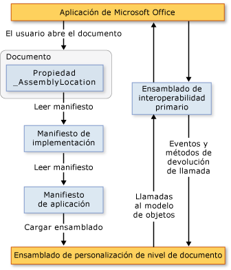

# Arquitectura de las personalizaciones de nivel de documento
  [!INCLUDE[vs_dev12](../vsto/includes/vs-dev12-md.md)] incluye proyectos para la creación de personalizaciones de nivel de documento de Microsoft Office Word y Microsoft Office Excel. En este tema se describen los siguientes aspectos de las personalizaciones de nivel de documento:

- [Descripción de las personalizaciones](#UnderstandingCustomizations)

- [Componentes de las personalizaciones](#Components)

- [Cómo funcionan las personalizaciones con aplicaciones de Microsoft Office](#HowCustomizationsWork)

  [!INCLUDE[appliesto_alldoc](../vsto/includes/appliesto-alldoc-md.md)]

  Para obtener información general sobre cómo crear personalizaciones de nivel de documento, vea [información general sobre el desarrollo de soluciones de Office &#40;VSTO&#41;](../vsto/office-solutions-development-overview-vsto.md), introducción a [la programación de personalizaciones de nivel de documento para Word](../vsto/getting-started-programming-document-level-customizations-for-word.md)y Introducción a [la programación de personalizaciones de nivel de documento para Excel](../vsto/getting-started-programming-document-level-customizations-for-excel.md).

##  Descripción de las personalizaciones
 Si usa Office Developer Tools en Visual Studio para compilar una personalización de nivel de documento, se crea un ensamblado de código administrado que se asocia con un documento concreto. Se dice que un documento o un libro con un ensamblado vinculado dispone de extensiones de código administrado. Para obtener más información, vea [diseñar y crear soluciones de Office](../vsto/designing-and-creating-office-solutions.md).

 Cuando un usuario abre el documento, la aplicación de Microsoft Office carga el ensamblado. Cuando se carga el ensamblado, la personalización puede responder a eventos mientras el documento está abierto. La personalización también puede hacer llamadas al modelo de objetos para automatizar y extender la aplicación mientras el documento está abierto, y puede usar cualquiera de las clases de [!INCLUDE[dnprdnshort](../sharepoint/includes/dnprdnshort-md.md)].

 El ensamblado se comunica con los componentes COM de la aplicación a través del ensamblado de interoperabilidad primario de la aplicación. Para obtener más información, vea [ensamblados de interoperabilidad primarios de Office](../vsto/office-primary-interop-assemblies.md) y [información general sobre el desarrollo de soluciones de office &#40;VSTO&#41;](../vsto/office-solutions-development-overview-vsto.md).

 Si un usuario abre varias personalizaciones de nivel de documento a la vez, cada ensamblado se carga en un dominio de aplicación distinto. Esto significa que una solución que se comporta incorrectamente no puede hacer que otras generen un error. Las personalizaciones de nivel de documento están diseñadas para trabajar con un único documento en un dominio de aplicación único. No están diseñados para una comunicación entre documentos. Para obtener más información sobre los dominios de aplicación, consulte [dominios de aplicación](/dotnet/framework/app-domains/application-domains).

> [!NOTE]
> Las personalizaciones de nivel de documento que se crean con Office Developer Tools en Visual Studio están diseñadas para usarse solo cuando un usuario final inicia la aplicación. Si la aplicación se inicia mediante programación, por ejemplo, mediante Automatización, la personalización podría no funcionar según lo esperado.

### Experiencias en tiempo de diseño y en tiempo de ejecución
 Para entender la arquitectura de las personalizaciones de nivel de documento, resulta útil comprender las experiencias de diseño y de ejecución de una solución.

#### Tiempo de diseño
 En la experiencia en tiempo de diseño se incluyen los pasos siguientes:

1. El desarrollador crea un proyecto de nivel de documento en [!INCLUDE[vsprvs](../sharepoint/includes/vsprvs-md.md)]. El proyecto incluye el documento y el ensamblado que se ejecuta detrás del documento. Es posible que el documento ya exista (creado por un diseñador) o que se pueda crear un nuevo documento junto con el proyecto.

2. El diseñador, ya sea el desarrollador que crea el proyecto u otra persona, crea la apariencia final del documento para el usuario final.

#### Tiempo de ejecución
 En la experiencia en tiempo de ejecución se incluyen los pasos siguientes:

1. El usuario final abre un documento o un libro que tiene extensiones de código administrado.

2. El documento o el libro carga el ensamblado compilado.

3. El ensamblado responde a los eventos mientras el usuario trabaja en el documento o el libro.

#### Comparación de la perspectiva del desarrollador y del usuario final
 Como el desarrollador trabaja principalmente en [!INCLUDE[vsprvs](../sharepoint/includes/vsprvs-md.md)]y el usuario final trabaja en Word o Excel, hay dos maneras de entender las personalizaciones de nivel de documento.

|Perspectiva del desarrollador|Perspectiva del usuario final|
|-----------------------------|----------------------------|
|Con [!INCLUDE[vsprvs](../sharepoint/includes/vsprvs-md.md)], el desarrollador escribe código que es accesible para Word y Excel.   Aunque pueda parecer que el programador crea un archivo ejecutable que ejecuta Word o Excel, en realidad el proceso funciona al revés. El documento se asocia a un ensamblado y contiene un puntero a ese ensamblado. Cuando se abre el documento, Word o Excel localiza el ensamblado y ejecuta el código en respuesta a todos los eventos controlados.|Los que usan la solución simplemente abren el documento o el libro (o crean un nuevo documento desde una plantilla) de la misma forma que abrirían cualquier otro archivo de Microsoft Office.   El ensamblado ofrece personalizaciones en el documento o el libro, como rellenarlos automáticamente con datos actuales o mostrar un cuadro de diálogo para solicitar información.|

### Formatos de documento admitidos para las personalizaciones de nivel de documento
 Cuando crea un proyecto de personalización, puede elegir el formato del documento que desea utilizar en el proyecto. Para obtener más información, vea [Cómo: crear proyectos de Office en Visual Studio](../vsto/how-to-create-office-projects-in-visual-studio.md).

 En la tabla siguiente se enumeran los formatos de documento que se pueden utilizar en las personalizaciones de nivel de documento para Excel y Word.

|Excel|Word|
|-----------|----------|
|Libro de Excel (*. xlsx*)   Libro de Excel habilitado para macros (*. xlsm*)   Libro binario de Excel (*. xlsb*)   Libro de Excel 97-2003 (*. xls*)   Plantilla de Excel (*. xltx*)   Plantilla de Excel habilitada para macros (*. xltm*)   Plantilla de Excel 97-2003 (*. xlt*)|Documento de Word (*. docx*)   Documento habilitado para macros de Word (*. docm*)   Documento de Word 97-2003 (*. doc*)   Plantilla de Word (*. dotx*)   Plantilla habilitada para macros de Word (*. dotm*)   Plantilla de Word 97-2003 (*. dot*)|

 Debe diseñar extensiones de código administrado únicamente para los documentos en los formatos que se admiten. De lo contrario, es posible que no se generen determinados eventos si el documento se abre en la aplicación. Por ejemplo, el <xref:Microsoft.Office.Tools.Excel.Workbook.Open> evento no se genera cuando se utilizan extensiones de código administrado con libros guardados en el formato de hoja de cálculo XML de Excel o en la página web (*. htm*; *. html*) Aplique.

### Compatibilidad con documentos de Word que tienen extensiones de nombre de archivo. XML
 Las plantillas de proyecto de nivel de documento no permiten crear proyectos basados en los siguientes formatos de archivo:

- Documento XML de Word (*\* XML*).

- Documento XML de Word 2003 (*\* XML*).

  Si desea que los usuarios finales utilicen las personalizaciones en estos formatos de archivo, compile e implemente una personalización que use uno de los formatos de archivo compatibles que se especifican en la tabla anterior. Después de instalar la personalización, los usuarios finales pueden guardar el documento en el formato de documento XML de Word (*\* XML*) o en el formato de documento XML (*\* XML*) de Word 2003 y la personalización continuará funcionando según lo previsto.

##  Componentes de las personalizaciones
 Los componentes principales de una personalización son el documento y el ensamblado. Además de estos componentes, existen otras partes que desempeñan un papel importante en la forma en que las aplicaciones de Microsoft Office detectan y cargan personalizaciones.

### Manifiesto de implementación y manifiesto de aplicación
 Las personalizaciones usan manifiestos de implementación y manifiestos de aplicación para identificar y cargar la versión más reciente del ensamblado de personalización. El manifiesto de implementación apunta al manifiesto de aplicación actual. El manifiesto de aplicación apunta al ensamblado de personalización y especifica la clase (o clases) de punto de entrada que se ejecutará en el ensamblado. Para obtener más información, vea [manifiestos de aplicación e implementación en soluciones de Office](../vsto/application-and-deployment-manifests-in-office-solutions.md).

### Visual Studio Tools para Office Runtime
 Para ejecutar personalizaciones de nivel de documento que se crean con Office Developer Tools en Visual Studio, los equipos de usuario final deben tener [!INCLUDE[vsto_runtime](../vsto/includes/vsto-runtime-md.md)] instalado. [!INCLUDE[vsto_runtime](../vsto/includes/vsto-runtime-md.md)] incluye componentes no administrados que cargan el ensamblado de personalización y también un conjunto de ensamblados administrados. Estos ensamblados administrados proporcionan el modelo de objetos que el código de personalización usa para automatizar y extender la aplicación host.

 Para obtener más información, vea [información general sobre el Runtime de Visual Studio Tools para Office](../vsto/visual-studio-tools-for-office-runtime-overview.md).

##  Cómo funcionan las personalizaciones con aplicaciones de Microsoft Office
 Cuando un usuario abre un documento que forma parte de una personalización de Microsoft Office, la aplicación utiliza el manifiesto de implementación que está vinculado al documento para buscar y cargar la versión más reciente del ensamblado de personalización. La ubicación del manifiesto de implementación se almacena en una propiedad de documento personalizada denominada **AssemblyLocation**. La cadena que identifica esta ubicación se inserta en la propiedad cuando se compila la solución.

 El manifiesto de implementación apunta al manifiesto de aplicación, que a su vez apunta al ensamblado más actual. Para obtener más información, vea [manifiestos de aplicación e implementación en soluciones de Office](../vsto/application-and-deployment-manifests-in-office-solutions.md).

 En la ilustración siguiente se muestra la arquitectura básica de una personalización de nivel de documento.

 

> [!NOTE]
> En soluciones de Office destinadas a [!INCLUDE[net_v40_short](../sharepoint/includes/net-v40-short-md.md)], las soluciones llaman al modelo de objetos de la aplicación host mediante la información de tipo de ensamblado de interoperabilidad primario (PIA) que está insertada en el ensamblado de la solución, en lugar de llamar directamente a los PIA. Para obtener más información, vea [diseñar y crear soluciones de Office](../vsto/designing-and-creating-office-solutions.md).

### Cargando proceso
 Los pasos siguientes se producen cuando un usuario abre un documento que forma parte de una solución de Microsoft Office.

1. La aplicación de Microsoft Office comprueba las propiedades de documento personalizadas para ver si hay extensiones de código administrado asociadas con el documento. Para obtener más información, vea [información general sobre las propiedades personalizadas del documento](../vsto/custom-document-properties-overview.md).

2. Si hay extensiones de código administrado, la aplicación carga *VSTOEE.dll*, que carga *VSTOLoader.dll*. Se trata de archivos dll no administrados que son los componentes del cargador para Visual Studio 2010 Tools para Office Runtime. Para obtener más información, vea [información general de Visual Studio Tools para Office Runtime](../vsto/visual-studio-tools-for-office-runtime-overview.md).

3. *VSTOLoader.dll* carga [!INCLUDE[dnprdnshort](../sharepoint/includes/dnprdnshort-md.md)] e inicia la parte administrada de [!INCLUDE[vsto_runtime](../vsto/includes/vsto-runtime-md.md)] .

4. Si el documento se abre desde una ubicación distinta del equipo local, [!INCLUDE[vsto_runtime](../vsto/includes/vsto-runtime-md.md)] comprueba que la ubicación del documento está en la lista **Ubicaciones de confianza** de la **Configuración del Centro de confianza** de esa aplicación de Office concreta. Si la ubicación del documento no está en una ubicación de confianza, la personalización no es de confianza y el proceso de carga se detiene ahí.

5. [!INCLUDE[vsto_runtime](../vsto/includes/vsto-runtime-md.md)] instala la solución si aún no lo está, descarga los manifiestos de aplicación e implementación más recientes y realiza una serie de comprobaciones de seguridad. Para obtener más información, vea [proteger soluciones de Office](../vsto/securing-office-solutions.md).

6. Si se confía en la personalización para que se ejecute, [!INCLUDE[vsto_runtime](../vsto/includes/vsto-runtime-md.md)] usa el manifiesto de implementación y el manifiesto de aplicación para comprobar si hay actualizaciones del ensamblado. Si está disponible una nueva versión del ensamblado, el runtime descarga la nueva versión del ensamblado en la memoria caché de [!INCLUDE[ndptecclick](../vsto/includes/ndptecclick-md.md)] del equipo cliente. Para obtener más información, vea [implementar una solución de Office](../vsto/deploying-an-office-solution.md).

7. [!INCLUDE[vsto_runtime](../vsto/includes/vsto-runtime-md.md)] crea un nuevo dominio de aplicación en el que se cargará el ensamblado de personalización.

8. [!INCLUDE[vsto_runtime](../vsto/includes/vsto-runtime-md.md)] carga el ensamblado de personalización en el dominio de aplicación.

9. [!INCLUDE[vsto_runtime](../vsto/includes/vsto-runtime-md.md)] llama al controlador de eventos de **Startup** en el ensamblado de personalización. Para obtener más información, vea [eventos en proyectos de Office](../vsto/events-in-office-projects.md).

## Vea también
- [Arquitectura de las soluciones de Office en Visual Studio](../vsto/architecture-of-office-solutions-in-visual-studio.md)
- [Architecture of VSTO Add-ins](../vsto/architecture-of-vsto-add-ins.md)
- [Información general sobre el tiempo de ejecución de Visual Studio Tools para Office](../vsto/visual-studio-tools-for-office-runtime-overview.md)
- [Proteger soluciones de Office](../vsto/securing-office-solutions.md)
- [Diseñar y crear soluciones de Office](../vsto/designing-and-creating-office-solutions.md)
- [Información general sobre propiedades personalizadas del documento](../vsto/custom-document-properties-overview.md)
- [Datos almacenados en caché en personalizaciones de nivel de documento](../vsto/cached-data-in-document-level-customizations.md)
