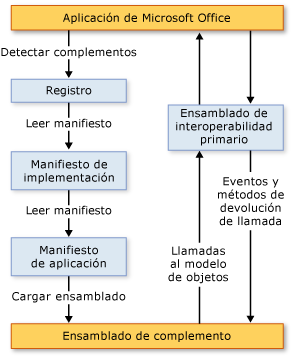

# Arquitectura de complementos de VSTO
  Los complementos de VSTO creados con Office Developer Tools en Visual Studio tienen unas características arquitectónicas que resaltan la estabilidad y seguridad, y que pueden trabajar en estrecha colaboración con Microsoft Office. En este tema, se describen los siguientes aspectos de los complementos de VSTO:  
  
-   [Descripción de los complementos de VSTO](#UnderstandingAddIns)  
  
-   [Componentes de los complementos de VSTO](#AddinComponents)  
  
-   [Cómo funcionan los complementos de VSTO con aplicaciones de Microsoft Office](#HowAddinsWork)  
  
 [!INCLUDE[appliesto_allapp](../vsto/includes/appliesto-allapp-md.md)]  
  
 Para obtener información general acerca de cómo crear complementos VSTO, consulte [información general sobre el desarrollo de soluciones de Office &#40;VSTO&#41; ](../vsto/office-solutions-development-overview-vsto.md) y [obtener iniciado programación complementos](../vsto/getting-started-programming-vsto-add-ins.md).  
  
##   Descripción de los complementos de VSTO  
 Cuando se usa Office Developer Tools en Visual Studio para compilar un complemento de VSTO, se crea un ensamblado de código administrado que es cargado por una aplicación de Microsoft Office. Una vez cargado el ensamblado, el complemento de VSTO puede responder a los eventos que se producen en la aplicación como, por ejemplo, cuando un usuario hace clic en un elemento de menú. El código del complemento de VSTO también puede hacer llamadas en el modelo de objetos para automatizar y extender la aplicación y puede usar cualquiera de las clases de [!INCLUDE[dnprdnshort](../sharepoint/includes/dnprdnshort-md.md)].  
  
 El ensamblado se comunica con los componentes COM de la aplicación a través del ensamblado de interoperabilidad primario de la aplicación. Para obtener más información, consulte [ensamblados de interoperabilidad primarios de Office](../vsto/office-primary-interop-assemblies.md) y [información general sobre el desarrollo de soluciones de Office &#40;VSTO&#41;](../vsto/office-solutions-development-overview-vsto.md).  
  
 Si se instalan varios complementos de VSTO para una aplicación, cada uno de ellos se carga en un dominio de aplicación diferente. Esto significa que un complemento de VSTO que se comporta incorrectamente no puede hacer que otros complementos de VSTO generen un error. También ayuda a garantizar que, cuando se cierra la aplicación, todos los ensamblados de complementos de VSTO se descarguen de la memoria. Para obtener más información acerca de los dominios de aplicación, consulte [dominios de aplicación](/dotnet/framework/app-domains/application-domains).  
  
> [!NOTE]  
>  Los complementos de VSTO que se crean con Office Developer Tools en Visual Studio están diseñados para usarse solo cuando la aplicación host de Microsoft Office es iniciada por un usuario final. Si la aplicación se inicia mediante programación (por ejemplo, al usar Automatización), el complemento de VSTO podría no funcionar según lo esperado.  
  
##   Componentes de los complementos de VSTO  
 Aunque el ensamblado del complemento de VSTO es el componente principal, hay otros componentes que desempeñan un papel importante en la forma en que las aplicaciones de Microsoft Office detectan y cargan complementos de VSTO.  
  
### Entradas del Registro  
 Para detectar complementos de VSTO, las aplicaciones de Microsoft Office buscan en un conjunto de entradas del registro. Para obtener una lista completa de las entradas del registro utilizado por los complementos de VSTO, consulte [entradas del registro para complementos VSTO](../vsto/registry-entries-for-vsto-add-ins.md).  
  
 Al compilar la solución, Visual Studio crea todas las entradas del Registro necesarias en el equipo de desarrollo para que el complemento de VSTO se pueda ejecutar y depurar fácilmente. Para obtener más información, consulte [compilar soluciones de Office](../vsto/building-office-solutions.md).  
  
 Si utiliza ClickOnce para implementar la solución, el programa de instalación generado automáticamente por el proceso de publicación crea las claves del registro en el equipo del usuario final. Para obtener más información, consulte [implementar una solución de Office mediante ClickOnce](../vsto/deploying-an-office-solution-by-using-clickonce.md).  
  
### Manifiesto de implementación y manifiesto de aplicación  
 Los complementos de VSTO usan manifiestos de implementación y manifiestos de aplicación para identificar y cargar la versión más reciente del ensamblado del complemento de VSTO. El manifiesto de implementación apunta al manifiesto de aplicación actual. El manifiesto de aplicación apunta al ensamblado del complemento de VSTO y especifica la clase de punto de entrada que se ejecutará en el ensamblado. Para obtener más información, consulta [Application and Deployment Manifests in Office Solutions](../vsto/application-and-deployment-manifests-in-office-solutions.md).  
  
### Visual Studio Tools para Office Runtime  
 Para ejecutar complementos de VSTO que se crean mediante Office Developer Tools en Visual Studio, los equipos de usuario final deben tener instalado [!INCLUDE[vsto_runtime](../vsto/includes/vsto-runtime-md.md)] . El tiempo de ejecución incluye los componentes no administrados y un conjunto de ensamblados administrados. Los componentes no administrados cargan el ensamblado del complemento de VSTO. Los ensamblados administrados proporcionan el modelo de objetos que el código del complemento de VSTO usa para automatizar y extender la aplicación host.  
  
 Para obtener más información, consulta [Visual Studio Tools for Office Runtime Overview](../vsto/visual-studio-tools-for-office-runtime-overview.md).  
  
##   How VSTO Add-ins Work with Microsoft Office Applications  
 Cuando un usuario inicia una aplicación de Microsoft Office, la aplicación usa el manifiesto de implementación y el manifiesto de aplicación para buscar y cargar la versión más reciente del ensamblado del complemento de VSTO. La ilustración siguiente muestra la arquitectura básica de estos complementos de VSTO.  
  
   
  
> [!NOTE]  
>  En soluciones de Office destinadas a [!INCLUDE[net_v40_short](../sharepoint/includes/net-v40-short-md.md)] o [!INCLUDE[net_v45](../vsto/includes/net-v45-md.md)], la solución llama al modelo de objetos de la aplicación host usando la información de tipo PIA que está incrustada en el ensamblado de la solución, en lugar de llamar directamente a los PIA. Para obtener más información, consulta [Designing and Creating Office Solutions](../vsto/designing-and-creating-office-solutions.md).  
  
### Proceso de carga  
 Cuando un usuario inicia una aplicación, se dan los pasos siguientes:  
  
1.  La aplicación busca en el registro entradas que identifiquen complementos de VSTO que se hayan creado con Office Developer Tools en Visual Studio.  
  
2.  Si encuentra estas entradas del Registro, la aplicación carga VSTOEE.dll, que a su vez carga VSTOLoader.dll. Se trata de DLL no administradas que son los componentes de carga para Visual Studio 2010 Tools para Office Runtime. Para obtener más información, consulta [Visual Studio Tools for Office Runtime Overview](../vsto/visual-studio-tools-for-office-runtime-overview.md).  
  
3.  VSTOLoader.dll carga [!INCLUDE[dnprdnshort](../sharepoint/includes/dnprdnshort-md.md)] e inicia la parte administrada de [!INCLUDE[vsto_runtime](../vsto/includes/vsto-runtime-md.md)].  
  
4.  [!INCLUDE[vsto_runtime](../vsto/includes/vsto-runtime-md.md)] comprueba si hay actualizaciones de manifiesto y descarga los manifiestos de aplicación e implementación más recientes.  
  
5.  [!INCLUDE[vsto_runtime](../vsto/includes/vsto-runtime-md.md)] realiza una serie de comprobaciones de seguridad. Para obtener más información, consulta [Securing Office Solutions](../vsto/securing-office-solutions.md).  
  
6.  Si se confía en el complemento de VSTO para que se ejecute, [!INCLUDE[vsto_runtime](../vsto/includes/vsto-runtime-md.md)] usa el manifiesto de implementación y el manifiesto de aplicación para comprobar si hay actualizaciones del ensamblado. Si está disponible una nueva versión del ensamblado, el runtime descarga la nueva versión del ensamblado en la memoria caché de [!INCLUDE[ndptecclick](../vsto/includes/ndptecclick-md.md)] del equipo cliente. Para obtener más información, consulte [implementar una solución de Office](../vsto/deploying-an-office-solution.md).  
  
7.  [!INCLUDE[vsto_runtime](../vsto/includes/vsto-runtime-md.md)] crea un nuevo dominio de aplicación en el que se va a cargar el ensamblado del complemento de VSTO.  
  
8.  [!INCLUDE[vsto_runtime](../vsto/includes/vsto-runtime-md.md)] carga el ensamblado del complemento de VSTO en el dominio de aplicación.  
  
9. [!INCLUDE[vsto_runtime](../vsto/includes/vsto-runtime-md.md)] llama al método <xref:Microsoft.Office.Tools.AddInBase.RequestComAddInAutomationService%2A> en el complemento de VSTO, si se ha reemplazado.  
  
     Si lo desea, puede invalidar este método para exponer un objeto del complemento de VSTO a otras soluciones de Microsoft Office. Para obtener más información, consulta [Llamar a código en complementos VSTO desde otras soluciones de Office](../vsto/calling-code-in-vsto-add-ins-from-other-office-solutions.md).  
  
10. [!INCLUDE[vsto_runtime](../vsto/includes/vsto-runtime-md.md)] llama al método <xref:Microsoft.Office.Tools.AddInBase.RequestService%2A> en el complemento de VSTO, si se ha reemplazado.  
  
     Opcionalmente, puede devolver un objeto que implementa una interfaz de extensibilidad para invalidar este método y extender una característica de Microsoft Office. Para obtener más información, consulta [Customizing UI Features By Using Extensibility Interfaces](../vsto/customizing-ui-features-by-using-extensibility-interfaces.md).  
  
    > [!NOTE]  
    >  [!INCLUDE[vsto_runtime](../vsto/includes/vsto-runtime-md.md)] hace una llamada al método <xref:Microsoft.Office.Tools.AddInBase.RequestService%2A> por cada interfaz de extensibilidad admitida por la aplicación host. Aunque la primera llamada al método <xref:Microsoft.Office.Tools.AddInBase.RequestService%2A> suele hacerse antes de llamar al método `ThisAddIn_Startup` , el complemento de VSTO no debe hacer ninguna suposición sobre cuándo se llamará al método <xref:Microsoft.Office.Tools.AddInBase.RequestService%2A> o cuántas veces se le llamará.  
  
11. [!INCLUDE[vsto_runtime](../vsto/includes/vsto-runtime-md.md)] llama al método `ThisAddIn_Startup` en el complemento de VSTO. Este método es el controlador de eventos predeterminado para el evento <xref:Microsoft.Office.Tools.AddInBase.Startup> . Para obtener más información, consulta [Events in Office Projects](../vsto/events-in-office-projects.md).  
  
## Vea también  
 [Arquitectura de soluciones de Office en Visual Studio](../vsto/architecture-of-office-solutions-in-visual-studio.md)   
 [Arquitectura de las personalizaciones de nivel de documento](../vsto/architecture-of-document-level-customizations.md)   
 [Visual Studio Tools for Office Runtime Overview](../vsto/visual-studio-tools-for-office-runtime-overview.md)   
 [Programming VSTO Add-Ins](../vsto/programming-vsto-add-ins.md)   
 [Desarrollar soluciones de Office](../vsto/developing-office-solutions.md)   
 [Asegurar las soluciones de Office](../vsto/securing-office-solutions.md)   
 [Implementación de una solución de Office](../vsto/deploying-an-office-solution.md)  
  
  