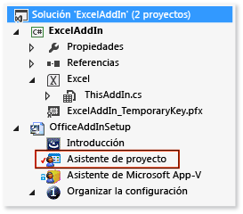
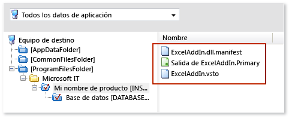
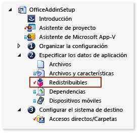
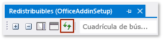

# <a name="deploy-an-office-solution-by-using-windows-installer"></a>Implementación de una solución de Office mediante Windows Installer

Obtenga información sobre cómo crear un archivo de Windows Installer para la solución de Office mediante [!INCLUDE[vs_dev12](../vsto/includes/vs-dev12-md.md)].

Al usar Visual Studio para crear un archivo de Windows Installer, puede implementar una solución de Office que requiera acceso administrativo en el equipo del usuario final. Por ejemplo, puede utilizar este archivo para instalar una solución solo una vez para todos los usuarios de un equipo. También puede implementar una solución de Office mediante ClickOnce, aunque esa solución se debe instalar por separado para cada usuario del equipo.

[!include[Add-ins note](includes/addinsnote.md)]

## <a name="in-this-topic"></a>En este tema

- [Descarga de ejemplos de complementos de VSTO](#Download)

- [Obtener InstallShield Limited Edition](#Obtain)

- [Decidir cómo conceder confianza a la solución](#ApplySecurity)

- [Crear un proyecto de instalación](#Create)

- [Agregar el resultado del proyecto](#Add)

- [Agregar los manifiestos de implementación y de aplicación](#AddD)

- [Configurar los componentes dependientes como requisitos previos](#Configure)

- [Specify where you want to deploy the solution on the user's computer](#Location)

- [Configuración de un complemento de VSTO](#ConfigureRegistry)

- [Configure a Document-Level Customization](#ConfigureDocument)

- [Build the Setup Project](#Build)

Para obtener más información sobre cómo implementar una solución de Office mediante ClickOnce, vea Implementar una [solución de Office mediante ClickOnce.](../vsto/deploying-an-office-solution-by-using-clickonce.md)

Para obtener información sobre cómo crear un archivo Windows Installer mediante , vea [!INCLUDE[vs_dev10_long](../sharepoint/includes/vs-dev10-long-md.md)] [Deploy a Visual Studio 2010 Tools for Office solution using Windows Installer](/previous-versions/visualstudio/visual-studio-2010/ff937654(v=msdn.10)).

## <a name="download-samples"></a><a name="Download"></a>Descargar ejemplos
Este tema hace referencia a los ejemplos descargables siguientes.

|Muestra<br /><br />|Descripción<br /><br />|
|----------|---------------|
|[ExcelAddIn](https://code.msdn.microsoft.com/VSTO-Deploy-an-Office-fbcc09ad)<br /><br />|Complemento VSTO de Excel que se puede instalar en un equipo que ejecute una versión de Office de 32 o de 64 bits.<br /><br />|
|[ExcelWorkbook](https://code.msdn.microsoft.com/VSTO-Deploy-a-Customization-f70fae33)<br /><br />|Personalización de nivel de documento de Excel que se puede instalar en un equipo que ejecute una versión de Office de 32 o de 64 bits.<br /><br />|

## <a name="decide-how-to-grant-trust-to-the-solution"></a><a name="ApplySecurity"></a>Decidir cómo conceder confianza a la solución
Para que una solución pueda ejecutarse en los equipos de los usuarios, debe conceder confianza de una de las siguientes maneras, o los usuarios deben responder al mensaje relativo a la confianza cuando instalen la solución.

- Firmar los manifiestos mediante un certificado que identifique un editor de confianza conocido. Para obtener más información, vea [Confiar en la solución firmando la aplicación y los manifiestos de implementación.](../vsto/granting-trust-to-office-solutions.md#Signing)

- Instale la solución en el directorio Archivos de programa del equipo del usuario.

> [!NOTE]
> En las personalizaciones de nivel de documento, la ubicación del documento también debe ser de confianza. Para obtener más información, vea [Conceder confianza a documentos](../vsto/granting-trust-to-documents.md).

## <a name="get-installshield-limited-edition"></a><a name="Obtain"></a>Obtener InstallShield Limited Edition

Puede crear un archivo de Windows Installer mediante InstallShield Limited Edition (ISLE), que está disponible de forma gratuita si ha instalado Visual Studio. ISLE reemplaza a la funcionalidad de las plantillas de proyecto para la configuración y la implementación de las versiones anteriores de Visual Studio.

### <a name="to-get-installshield-limited-edition"></a>Para obtener InstallShield Limited Edition

1. En la barra de menús, elija **Archivo** > **Nuevo** > **Proyecto**.

   Aparece el cuadro de diálogo **Nuevo proyecto** .

2. En el panel de plantillas, expanda **Otros tipos de proyectos** y después elija la plantilla **Instalación e implementación** .

3. En la lista de tipos de proyecto de **Instalación e implementación**, seleccione **Habilitar InstallShield Limited Edition** y elija el botón **Aceptar** .

   Aparece una página que proporciona información sobre cómo obtener InstallShield Limited Edition.

4. En esa página, elija el vínculo **Vaya al sitio web de descarga** .

5. En la página de descarga de InstallShield Limited Edition, escriba la información necesaria en los campos correspondientes y elija el vínculo **Descargar ahora** .

   Después de descargar, instalar y activar el producto, la plantilla **Proyecto de InstallShield Limited Edition** aparece en Visual Studio.

## <a name="create-a-setup-project"></a><a name="Create"></a>Crear un proyecto de instalación

1. En [!INCLUDE[vsprvs](../sharepoint/includes/vsprvs-md.md)], abra el proyecto de Office que desea implementar.

   Los ejemplos de complementos de VSTO asociados a este tema contienen un proyecto denominado **ExcelAddIn**. Los ejemplos de personalizaciones de nivel de documento contienen un proyecto denominado **ExcelWorkbook**. En este tema se hace referencia al proyecto de Office en la solución mediante uno de los dos nombres.

2. En la barra de menús, elija **Archivo**  >  **Agregar**  >  **nuevo proyecto.**

   Se abre el cuadro de diálogo **Agregar nuevo proyecto** .

3. En el panel de plantillas, expanda **Otros tipos de proyectos** y después elija la plantilla **Instalación e implementación** .

4. En la lista de tipos de proyecto para **Instalación e implementación**, elija **Proyecto de InstallShield Limited Edition**, asigne un nombre al proyecto y elija el botón **Aceptar** .

   El proyecto de instalación de InstallShield que creó aparece en la solución.

   Los ejemplos de este tema contienen un proyecto de instalación que se denomina **OfficeAddInSetup**. En este tema se hace referencia al proyecto de instalación de la solución con el mismo nombre.

## <a name="add-the-project-output"></a><a name="Add"></a>Agregar el resultado del proyecto

Configure el proyecto **OfficeAddInSetup** para incluir el resultado del proyecto de Office. Para los proyectos de complemento de VSTO, el resultado del proyecto es solo el ensamblado de solución. Para los proyectos de personalización de nivel de documento, el resultado del proyecto incluye el ensamblado de solución y, además, el propio documento.

### <a name="to-add-the-project-output"></a>Para agregar el resultado del proyecto

1. En el **Explorador de soluciones**, expanda el nodo de proyecto **OfficeAddInSetup** y, a continuación, elija el archivo **Project Assistant** (Asistente para proyectos), que se muestra en la siguiente ilustración.

   

2. En la barra de menús, elija **Ver**  >  **abrir.**

3. En la parte inferior de la página **Project assistant** (Asistente para proyectos), elija el botón **Archivos de aplicación** , como se muestra en la siguiente ilustración.

   

4. En la página de **Archivos de aplicación** , elija el botón **Agregar resultados del proyecto** .

5. En el cuadro de diálogo del **selector de resultados de Visual Studio** , active la casilla **Resultado principal** y después elija el botón **Aceptar** .

## <a name="add-the-deployment-and-application-manifests"></a><a name="AddD"></a>Agregar los manifiestos de implementación y de aplicación

1. En la página **Archivos de aplicación** , elija el botón **Agregar archivos** .

2. En el cuadro de diálogo **Abrir** , vaya al directorio de resultados del proyecto **ExcelAddIn** .

   Normalmente, el directorio de resultados es la subcarpeta **bin\release** del directorio raíz del proyecto, según la configuración de compilación que elija.

3. En el directorio de resultados, seleccione los archivos **ExcelAddIn.vsto** y **ExcelAddIn.dll.manifest** y elija el botón **Abrir** .

   La página **Archivos de aplicación** contiene ahora el archivo de salida del proyecto, el manifiesto de implementación y el manifiesto de aplicación, como muestra la siguiente ilustración.

   

## <a name="configure-the-dependent-components-as-prerequisites"></a><a name="Configure"></a>Configurar los componentes dependientes como requisitos previos

En la aplicación de instalación, debe incluir los componentes siguientes y cualquier otro componente necesario para ejecutar la solución.

- La versión de .NET Framework a la que se destina la solución de Office.

- Runtime de Microsoft Visual Studio 2010 Tools para Office.

### <a name="add-the-net-framework-4-or-the-net-framework-45-as-a-prerequisite"></a>Agregue el .NET Framework 4 o el .NET Framework 4.5 como requisito previo

1. En el **Explorador de soluciones**, expanda el nodo de proyecto **OfficeAddInSetup** , expanda el nodo **Specify Application Data** (Especificar datos de la aplicación) y, a continuación, elija el archivo de **Redistributables** (Componentes redistribuibles), que se muestra en la siguiente ilustración.

   

2. En la barra de menús, elija **Ver**  >  **abrir.**

   Se abre la página **Redistributables** .

3. En la lista de componentes redistribuibles, active la casilla correspondiente para la versión de .NET Framework de destino de la solución.

   Por ejemplo, si la solución tiene como destino [!INCLUDE[net_v45](../vsto/includes/net-v45-md.md)], active la casilla de **Microsoft .NET Framework 4.5 Full** (Microsoft .NET Framework 4.5 versión completa). Puede aparecer un cuadro de diálogo preguntando si desea instalar el componente redistribuible, que InstallShield requiere para poder agregar el componente como requisito previo. Si no aparece este cuadro de diálogo, el componente ya existe en el equipo.

4. Si aparece el cuadro de diálogo, elija el botón **No** .

### <a name="add-the-visual-studio-2010-tools-for-office-runtime"></a><a name="AddToolsForOffice"></a>Agregar Runtime de Visual Studio 2010 Tools para Office

La página **Redistributables** contiene un elemento denominado **Microsoft VSTO 2010 Runtime**(Tiempo de ejecución de Microsoft VSTO 2010), aunque hace referencia a una versión anterior del runtime. Por lo tanto, podría crear manualmente un archivo de configuración que haga referencia a la versión más reciente. A continuación, coloque el archivo en el mismo directorio que los archivos de configuración de todos los demás elementos que aparecen en la página **Redistributables** .

#### <a name="to-add-the-visual-studio-2010-tools-for-office-runtime-as-a-prerequisite"></a>Para agregar la versión Visual Studio 2010 Tools for Office runtime como requisito previo

1. Abra el Bloc de notas y, a continuación, pegue el siguiente código XML en un archivo de texto.

   ```xml
   <?xml version="1.0" encoding="UTF-8"?>
   <SetupPrereq>
   <conditions>
       <condition Type="32" Comparison="2" Path="HKEY_LOCAL_MACHINE\SOFTWARE\Microsoft\VSTO Runtime Setup\v4R" FileName="Version" ReturnValue="10.0.50903" Bits="2"></condition>
   <condition Type="32" Comparison="2" Path="HKEY_LOCAL_MACHINE\SOFTWARE\Wow6432Node\Microsoft\VSTO Runtime Setup\v4R" FileName="Version" ReturnValue="10.0.50903" Bits="2"></condition>
   </conditions>
   <files>
       <file LocalFile="<ISProductFolder>\SetupPrerequisites\VSTOR\vstor_redist.exe" URL="http://download.microsoft.com/download/C/0/0/C001737F-822B-48C2-8F6A-CDE13B4B9E9C/vstor_redist.exe" CheckSum="88b8aa9e8c90818f98c80ac4dd998b88" FileSize=" 0,40117912"></file>
   </files>
   <execute file="vstor_redist.exe" returncodetoreboot="1641,3010" requiresmsiengine="1">
   </execute>
   <properties Id="{15965040-56BB-49B8-A88F-3525C48D9BA8}" Description="This prerequisite installs the most recent version of the Microsoft Visual Studio 2010 Tools for Office Runtime." >
   </properties>

   </SetupPrereq>
   ```

2. Genere un GUID en Visual Studio. En el menú **Herramientas** , elija **Crear GUID**.

3. En el programa **Generador GUID** , elija el botón de opción **Formato de registro** , elija el botón **Copiar** y, por último, haga clic en el botón **Salir** .

4. En el Bloc de notas, reemplace el texto **Your GUID goes here** por el GUID.

   El **&lt; elemento properties &gt;** del archivo es similar al siguiente.

   ```xml
   <properties Id="{87989B73-21DC-4403-8FD1-0C68A41A6D8C}" Description="This prerequisite installs the most recent version of the Microsoft Visual Studio 2010 Tools for Office Runtime." >
   </properties>
   ```

5. En la barra de menús del Bloc de notas, elija **Guardar**  >  **archivo.**

6. En el cuadro de diálogo **Guardar como** , vaya a la carpeta **Escritorio** .

7. En la **lista Guardar como** tipo, elija Todos los archivos **(&#42;.&#42;).**

8. En el cuadro **Nombre de archivo** , escriba **Runtime de Visual Studio 2010 Tools para Office.prq** y elija el botón **Guardar** .

   > [!NOTE]
   > Asegúrese de agregar **.prq** al final del nombre de archivo para identificarlo como un archivo necesario.

9. Cierre el Bloc de notas.

10. Desde la **carpeta Desktop,** copie el archivo *Visual Studio Tools for Office Runtime.prq de 2010* en uno de los directorios siguientes del equipo.

   Para sistemas operativos de 32 bits: *%ProgramFiles%\InstallShield\2013LE\SetupPrerequisites \\*

   Para sistemas operativos de 64 bits: *%ProgramFiles(x86)%\2013LE\SetupPrerequisites \\*

11. En la página **Redistributable** del proyecto de InstallShield, elija el botón de **actualizar** para actualizar la lista de componentes redistribuibles, como se muestra en la siguiente ilustración.

   

12. En la lista de componentes redistribuibles, active la casilla **Visual Studio 2010 Tools for Office Runtime** (Runtime de Visual Studio 2010 Tools para Office).

   Puede aparecer un cuadro de diálogo preguntando si desea instalar el componente redistribuible. Si este cuadro de diálogo no aparece, [](#Location) puede ir directamente a la sección Especificar dónde desea implementar la solución en el equipo del usuario de este tema.

13. Si aparece el cuadro de diálogo, elija el botón **No** .

## <a name="specify-where-to-install-the-solution-on-the-users-computer"></a><a name="Location"></a>Especificar la ubicación de instalación de la solución en el equipo del usuario

1. En el **Explorador de soluciones**, expanda el nodo **OfficeAddInSetup** , después, expanda el nodo **Organize your Setup** (Organizar la instalación) y, por último, elija el archivo **General Information** (Información general).

2. En la barra de menús, elija **Ver**  >  **abrir.**

3. En la lista de propiedades, elija el botón **Examinar** junto a la propiedad **INSTALLDIR** .

4. En el **cuadro de diálogo Establecer INSTALLDIR,** elija una carpeta en el equipo del usuario donde desea instalar la solución.

   > [!NOTE]
   > También puede crear subdirectorios en el cuadro de diálogo **Set INSTALLDIR** (Establecer INSTALLDIR) abriendo el menú contextual de cualquier carpeta de la lista.

## <a name="configure-a-vsto-add-in"></a><a name="ConfigureRegistry"></a>Configuración de un complemento de VSTO

Puede especificar si desea instalar el complemento VSTO para todos los usuarios del equipo (por equipo) o solo para el usuario que realiza la instalación (por usuario).

Si desea admitir las instalaciones por equipo, cree dos instaladores independientes. Puede dividir los instaladores en función de la versión de Office (32 y 64 bits) o de la versión de Windows (32 bits y 64 bits) que el usuario ejecute.

Las instalaciones por usuario solo requieren un instalador, independientemente de la versión de Office o de Windows que se utilice.

> [!NOTE]
> Esta sección solo se aplica si va a implementar un complemento de VSTO. Si va a implementar una personalización de nivel de documento, puede ir inmediatamente a la [sección Configurar una personalización de nivel de](#ConfigureDocument) documento.

### <a name="to-specify-whether-you-want-to-support-per-user-or-per-computer-installations"></a>Para especificar si desea admitir las instalaciones por usuario o por equipo

1. En el **Explorador de soluciones**, expanda el nodo de proyecto **OfficeAddInSetup** , después, expanda el nodo **Organize Your Setup** (Organizar la instalación) y, por último, elija el archivo **General Information** (Información general).

2. En la barra de menús, elija **Ver**  >  **abrir.**

   Aparecerán las propiedades del proyecto de instalación.

3. En la lista de la propiedad **AllUSERS** , especifique si desea que esta solución se instale para todos los usuarios del equipo o solo para el usuario que instala la solución.

   Para instalar el complemento de VSTO para el usuario actual, elija **ALLUSERS="" (instalación por usuario).** Para instalar el complemento VSTO para todos los usuarios del equipo, elija **ALLUSERS=1 (Per-machine installation)**(ALLUSERS=1 (instalación por equipo)).

   En el siguiente procedimiento, creará claves del Registro para permitir que la aplicación de Office detecte y cargue el complemento de VSTO. Vea [Entradas del Registro para complementos de VSTO.](../vsto/registry-entries-for-vsto-add-ins.md)

### <a name="to-create-registry-keys"></a>Para crear las claves del Registro

1. En el **Explorador de soluciones**, elija el nodo **Project Assistant** (Asistente para proyectos).

   En la barra de menús, elija **Ver**  >  **abrir.**

2. En la parte inferior de la página **Project assistant** (Asistente para proyectos), elija el botón **Application Registry** (Registro de aplicaciones), como se muestra en la siguiente ilustración.

   

   Aparece la página **Application Registry** (Registro de aplicaciones).

3. Cuando se le pregunte **Do you want to configure the registry data that your application will install?**(¿Desea configurar los datos del Registro que la aplicación va a instalar?), elija el botón de opción **Yes** (Sí).

4. En la **lista Vista del** Registro del equipo de destino, agregue la jerarquía de claves que habilita el tipo de instalador que desea crear.

   La ruta de acceso que se configura en esta sección depende de si crea un instalador por usuario o por equipo.

   **Instalador por usuario**

   **HKEY_CURRENT_USER\Software\Microsoft\Office\Excel\Addins\SampleCompany.ExcelAddIn**

   **Instaladores por equipo según la versión de Office**

| Versión de Office<br /><br /> | Ruta de acceso de configuración de InstallShield<br /><br /> |
|----------------------------| - |
| 32 bits<br /><br /> | **HKEY_LOCAL_MACHINE\SOFTWARE(32-Bit)\Microsoft\Office\Excel\Addins\SampleCompany.ExcelAddIn**<br /><br /> |
| 64 bits<br /><br /> | **HKEY_LOCAL_MACHINE\SOFTWARE(64-Bit)\Microsoft\Office\Excel\Addins\SampleCompany.ExcelAddIn**<br /><br /> |

   **Instaladores por equipo según la versión de Windows**

| Versión de Windows<br /><br /> | Ruta de acceso de configuración de InstallShield<br /><br /> |
|-----------------------------| - |
| 32 bits<br /><br /> | **HKEY_LOCAL_MACHINE\SOFTWARE(32-Bit)\Microsoft\Office\Excel\Addins\SampleCompany.ExcelAddIn**<br /><br /> |
| 64 bits<br /><br /> | **HKEY_LOCAL_MACHINE\SOFTWARE(32-Bit)\Microsoft\Office\Excel\Addins\SampleCompany.ExcelAddIn**<br /><br />**HKEY_LOCAL_MACHINE\SOFTWARE(64-Bit)\Microsoft\Office\Excel\Addins\SampleCompany.ExcelAddIn**<br /><br /> |

   > [!NOTE]
   > Un instalador para Windows de 64 bits requiere dos rutas de acceso del Registro porque es posible que los usuarios ejecuten versiones de Office de 32 y 64 bits en un equipo que ejecute Windows de 64 bits.

   > [!NOTE]
   > Como procedimiento recomendado, escriba el nombre de la compañía al principio del nombre del complemento VSTO. Esta convención aumenta la posibilidad de que la clave sea única y disminuye la posibilidad de conflicto con un complemento de VSTO de otro proveedor. Los complementos que tienen el mismo nombre pueden, por ejemplo, sobrescribir las claves del Registro entre ellos. Este método no garantiza que la clave sea única, pero ayuda a reducir posibles conflictos con los nombres.

5. Después de crear la jerarquía de claves, abra el menú contextual de la tecla **SampleCompany.ExcelAddIn,** elija Nuevo y, a continuación, **elija Valor de cadena**.

   El nuevo valor de cadena aparece en **la lista Datos del** Registro del equipo de destino. El nombre del valor de cadena se resalta de modo que se pueda cambiar.

6. Cambie el nombre del valor a **Description**.

7. Repita este proceso para crear los valores siguientes.

|Tipo de valor<br /><br />|Nombre<br /><br />|
|--------------|--------|
|Valor de cadena<br /><br />|**FriendlyName**<br /><br />|
|Valor DWORD<br /><br />|**LoadBehavior**<br /><br />|
|Valor de cadena<br /><br />|**de manifiesto**<br /><br />|

8. Abra el menú contextual del valor **Description** y, a continuación, elija **Modificar**.

   Aparece el cuadro de diálogo **Editar datos** .

9. En el cuadro de texto **Datos del valor** , escriba **Excel Demo Add-In** y elija el botón **Aceptar** .

   Esta descripción aparece cuando el usuario abre la aplicación de Office, abre el cuadro de diálogo **Opciones** y, a continuación, en el panel **Complementos** , elige el complemento VSTO.

10. Abra el menú contextual del valor **FriendlyName** y, a continuación, elija **Modificar**.

   Aparece el cuadro de diálogo **Editar datos** .

11. En el cuadro de texto **Datos del valor** , escriba **Excel Demo Add-In** y elija el botón **Aceptar** .

   Esta cadena aparece en el cuadro de diálogo **Complementos COM** en la aplicación de Office. De forma predeterminada, el valor de la cadena es el identificador del complemento VSTO.

12. Abra el menú contextual del valor **LoadBehavior** y, a continuación, elija **Modificar**.

   Aparece el cuadro de diálogo **Editar datos** .

13. En el cuadro de texto **Datos del valor** , escriba **3** y, a continuación, elija el botón **Aceptar** .

   El valor 3 carga el complemento VSTO cuando se inicia la aplicación. Para obtener más información sobre los valores de LoadBehavior, vea Entradas del Registro [para complementos de VSTO.](../vsto/registry-entries-for-vsto-add-ins.md)

14. Abra el menú contextual del valor **Manifest** y, a continuación, elija **Modificar**.

   Aparece el cuadro de diálogo **Editar datos** .

15. En el cuadro de texto **Datos del valor** , escriba **file:///[INSTALLDIR]ExcelAddIn.vsto|vstolocal** y, a continuación, elija el botón **Aceptar** .

   Runtime de Visual Studio 2010 Tools para Office utiliza esta ruta para buscar el manifiesto de implementación. La parte **[INSTALLDIR]** de esta ruta de acceso es una macro que se asigna a la propiedad **INSTALLDIR** en la página de propiedades **General Information** del programa de instalación de InstallShield. Esta propiedad especifica la ubicación de instalación del complemento VSTO en el equipo de destino. El sufijo **|vstolocal** garantiza que la solución se cargue desde la carpeta de instalación, no desde la memoria caché de ClickOnce.

> [!IMPORTANT]
> Si crea un área de formulario personalizada en un complemento de VSTO para Outlook, debe crear más entradas del Registro para registrar la región con Outlook. Para obtener más información, vea [Entradas del Registro para las regiones de formulario de Outlook.](../vsto/registry-entries-for-vsto-add-ins.md#OutlookEntries)

## <a name="configure-a-document-level-customization"></a><a name="ConfigureDocument"></a>Configure a Document-Level Customization

Esta sección solo se aplica si va a implementar una personalización de nivel de documento. Si va a implementar un complemento de VSTO, puede ir inmediatamente a la sección [Compilación del proyecto de](#Build) instalación.

Las personalizaciones de nivel de documento no usan claves del Registro. En su lugar, las propiedades de documento personalizadas contienen la ubicación del manifiesto de implementación.

Para modificar las propiedades personalizadas, cree un programa que quite la personalización de nivel de documento del documento, modifique las propiedades adecuadas y, a continuación, vuelva a crear la personalización en el documento. Después, se crea una acción personalizada que ejecuta el programa y se agrega al proyecto de instalación.

### <a name="to-create-a-program-that-modifies-document-properties"></a>Para crear un programa que modifique las propiedades del documento

1. En la barra de menús, elija **Archivo**  >  **Agregar**  >  **nuevo proyecto.**

   Aparece el cuadro de diálogo **Agregar nuevo proyecto** .

2. En el panel de plantillas, debajo del nodo del lenguaje que desee usar, elija la carpeta **Windows** .

3. En la lista de tipos de proyecto para **Windows**, elija la plantilla **Aplicación de consola** .

4. Asigne el nombre **SetExcelDocumentProperties** al proyecto y, a continuación, elija el botón **Aceptar** .

5. En el **Explorador de soluciones**, elija el botón **Mostrar todos los archivos** , abra el menú contextual del nodo de proyecto **SetExcelDocumentProperties** y elija **Agregar referencia**.

6. En el cuadro de diálogo **Administrador de referencias** , elija la pestaña **Extensiones** , active la casilla situada junto a los siguientes ensamblados y, después, elija el botón **Aceptar** .

   - Microsoft.VisualStudio.Tools.Applications.Runtime

   - Microsoft.VisualStudio.Tools.Applications.ServerDocument

7. En el **Explorador de soluciones**, elija el archivo **Program.cs** (para las aplicaciones de C#) o el archivo **Module1.vb** (para las aplicaciones de Visual Basic).

8. En la barra de menús, elija **Ver**  >  **Abrir.**

9. Reemplace el contenido de todo el archivo por el código siguiente.

:::code language="vb" source="../vsto/codesnippet/VisualBasic/setexceldocumentproperties/module1.vb" id="Snippet1":::
:::code language="csharp" source="../vsto/codesnippet/CSharp/setexceldocumentproperties/program.cs" id="Snippet1":::

10. Compile el proyecto.

### <a name="to-add-a-custom-action-that-runs-your-program"></a>Para agregar una acción personalizada que ejecute el programa

1. En el **Explorador de soluciones**, expanda el nodo de proyecto **OfficeAddInSetup** y, a continuación, elija el archivo **Project Assistant** (Asistente para proyectos), que se muestra en la siguiente ilustración.

   

2. En la barra de menús, elija **Ver**  >  **Abrir.**

3. En la parte inferior de la página **Project assistant** (Asistente para proyectos), elija el botón **Archivos de aplicación** , como se muestra en la siguiente ilustración.

   

4. En la página de **Archivos de aplicación** , elija el botón **Agregar resultados del proyecto** .

   Aparece el cuadro de diálogo del **selector de resultados de Visual Studio** .

5. Bajo el nodo **SetExcelDocumentProperties** , active la casilla **Resultado principal** y después elija el botón **Aceptar** .

6. En el **Explorador de soluciones**, bajo el nodo **OfficeAddInSetup** , expanda el nodo **Define Setup Requirements and Actions** (Definir acciones y requisitos de instalación) y, después, elija la carpeta **Acciones personalizadas** .

7. En la barra de menús, elija **Ver**  >  **Abrir.**

   Aparece una lista de eventos en un panel a un lado de la pantalla.

   > [!NOTE]
   > Solo algunos de los eventos que aparecen en esta lista están disponibles en InstallShield Limited Edition. En este procedimiento, ejecutará el programa mediante el evento de cuadro de diálogo Después de completar la instalación **correcta.**

8. En la lista de eventos, en **Custom Actions During Installation**(Acciones personalizadas durante la instalación), abra el menú contextual del evento de **cuadro de diálogo de instalación correcta después de la finalización** y, a continuación, elija **New EXE**(Nuevo EXE).

   Aparece una acción personalizada denominada **NewCustomAction1** bajo el evento de **cuadro de diálogo de instalación correcta después de la finalización** . Un conjunto de propiedades para la acción personalizada aparece en un panel junto a los eventos.

   > [!IMPORTANT]
   > Dos eventos de **cuadro de diálogo de instalación correcta después de la finalización** aparecen en la lista de eventos. Asegúrese de elegir la instancia del evento de **cuadro de diálogo de instalación correcta después de la finalización** que aparece bajo el nodo de **Custom Actions During Installation** (Acciones personalizadas durante la instalación).

9. En la lista de la propiedad **Source Location** (Ubicación de origen), elija **Installed with the Product**(Instalado con el producto).

10. Elija el botón **Examinar** junto a la propiedad **Nombre de archivo** .

11. En el cuadro de diálogo de **Browse for a Destination File** (Buscar un archivo de destino), vaya al archivo **SetExcelDocumentProperties.Primary.output** y elija el botón **Abrir** .

    La ubicación de este archivo depende de la carpeta que se especificó para la propiedad **INSTALLDIR** del proyecto de instalación. Por ejemplo, si establece esta propiedad en una carpeta que se denomina **[PersonalFolder]DemoWorkbookApp**, el archivo **SetExcelDocumentProperties.Primary.output** se encuentra en **[ProgramFilesFolder]\DemoWorkbookApp**.

    En los pasos siguientes, se obtiene el identificador de solución del documento y, a continuación, se pasa ese identificador como parámetro a la aplicación de consola. También pasará la ubicación del documento, el manifiesto de implementación y el ensamblado del documento.

12. Abra el menú contextual del proyecto **ExcelWorkbook** y, a continuación, elija **Abrir carpeta en el Explorador de Windows** o **Abrir carpeta en el Explorador de archivos** , según el sistema operativo.

    Se abre la carpeta que contiene la solución.

13. Abra el archivo de proyecto de la solución en el Bloc de notas. Para Visual Basic proyecto, el nombre del archivo es *ExcelWorkbook.vbproj*. Para los proyectos de C#, el nombre del archivo *es ExcelWorkbook.csproj*.

14. En el archivo de proyecto, busque el **&lt; elemento SolutionID, &gt;** copie su valor en el Portapapeles y cierre el Bloc de notas.

    Este valor se transfiere a la aplicación de consola como un parámetro.

15. En la página de propiedades de **NewCustomAction1**, establezca la propiedad de **Línea de comandos** en la siguiente línea de texto.

   ```cmd
   /assemblyLocation="[INSTALLDIR]ExcelWorkbook.dll" /deploymentManifestLocation="[INSTALLDIR]ExcelWorkbook.vsto" /documentLocation="[INSTALLDIR]ExcelWorkbook.xlsx" /solutionID="Your Solution ID"
   ```

16. Reemplace **Your Solution ID** por el identificador de la solución que copió en el Portapapeles.

   > [!IMPORTANT]
   > Pruebe el instalador para comprobar que la aplicación de consola que ejecuta esta acción personalizada tiene acceso a los documentos del directorio [INSTALLDIR]. Algunos directorios del equipo del usuario pueden requerir acceso administrativo (por ejemplo, el directorio Archivos de programa). Si va a implementar la solución en un directorio que  requiere acceso administrativo, debe abrir el  cuadro de diálogo  Propiedades del archivo *setup.exe,* elegir la pestaña Compatibilidad y, a continuación, activar la casilla Ejecutar este programa como administrador antes de distribuir el instalador. Si no desea que los usuarios ejecuten el programa de instalación con permisos administrativos, establezca la propiedad [INSTALLDIR] en un directorio al que probablemente el usuario ya tenga acceso, como el directorio **Documentos.** Para obtener más información, vea [la sección Especificar](#Location) dónde desea instalar la solución en el equipo del usuario de este tema.

## <a name="build-the-setup-project"></a><a name="Build"></a>Build the Setup Project

1. En el **Explorador de soluciones**, expanda el nodo de **Prepare for Release** (Preparar para lanzamiento) y, a continuación, elija el archivo **Versiones** .

2. En la barra de menús, elija **Ver**  >  **abrir.**

   Se abre el explorador de **compilaciones** en un panel lateral para poder elegir el tipo de versión que desea crear.

3. En el explorador de **compilaciones** , elija la carpeta **SingleImage** .

4. En el panel situado junto al explorador de **compilaciones** , elija la pestaña **Setup.exe** .

5. En la página de propiedades de **Setup.exe** , en la lista **InstallShield Prerequisites Location** (Ubicación de los requisitos previos de InstallShield), elija **Download From The Web**(Descargar de la Web).

6. En la barra de menús, elija **Compilar** > **Administrador de configuración**.

7. En la lista **Configuración de soluciones activas** , elija **SingleImage**.

8. En la tabla **Contextos del proyecto** , en la columna **Configuración** del proyecto **OfficeAddInSetup** , elija **SingleImage** y, después, elija el botón **Cerrar** .

9. En la barra de menús, elija **Compilar**  >  **Office BuildAddInSetup**.

   Una vez completada la compilación, puede encontrar el archivo *setup.exe* del proyecto **OfficeAddInSetup** en la siguiente ubicación: <em>OfficeAddInSetupProjectRoot</em>**\OfficeAddInSetup\Express\SingleImage\DiskImages\DISK1 \\**

## <a name="see-also"></a>Consulte también

- [Requisitos previos de la solución de Office para la implementación](/previous-versions/bb608617(v=vs.110))
- [Implementación de una solución de Office](../vsto/deploying-an-office-solution.md)
- [Entradas del Registro para complementos de VSTO](../vsto/registry-entries-for-vsto-add-ins.md)
- [Introducción a las propiedades de documentos personalizados](../vsto/custom-document-properties-overview.md)
- [Concesión de confianza a soluciones de Office](../vsto/granting-trust-to-office-solutions.md)
- [Concesión de confianza a documentos](../vsto/granting-trust-to-documents.md)
- [Implementar una solución Visual Studio Tools for Office de Visual Studio 2010 mediante Windows Installer](/previous-versions/visualstudio/visual-studio-2010/ff937654(v=msdn.10))