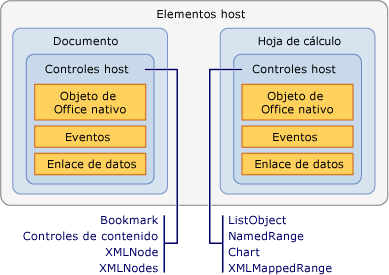

# Información general sobre elementos y controles Host
  Elementos host y los controles host son tipos que ayudan a proporcionar el modelo de programación para las soluciones de Office que se crean con las herramientas de desarrollo de Office en Visual Studio. Tales elementos y controles hacen que la interacción con los modelos de objetos de Microsoft Office Word y Microsoft Office Excel, que se basan en COM, sea más similar a la interacción con objetos administrados como, por ejemplo, los controles de Windows Forms.  
  
 [!INCLUDE[appliesto_controls](../vsto/includes/appliesto-controls-md.md)]  
  
## Elementos host  
 Los elementos host son tipos que están en la parte superior de las jerarquías del modelo de objetos en los proyectos de Office. El [!INCLUDE[vsto_runtime](../vsto/includes/vsto-runtime-md.md)] define los siguientes elementos host para soluciones de Word y Excel:  
  
-   <xref:Microsoft.Office.Tools.Word.Document>  
  
-   <xref:Microsoft.Office.Tools.Excel.Workbook>  
  
-   <xref:Microsoft.Office.Tools.Excel.Worksheet>  
  
-   <xref:Microsoft.Office.Tools.Excel.ChartSheet>  
  
 Cada uno de estos tipos extiende un objeto que existe de forma nativa en el modelo de objetos de Word o Excel, denominado un *objeto nativo de Office*. Por ejemplo, el elemento host <xref:Microsoft.Office.Tools.Word.Document> extiende el objeto <xref:Microsoft.Office.Interop.Word.Document> , que se define en el ensamblado de interoperabilidad primario para Word.  
  
 Los elementos host generalmente tienen la misma funcionalidad básica que los objetos de Office correspondientes, pero están mejorados con las características siguientes:  
  
-   La capacidad de hospedar controles administrados, incluidos los controles host y controles de Windows Forms.  
  
-   Modelos de eventos más completo. Algunos eventos de documento, libro y hoja de cálculo de los modelos de objetos nativos de Word y Excel solo se desencadenan en el nivel de aplicación. Los elementos host proporcionan estos eventos en el nivel de documento para que resulte más fácil controlar los eventos de un documento específico.  
  
### Comprender los elementos host de proyectos de nivel del documento  
 En los proyectos de nivel de documento, los elementos host proporcionan un punto de entrada para el código y tienen diseñadores que ayudan a desarrollar la solución.  
  
 Los elementos host <xref:Microsoft.Office.Tools.Word.Document> y <xref:Microsoft.Office.Tools.Excel.Worksheet> tienen asociados diseñadores que son la representación visual del documento o la hoja de cálculo, como un diseñador de Windows Forms. Puede usar este diseñador para modificar el contenido del documento o la hoja de cálculo directamente en Word o Excel y para arrastrar controles a la superficie de diseño. Para obtener más información, consulte [Document Host Item](../vsto/document-host-item.md) y [Worksheet Host Item](../vsto/worksheet-host-item.md).  
  
 El elemento host <xref:Microsoft.Office.Tools.Excel.Workbook> no actúa como un contenedor para los controles que tienen una interfaz de usuario. En cambio, el diseñador de este elemento host funciona como una bandeja de componentes que permite arrastrar un componente, como <xref:System.Data.DataSet>, a la superficie de diseño. Para obtener más información, consulta [Workbook Host Item](../vsto/workbook-host-item.md).  
  
 No es posible crear elementos host mediante programación en proyectos de nivel de documento. En su lugar, use las clases `ThisDocument`, `ThisWorkbook`o `Sheet`*n* que Visual Studio genera automáticamente en tiempo de diseño en el proyecto. Estas clases generadas se derivan de los elementos host y proporcionan un punto de entrada para el código. Para obtener más información, consulta [Programmatic Limitations of Host Items and Host Controls](../vsto/programmatic-limitations-of-host-items-and-host-controls.md).  
  
### Comprender los elementos host en proyectos de complemento de VSTO  
 De forma predeterminada, al crear un complemento de VSTO, no se tiene acceso a los elementos host. Sin embargo, puede generar en tiempo de ejecución los elementos host <xref:Microsoft.Office.Tools.Word.Document>, <xref:Microsoft.Office.Tools.Excel.Workbook>y <xref:Microsoft.Office.Tools.Excel.Worksheet> en complementos de VSTO para Word y Excel.  
  
 Después de generar un elemento host, puede realizar tareas como agregar controles a documentos. Para obtener más información, consulta [Extending Word Documents and Excel Workbooks in VSTO Add-ins at Run Time](../vsto/extending-word-documents-and-excel-workbooks-in-vsto-add-ins-at-run-time.md).  
  
## Controles host  
 Controles host extienden varios objetos de interfaz de usuario en los modelos de objetos de Word y Excel, como Microsoft.Office.Interop.Word.ContentControl y <xref:Microsoft.Office.Interop.Excel.Range> objetos.  
  
 Los siguientes controles host están disponibles para los proyectos de Excel:  
  
-   [Chart Control](../vsto/chart-control.md)  
  
-   [ListObject (control)](../vsto/listobject-control.md)  
  
-   [NamedRange (control)](../vsto/namedrange-control.md)  
  
-   [XmlMappedRange (control)](../vsto/xmlmappedrange-control.md)  
  
 Los siguientes controles host están disponibles para los proyectos de Word:  
  
-   [Bookmark (Control)](../vsto/bookmark-control.md)  
  
-   [Controles de contenido](../vsto/content-controls.md)  
  
-   [XMLNode (control)](../vsto/xmlnode-control.md)  
  
-   [XMLNodes (control)](../vsto/xmlnodes-control.md)  
  
 Los controles host que se agregan a documentos de Office se comportan como los objetos nativos de Office; sin embargo, los controles host tienen funcionalidad adicional que incluye eventos y capacidades de enlace de datos. Por ejemplo, cuando quiere capturar los eventos de un objeto <xref:Microsoft.Office.Interop.Excel.Range> nativo en Excel, primero debe controlar el evento de cambio de la hoja de cálculo. A continuación, debe determinar si el cambio se produjo dentro de <xref:Microsoft.Office.Interop.Excel.Range>. En cambio, el control host <xref:Microsoft.Office.Tools.Excel.NamedRange> tiene un evento <xref:Microsoft.Office.Tools.Excel.NamedRange.Change> que se puede controlar directamente.  
  
 La relación entre un elemento host y controles host es muy similar a la relación entre un Windows Form y los controles de Windows Forms. Del mismo modo que colocaría un control de cuadro de texto en un Windows Form, se coloca un control <xref:Microsoft.Office.Tools.Excel.NamedRange> en un elemento host <xref:Microsoft.Office.Tools.Excel.Worksheet> . En la siguiente ilustración se muestra la relación entre los elementos host y los controles host.  
  
   
  
 También puede usar controles de Windows Forms en las soluciones de Office agregándolos directamente a la superficie del documento de Word y Excel. Para obtener más información, consulta [Windows Forms Controls on Office Documents Overview](../vsto/windows-forms-controls-on-office-documents-overview.md).  
  
> [!NOTE]  
>  No se permite agregar controles host ni controles de Windows Forms a un subdocumento de Word.  
  
### Agregar controles host a los documentos  
 En los proyectos de nivel de documento, puede agregar controles host a los documentos de Word o a las hojas de cálculo de Excel en tiempo de diseño de las maneras siguientes:  
  
-   Agregue controles host al documento en tiempo de diseño de la misma manera que agregaría un objeto nativo.  
  
-   Arrastre los controles host desde el **Cuadro de herramientas** hasta los documentos y las hojas de cálculo. Los controles host de Excel están disponibles en la pestaña **Controles de Excel** en proyectos de Excel, mientras que los controles host de Word están disponibles en la pestaña **Controles de Word** en proyectos de Word.  
  
-   Arrastre los controles host desde la ventana **Orígenes de datos** hasta los documentos y las hojas de cálculo. Esto permite agregar controles que ya están enlazados a datos. Para obtener más información, consulte [enlazar datos a controles en soluciones de Office](../vsto/binding-data-to-controls-in-office-solutions.md).  
  
 En proyectos de nivel de documento y de complementos de VSTO, también puede agregar algunos controles host a documentos en tiempo de ejecución. Para obtener más información, consulta [Adding Controls to Office Documents at Run Time](../vsto/adding-controls-to-office-documents-at-run-time.md).  
  
 Para obtener más información sobre cómo agregar controles host a documentos, vea los temas siguientes:  
  
-   [Cómo: Agregar controles Chart a hojas de cálculo](../vsto/how-to-add-chart-controls-to-worksheets.md)  
  
-   [Cómo: Agregar controles ListObject a hojas de cálculo](../vsto/how-to-add-listobject-controls-to-worksheets.md)  
  
-   [Cómo: Agregar controles NamedRange a hojas de cálculo](../vsto/how-to-add-namedrange-controls-to-worksheets.md)  
  
-   [Cómo: Agregar controles XMLMappedRange a hojas de cálculo](../vsto/how-to-add-xmlmappedrange-controls-to-worksheets.md)  
  
-   [Cómo: Agregar controles Bookmark a documentos de Word](../vsto/how-to-add-bookmark-controls-to-word-documents.md)  
  
-   [Cómo: Agregar controles de contenido a documentos de Word](../vsto/how-to-add-content-controls-to-word-documents.md)  
  
-   [Cómo: Agregar controles XMLNode a documentos de Word](../vsto/how-to-add-xmlnode-controls-to-word-documents.md)  
  
-   [Cómo: Agregar controles XMLNodes a documentos de Word](../vsto/how-to-add-xmlnodes-controls-to-word-documents.md)  
  
### Asignación de nombres a controles host  
 Si arrastra un control host desde el **Cuadro de herramientas** al documento, se asignará automáticamente un nombre al control. Este nombre se compone del tipo de control con un número incremental al final. Por ejemplo, los marcadores se denominan **bookmark1**, **bookmark2**, etc. Si usa la funcionalidad nativa de Word o Excel para agregar el control, puede asignarle un nombre específico en el momento de crearlo. También puede cambiar el nombre de los controles modificando el valor de la propiedad **Name** en la ventana **Propiedades** .  
  
> [!NOTE]  
>  No es posible usar palabras reservadas para denominar controles host. Por ejemplo, si agrega un el control <xref:Microsoft.Office.Tools.Excel.NamedRange> a una hoja de cálculo y cambia el nombre a **System**, se producen errores al compilar el proyecto.  
  
### Eliminar controles host  
 En los proyectos de nivel de documento, puede eliminar controles host en tiempo de diseño si selecciona el control en la hoja de cálculo de Excel o el documento de Word y presiona la tecla Supr. Sin embargo, debe usar el cuadro de diálogo **Definir nombre** en Excel para eliminar los controles <xref:Microsoft.Office.Tools.Excel.NamedRange> .  
  
 Si agrega un control host a un documento en tiempo de diseño, no debería quitarlo mediante programación en tiempo de ejecución porque la próxima vez que se intente usar el control en el código, se produce una excepción. El método `Delete` de un control host solo quita controles host agregados al documento en tiempo de ejecución. Si se llama al método `Delete` de un control host creado en tiempo de diseño, se produce una excepción.  
  
 Por ejemplo, el método <xref:Microsoft.Office.Tools.Excel.NamedRange.Delete%2A> de un control <xref:Microsoft.Office.Tools.Excel.NamedRange> solo elimina correctamente <xref:Microsoft.Office.Tools.Excel.NamedRange> si se agregó mediante programación a la hoja de cálculo, lo que se conoce como creación de controles host dinámicamente. Los controles host creados dinámicamente también pueden quitarse pasando el nombre del control al método `Remove` de la propiedad <xref:Microsoft.Office.Tools.Excel.Worksheet.Controls%2A> o <xref:Microsoft.Office.Tools.Word.Document.Controls%2A> . Para obtener más información, consulta [Adding Controls to Office Documents at Run Time](../vsto/adding-controls-to-office-documents-at-run-time.md).  
  
 Si los usuarios finales eliminan un control host del documento en tiempo de ejecución, se podrían producir errores inesperados en la solución. Puede usar las características de protección de documentos en Word y Excel para evitar que se eliminen los controles host. Para obtener más información, consulta [Office Development Samples and Walkthroughs](../vsto/office-development-samples-and-walkthroughs.md).  
  
> [!NOTE]  
>  No quite controles mediante programación durante el funcionamiento del controlador de eventos `Shutdown` del documento o la hoja de cálculo. Los elementos de la interfaz de usuario dejan de estar disponibles cuando se produce el evento `Shutdown` . Si quiere quitar controles antes de que se cierre la aplicación, agregue su código a otro controlador de eventos, como, por ejemplo, `BeforeClose` o `BeforeSave`.  
  
### Programar basándose en eventos de controles host  
 Una manera en que los controles host extienden los objetos de Office es agregando eventos. Por ejemplo, el objeto <xref:Microsoft.Office.Interop.Excel.Range> de Excel y el objeto <xref:Microsoft.Office.Interop.Word.Bookmark> de Word no tienen eventos, pero el [!INCLUDE[vsto_runtime](../vsto/includes/vsto-runtime-md.md)] extiende estos objetos agregando eventos programables. Puede obtener acceso y escribir código basado en estos eventos de la misma manera que tiene acceso a los eventos de los controles de Windows Forms: a través de la lista desplegable de eventos en Visual Basic y la página de propiedades de evento en C#. Para obtener más información, consulta [Walkthrough: Programming Against Events of a NamedRange Control](../vsto/walkthrough-programming-against-events-of-a-namedrange-control.md).  
  
> [!NOTE]  
>  No debería establecer la propiedad <xref:Microsoft.Office.Interop.Excel._Application.EnableEvents%2A> del objeto <xref:Microsoft.Office.Interop.Excel.Application> en Excel como **false**. Al establecer esta propiedad en **false** , impide que Excel active cualquier evento, incluidos los eventos de los controles host.  
  
## Vea también  
 [Programmatic Limitations of Host Items and Host Controls](../vsto/programmatic-limitations-of-host-items-and-host-controls.md)   
 [Programming VSTO Add-Ins](../vsto/programming-vsto-add-ins.md)   
 [Programación de personalizaciones de nivel de documento](../vsto/programming-document-level-customizations.md)   
 [Automatizar Word con objetos extendidos](../vsto/automating-word-by-using-extended-objects.md)   
 [Automatizar Excel usando objetos extendidos](../vsto/automating-excel-by-using-extended-objects.md)   
 [Controles en documentos de Office](../vsto/controls-on-office-documents.md)   
 [Enlace de datos a controles en soluciones de Office](../vsto/binding-data-to-controls-in-office-solutions.md)  
  
  