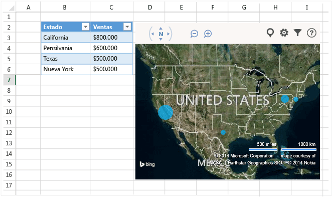
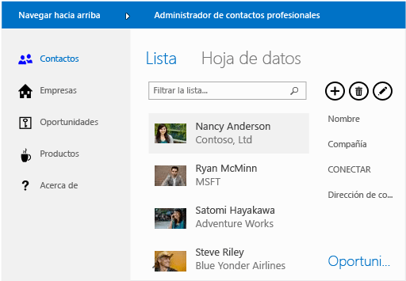

# Office and SharePoint Development in Visual Studio
  Puede ampliar Microsoft Office y SharePoint mediante la creación de una aplicación ligera o un complemento que los usuarios descarguen desde la [Tienda Office](https://store.office.com/) o un catálogo de la organización, o bien mediante la creación de una solución basada en .NET Framework que los usuarios instalen en un equipo.  
  
 En este tema:  
  
-   [Crear complementos para Office y SharePoint](#Apps)  
  
-   [Crear un complemento de VSTO](#Add-ins)  
  
-   [Crear una solución de SharePoint](#Solutions)  
  
##   Crear complementos para Office y SharePoint  
 Office 2013 y SharePoint 2013 presentan un nuevo modelo de complementos que ayuda a compilar, distribuir y rentabilizar los complementos que amplían Office y SharePoint.  Estos complementos se pueden ejecutar en Office o SharePoint Online y los usuarios pueden interactuar con ellos desde muchos dispositivos.  
  
 Descubra cómo usar el nuevo [modelo de complementos de Office](https://msdn.microsoft.com/library/office/jj220082.aspx) a fin de ampliar la experiencia de Office para los usuarios.  
  
 Estos complementos tienen una superficie muy pequeña en comparación con las soluciones y los complementos de VSTO, y puede crearlos con prácticamente cualquier tecnología de programación web, como HTML5, CSS3, JavaScript y XML.  Para comenzar, use Office Developer Tools en Visual Studio o las herramientas ligeras basadas en web con nombre en clave herramientas de desarrollo de Office 365 Napa, que permiten crear proyectos, escribir código y ejecutar complementos en un explorador.  
  
   
  
 **Más información**  
  
|En|Vea|  
|--------|---------|  
|Más información acerca de las herramientas de desarrollo de Office 365 Napa.|[Herramientas de desarrollo de Office 365 Napa](https://msdn.microsoft.com/library/dn974046.aspx)|  
  
### Crear un complemento de Office  
 Puede crear un complemento de Office para ampliar la funcionalidad de Office. Se trata básicamente de una página web que está hospedada en una aplicación de Office, como Word, Excel, Outlook y PowerPoint. La aplicación puede agregar funcionalidad a documentos, hojas de cálculo, mensajes de correo electrónico, citas, presentaciones y proyectos.  
  
 Puede vender la aplicación en la Tienda Office.  En la [Tienda Office](https://store.office.com/), es fácil rentabilizar los complementos, administrar las actualizaciones y hacer un seguimiento de la telemetría. También puede publicar la aplicación para los usuarios por medio de un catálogo de aplicaciones en SharePoint o en Exchange Server.  
  
 La siguiente aplicación para Office muestra datos de una hoja de cálculo en un mapa de Bing.  
  
   
  
 **Más información**  
  
|En|Vea|  
|--------|---------|  
|Obtenga más información sobre los complementos de Office y luego cree uno.|[Complementos de Office](http://msdn.microsoft.com/office/dn448457)|  
|Compare las distintas maneras en que puede ampliar Office para decidir si le conviene usar una aplicación o un complemento de Office.|[Guía básica de los complementos de Office, VSTO y VBA](http://blogs.msdn.com/b/officeapps/archive/2013/06/18/roadmap-for-apps-for-office-vsto-and-vba.aspx)|  
|Más información acerca de las herramientas de desarrollo de Office 365 Napa.|[Herramientas de desarrollo de Office 365 Napa](https://msdn.microsoft.com/library/dn974046.aspx)|  
  
### Crear un complemento de SharePoint  
 Puede compilar un complemento de SharePoint a fin de ampliar la funcionalidad de SharePoint para los usuarios. Es básicamente una aplicación pequeña, fácil de usar e independiente que resuelve una necesidad a nivel de usuario o de empresa.  
  
 Puede vender la aplicación para SharePoint en la [Tienda Office](https://store.office.com/). También puede publicar el complemento para los usuarios por medio de un catálogo de complementos en SharePoint.  Los propietarios de los sitios pueden instalar, actualizar y desinstalar el complemento en sus sitios de SharePoint sin ayuda del administrador de un servidor de la granja o de la colección de sitios.  
  
 A continuación se incluye un ejemplo de una aplicación para SharePoint que ayuda a los usuarios a administrar contactos de negocios.  
  
   
  
 **Más información**  
  
|En|Vea|  
|--------|---------|  
|Obtenga más información sobre los complementos de SharePoint y luego cree uno.|[Complementos de SharePoint](https://msdn.microsoft.com/library/office/fp179930.aspx)|  
|Compare los complementos de SharePoint con las soluciones tradicionales de SharePoint.|[Complementos para SharePoint comparados con las soluciones de SharePoint](http://msdn.microsoft.com/library/office/jj163114.aspx)|  
|Elija si quiere compilar un complemento de SharePoint o una solución de SharePoint.|[Decidir entre los complementos de SharePoint y las soluciones de SharePoint](https://msdn.microsoft.com/library/office/jj163114.aspx)|  
|Más información acerca de las herramientas de desarrollo de Office 365 Napa.|[Herramientas de desarrollo de Office 365 Napa](https://msdn.microsoft.com/library/dn974046.aspx)|  
  
##   Crear un complemento de VSTO  
 Cree un complemento de VSTO para Office 2007 u Office 2010, o para ampliar Office 2013 y Office 2016 con nuevas opciones gracias a los complementos de Office. Los complementos de VSTO solo se ejecutan en el escritorio. Los usuarios deben instalar los complementos de VSTO, por lo que implementarlos y ofrecerles soporte técnico suele ser más difícil.  Sin embargo, su complemento de VSTO se puede integrar más estrechamente en Office. Por ejemplo, puede agregar pestañas y controles a la cinta de Office y realizar tareas de automatización avanzadas, como la combinación de documentos o la modificación de gráficos. Puede aprovechar .NET Framework y usar C\# y Visual Basic para interactuar con objetos de Office.  
  
 Aquí tiene un ejemplo de lo que puede hacer un complemento de VSTO. Este complemento de VSTO agrega controles de la Cinta, un panel de tareas personalizado y un cuadro de diálogo a PowerPoint.  
  
   
  
 **Más información**  
  
|En|Leer|  
|--------|----------|  
|Compare las distintas maneras en que puede ampliar Office y decida si debería usar un complemento de VSTO o un complemento de Office.|[Guía básica de los complementos de Office, VSTO y VBA](http://blogs.msdn.com/b/officeapps/archive/2013/06/18/roadmap-for-apps-for-office-vsto-and-vba.aspx)|  
|Cree un complemento de VSTO.|[Crear complementos de VSTO con Visual Studio](https://msdn.microsoft.com/library/jj620922.aspx)|  
  
##   Crear una solución de SharePoint  
 Cree una solución de SharePoint para SharePoint Foundation 2010 y SharePoint Server 2010, o para ampliar SharePoint 2013 y SharePoint 2016 con nuevas opciones gracias a los complementos de SharePoint.  
  
 Las soluciones de SharePoint requieren servidores de granja de SharePoint locales. Los administradores deben instalarlos y, como las soluciones se ejecutan en SharePoint, pueden afectar al rendimiento del servidor. Sin embargo, las soluciones proporcionan un acceso más detallado a los objetos de SharePoint. Además, cuando se compila una solución de SharePoint, se puede aprovechar .NET Framework y usar C\# y Visual Basic para interactuar con objetos de SharePoint.  
  
 **Más información**  
  
|En|Vea|  
|--------|---------|  
|Comparar soluciones de SharePoint con complementos de SharePoint|[Complementos para SharePoint comparados con las soluciones de SharePoint](http://msdn.microsoft.com/library/office/jj163114.aspx)|  
|Cree una solución de SharePoint.|[Crear soluciones de SharePoint](../sharepoint/create-sharepoint-solutions.md)|  
  
  