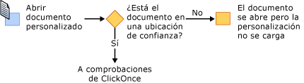
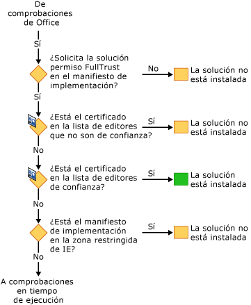
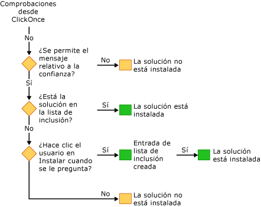

# Asegurar las soluciones de Office
  El modelo de seguridad para soluciones de Office incluye varias tecnologías: [!INCLUDE[vsto_runtime](../vsto/includes/vsto-runtime-md.md)], [!INCLUDE[ndptecclick](../vsto/includes/ndptecclick-md.md)], el Centro de confianza de Microsoft Office y la zona de sitios restringidos de Internet Explorer. En las secciones siguientes se describe el funcionamiento de las distintas características de seguridad:  
  
-   [Otorgar confianza a las soluciones de Office](#GrantingTrustToSolutions)  
  
-   [Otorgar confianza a los documentos](#GrantingTrustToDocuments)  
  
-   [Otorgar confianza al usar Windows Installer](#GrantingTrustWindowsInstaller)  
  
-   [Consideraciones de seguridad específicas para soluciones de Office](#Security)  
  
-   [Seguridad durante el desarrollo](#SecurityDuringDeployment)  
  
-   [Visual Studio Tools para Office Runtime](#VisualStudioToolsForOfficeRuntime)  
  
 [!INCLUDE[appliesto_all](../vsto/includes/appliesto-all-md.md)]  
  
##   Otorgar confianza a las soluciones de Office  
 Otorgar confianza a las soluciones de Office significa modificar la directiva de seguridad de cada usuario final para que se confíe en la solución de Office basándose en la evidencia siguiente:  
  
-   El certificado usado para firmar el manifiesto de implementación.  
  
-   La URL del manifiesto de implementación.  
  
 Para obtener más información, consulte [Otorgar confianza a las soluciones de Office](../vsto/granting-trust-to-office-solutions.md).  
  
##   Otorgar confianza a los documentos  
 Una personalización de nivel de documento requiere que el documento esté en un directorio designado como ubicación de confianza.  Para obtener más información, consulte [Otorgar confianza a los documentos](../vsto/granting-trust-to-documents.md).  
  
##   Otorgar confianza al usar Windows Installer  
 Con Windows Installer puede crear un archivo MSI para instalar soluciones de Office en el directorio Archivos de programa, lo que requiere derechos de administrador.  Visual Studio 2010 Tools para Office Runtime considera que las soluciones de Office del directorio Archivos de programa son de confianza y no muestra el mensaje de confianza de ClickOnce.  
  
##   Consideraciones de seguridad específicas para soluciones de Office  
 Las características de seguridad proporcionadas por [!INCLUDE[net_v40_short](../sharepoint/includes/net-v40-short-md.md)], [!INCLUDE[net_v45](../vsto/includes/net-v45-md.md)] y Microsoft Office pueden contribuir en la protección contra diversas amenazas de seguridad en soluciones de Office.  Para obtener más información, vea [Consideraciones de seguridad específicas para soluciones de Office](../vsto/specific-security-considerations-for-office-solutions.md).  
  
##   Seguridad durante el desarrollo  
 Para facilitar el proceso de desarrollo, cada vez que se compila un proyecto Visual Studio establece la directiva de seguridad que se necesita para ejecutar y depurar la solución en el equipo.  En algunos casos deberá tomar medidas de seguridad adicionales para desarrollar el proyecto.  
  
### Soluciones de nivel de documento  
 La ruta de acceso completa de un documento debe agregarse a la lista de ubicaciones de confianza en la aplicación de Microsoft Office si va a desarrollar los siguientes tipos de proyectos:  
  
-   Las soluciones de nivel de documento que se encuentran en un recurso compartido de red como *\\\\servidor\\recurso\_compartido*.  
  
-   Soluciones de nivel de documento para Word que usan archivos .doc o .docm.  
  
 Incluya los subdirectorios cuando agregue la ubicación del documento a la lista de ubicaciones de confianza, o incluya específicamente las carpetas de depuración y compilación.  Para obtener más información, vea el artículo de ayuda de Microsoft Office Online [Crear, quitar o cambiar una ubicación de confianza de los archivos](https://support.office.com/es-es/article/Create-remove-or-change-a-trusted-location-for-your-files-f5151879-25ea-4998-80a5-4208b3540a62).  
  
### Certificados temporales  
 Visual Studio crea un certificado temporal si no existe ya un certificado de firma.  Use este certificado temporal únicamente durante el desarrollo y adquiera un certificado oficial para la implementación.  
  
 El certificado temporal se genera después de compilar por vez primera un proyecto de Office.  El proyecto se recompila la próxima vez que presiona F5, ya que se marcó como modificado al agregar el certificado.  
  
 Los certificados temporales pueden acumularse pasado un tiempo, por lo que se recomienda borrarlos de vez en cuando.  
  
##   Visual Studio Tools para Office Runtime  
 [!INCLUDE[vsto_runtime](../vsto/includes/vsto-runtime-md.md)] tiene características que comprueban la identidad del publicador y los permisos concedidos a una personalización.  Estos permisos se comprueban mediante una secuencia de comprobaciones de seguridad.  
  
### Seguridad durante la carga de la personalización  
 Cuando se carga una personalización de nivel de documento, [!INCLUDE[vsto_runtime](../vsto/includes/vsto-runtime-md.md)] siempre comprueba si el documento está en la lista de ubicaciones de confianza.  Además, el runtime comprueba si la solución requiere el permiso FullTrust en el manifiesto de aplicación. Mientras se carga la personalización, no realiza ninguna otra comprobación de seguridad.  
  
### Secuencia de comprobaciones de seguridad durante la instalación  
 Cuando una solución de Office se instala o actualiza, [!INCLUDE[vsto_runtime](../vsto/includes/vsto-runtime-md.md)] realiza una serie de comprobaciones de seguridad en una secuencia concreta para tomar una decisión de confianza.  Una solución solo se instala o actualiza si el runtime determina que es de confianza.  
  
 Puede iniciar el proceso de instalación de cuatro maneras: ejecutando el programa de instalación, abriendo el manifiesto de implementación, abriendo el host de la aplicación de Microsoft Office o ejecutando VSTOInstaller.exe.  
  
 La primera comprobación de seguridad tan solo se aplica a las soluciones de nivel de documento.  El documento de una solución de nivel de documento debe estar en una ubicación de confianza.  Si el documento se encuentra en un recurso compartido de una red remota o si tiene una extensión .doc o .docm, la ubicación del documento deberá agregarse a la lista de ubicaciones de confianza.  Para obtener más información, consulte [Otorgar confianza a los documentos](../vsto/granting-trust-to-documents.md).  
  
   
  
 El siguiente conjunto de comprobaciones de seguridad son de [!INCLUDE[vsto_runtime](../vsto/includes/vsto-runtime-md.md)] y ClickOnce.  Para poder pasar estas comprobaciones, las soluciones de Office deben solicitar permisos FullTrust, estar firmadas con un certificado que no aparezca en la lista de editores que no son de confianza, y hallarse en una ubicación que no se encuentre en la zona restringida de Internet Explorer.  Si el certificado está en la lista de editores de confianza, la solución se instala de inmediato.  En caso contrario, si no produjo error en ninguna de las comprobaciones, la solución avanza hasta el conjunto final de las comprobaciones.  
  
   
  
 Si se permite el mensaje de confianza de [!INCLUDE[ndptecclick](../vsto/includes/ndptecclick-md.md)] y aún no se le ha concedido confianza a la solución, el runtime dejará que el usuario final tome la decisión de confianza.  Si el usuario concede confianza a la solución, se agrega una entrada a la lista de inclusión del usuario.  Todas las soluciones de la lista de inclusión del usuario tienen plena confianza y pueden instalarse y ejecutarse.  
  
 A partir de Visual Studio 2010, la lista de inclusión se omite si la solución de Office se instala mediante Windows Installer \(MSI\) en el directorio Archivos de programa.  Para obtener más información, consulte el artículo sobre [Otorgar confianza a las soluciones de Office mediante listas de inclusión](../vsto/trusting-office-solutions-by-using-inclusion-lists.md).  
  
   
  
## Vea también  
 [Otorgar confianza a las soluciones de Office](../vsto/granting-trust-to-office-solutions.md)   
 [Otorgar confianza a los documentos](../vsto/granting-trust-to-documents.md)   
 [Otorgar confianza a las soluciones de Office mediante listas de inclusión](../vsto/trusting-office-solutions-by-using-inclusion-lists.md)   
 [Cómo: Configurar la seguridad de la lista de inclusión](../vsto/how-to-configure-inclusion-list-security.md)   
 [Cómo: Firmar soluciones de Office](../vsto/how-to-sign-office-solutions.md)   
 [Solucionar problemas de seguridad de soluciones de Office](../vsto/troubleshooting-office-solution-security.md)   
 [Manifiestos de aplicación para soluciones de Office](../vsto/application-manifests-for-office-solutions.md)   
 [Manifiestos de implementación para soluciones de Office](../vsto/deployment-manifests-for-office-solutions.md)   
 [Referencia a ClickOnce](../deployment/clickonce-reference.md)   
 [Implementar una solución de Office](../vsto/deploying-an-office-solution.md)  
  
  