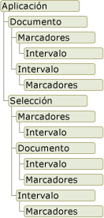

# Información general acerca del modelo de objetos de Word
  Cuando se desarrollan soluciones de Word en Visual Studio, se interactúa con el modelo de objetos de Word. Este modelo de objetos está compuesto de clases e interfaces que se proporcionan en el ensamblado de interoperabilidad primario de Word y que se definen en el espacio de nombres <xref:Microsoft.Office.Interop.Word> .  
  
 [!INCLUDE[appliesto_wdalldocapp](../vsto/includes/appliesto-wdalldocapp-md.md)]  
  
 En este tema se proporciona una breve introducción del modelo de objetos de Word. Para conocer los recursos donde puede obtener más información sobre el modelo de objetos de Word completo, consulte [Usar la documentación del modelo de objetos de Word](#WordOMDocumentation).  
  
 Para obtener información sobre cómo usar el modelo de objetos de Word para efectuar tareas específicas, consulte los siguientes temas:  
  
-   [Trabajar con documentos](../vsto/working-with-documents.md)  
  
-   [Trabajar con texto en documentos](../vsto/working-with-text-in-documents.md)  
  
-   [Trabajar con tablas](../vsto/working-with-tables.md)  
  
##   Descripción del modelo de objetos de Word  
 Word proporciona centenares de objetos con los que se puede interactuar. Estos objetos se organizan en una jerarquía que sigue estrechamente la interfaz de usuario. En la parte superior de la jerarquía se encuentra el objeto <xref:Microsoft.Office.Interop.Word.Application> , que representa la instancia actual de Word. El objeto <xref:Microsoft.Office.Interop.Word.Application> contiene los objetos <xref:Microsoft.Office.Interop.Word.Document>, <xref:Microsoft.Office.Interop.Word.Selection>, <xref:Microsoft.Office.Interop.Word.Bookmark>y <xref:Microsoft.Office.Interop.Word.Range> . Cada uno de estos objetos tiene muchos métodos y propiedades a los que puede tener acceso para manipular e interactuar con el objeto.  
  
 En la siguiente ilustración se muestra una vista de estos objetos en la jerarquía del modelo de objetos de Word.  
  
   
  
 A primera vista, parece que los objetos se superponen. Por ejemplo, los objetos <xref:Microsoft.Office.Interop.Word.Document> y <xref:Microsoft.Office.Interop.Word.Selection> son miembros del objeto <xref:Microsoft.Office.Interop.Word.Application> , pero el objeto <xref:Microsoft.Office.Interop.Word.Document> también es miembro del objeto <xref:Microsoft.Office.Interop.Word.Selection> . Tanto el objeto <xref:Microsoft.Office.Interop.Word.Document> como el objeto <xref:Microsoft.Office.Interop.Word.Selection> contienen objetos <xref:Microsoft.Office.Interop.Word.Bookmark> y <xref:Microsoft.Office.Interop.Word.Range> . El solapamiento se produce porque hay varias maneras de obtener acceso al mismo tipo de objeto. Por ejemplo, se puede aplicar formato a un objeto <xref:Microsoft.Office.Interop.Word.Range> , pero puede que desee tener acceso al intervalo de la selección actual, de un párrafo concreto, de una sección o de todo el documento.  
  
 En las siguientes secciones se describen brevemente los objetos de nivel superior y cómo interactúan entre sí. Estos objetos incluyen los cinco siguientes:  
  
-   Application (objeto)  
  
-   Document (objeto)  
  
-   Selection (objeto)  
  
-   Range (objeto)  
  
-   Bookmark (objeto)  
  
 Además del modelo de objetos de Word, los proyectos de Office en Visual Studio proporcionan *elementos host* y *controles host* que extienden algunos objetos del modelo de objetos de Word. Los elementos y controles host se comportan como los objetos de Word que extienden, pero tienen también una funcionalidad adicional, como capacidades de enlace de datos y eventos adicionales. Para obtener más información, consulte [Automating Word by Using Extended Objects](../vsto/automating-word-by-using-extended-objects.md) y [Host Items and Host Controls Overview](../vsto/host-items-and-host-controls-overview.md).  
  
### Application (objeto)  
 El objeto <xref:Microsoft.Office.Interop.Word.Application> representa la aplicación de Word y es el primario de los demás objetos. Sus miembros normalmente son aplicables a Word en su totalidad. Puede usar sus propiedades y métodos para controlar el entorno de Word.  
  
 En los proyectos de complemento de VSTO, puede acceder al objeto <xref:Microsoft.Office.Interop.Word.Application> mediante el campo `Application` de la clase `ThisAddIn` . Para obtener más información, consulta [Programming VSTO Add-Ins](../vsto/programming-vsto-add-ins.md).  
  
 En los proyectos de nivel de documento, puede obtener acceso al objeto <xref:Microsoft.Office.Interop.Word.Application> mediante la propiedad <xref:Microsoft.Office.Tools.Word.Document.Application%2A> de la clase `ThisDocument` .  
  
### Document (objeto)  
 El objeto <xref:Microsoft.Office.Interop.Word.Document> es fundamental para la programación de Word. Representa un documento y todo su contenido. Al abrir un documento o crear uno nuevo, se crea un nuevo objeto <xref:Microsoft.Office.Interop.Word.Document> que se agrega a la colección <xref:Microsoft.Office.Interop.Word.Documents> del objeto <xref:Microsoft.Office.Interop.Word.Application> . El documento que tiene el foco se llama documento activo. Se representa mediante la propiedad <xref:Microsoft.Office.Interop.Word._Application.ActiveDocument%2A> del objeto <xref:Microsoft.Office.Interop.Word.Application> .  
  
 Las herramientas de desarrollo de Office en Visual Studio extienden el objeto <xref:Microsoft.Office.Interop.Word.Document> proporcionando el tipo <xref:Microsoft.Office.Tools.Word.Document> . Este tipo es un *elemento host* que proporciona acceso a todas las características de un objeto <xref:Microsoft.Office.Interop.Word.Document> y agrega eventos adicionales, además de aportar la capacidad de agregar controles administrados.  
  
 Cuando se crea un proyecto de nivel de documento, puede obtener acceso a los miembros de <xref:Microsoft.Office.Tools.Word.Document> mediante la clase `ThisDocument` generada en el proyecto. Puede obtener acceso a los miembros del elemento host <xref:Microsoft.Office.Tools.Word.Document> usando las palabras clave **Me** o **this** desde el código en la clase `ThisDocument` o usando `Globals.ThisDocument` desde el código fuera de la clase `ThisDocument` . Para obtener más información, consulta [Programming Document-Level Customizations](../vsto/programming-document-level-customizations.md). Por ejemplo, para seleccionar el primer párrafo del documento, use el siguiente código.  
  
 [!code-vb[Trin_VstcoreWordAutomation#120](../vsto/codesnippet/VisualBasic/Trin_VstcoreWordAutomationVB/ThisDocument.vb#120)]
 [!code-csharp[Trin_VstcoreWordAutomation#120](../vsto/codesnippet/CSharp/Trin_VstcoreWordAutomationCS/ThisDocument.cs#120)]  
  
 En los proyectos de complemento de VSTO, puede generar elementos host <xref:Microsoft.Office.Tools.Word.Document> en tiempo de ejecución. Puede usar el elemento host generado para agregar controles al documento asociado. Para obtener más información, consulta [Extending Word Documents and Excel Workbooks in VSTO Add-ins at Run Time](../vsto/extending-word-documents-and-excel-workbooks-in-vsto-add-ins-at-run-time.md).  
  
### Selection (objeto)  
 El objeto <xref:Microsoft.Office.Interop.Word.Selection> representa el área actualmente seleccionada. Al efectuar una operación en la interfaz de usuario de Word, como poner un texto en negrita, seleccione o resalte el texto y, después, aplique el formato. El objeto <xref:Microsoft.Office.Interop.Word.Selection> siempre está presente en un documento. Si no hay nada seleccionado, representa el punto de inserción. Además, una selección puede estar formada por varios bloques de texto no contiguos.  
  
### Range (objeto)  
 El objeto <xref:Microsoft.Office.Interop.Word.Range> representa un área contigua de un documento y se define mediante una posición de carácter inicial y una posición de carácter final. Se pueden usar varios objetos <xref:Microsoft.Office.Interop.Word.Range> a la vez. Asimismo, se pueden definir varios objetos <xref:Microsoft.Office.Interop.Word.Range> en el mismo documento. El objeto <xref:Microsoft.Office.Interop.Word.Range> tiene las siguientes características:  
  
-   Puede estar formado solo por el punto de inserción, un intervalo de texto o el documento completo.  
  
-   Incluye caracteres no imprimibles como espacios, caracteres de tabulación y marcas de párrafo.  
  
-   Puede ser el área representada por la selección actual o puede representar un área diferente de la selección actual.  
  
-   No está visible en los documentos, a diferencia de una selección, que siempre está visible.  
  
-   No se guarda con un documento y solo existe mientras se ejecuta el código.  
  
 Cuando se inserta texto al final de un intervalo, Word lo amplía automáticamente para que incluya el texto insertado.  
  
### Objetos de control de contenido  
 Un <xref:Microsoft.Office.Interop.Word.ContentControl> permite controlar la entrada y la presentación de texto y otros tipos de contenido en documentos de Word. Un <xref:Microsoft.Office.Interop.Word.ContentControl> puede mostrar varios tipos diferentes de interfaz de usuario que se optimizan para su uso en documentos de Word, como un control de texto enriquecido, un selector de fecha o un cuadro combinado. También puede usar un <xref:Microsoft.Office.Interop.Word.ContentControl> para evitar que los usuarios editen secciones del documento o la plantilla.  
  
 Visual Studio extiende el objeto <xref:Microsoft.Office.Interop.Word.ContentControl> en varios controles host diferentes. Mientras que el objeto <xref:Microsoft.Office.Interop.Word.ContentControl> puede mostrar cualquiera de los diferentes tipos de interfaz de usuario disponibles para los controles de contenido, Visual Studio proporciona un tipo distinto para cada control de contenido. Por ejemplo, puede usar un <xref:Microsoft.Office.Tools.Word.RichTextContentControl> para crear un control de texto enriquecido o un <xref:Microsoft.Office.Tools.Word.DatePickerContentControl> para crear un selector de fecha. Estos controles host se comportan como un <xref:Microsoft.Office.Interop.Word.ContentControl>nativo, pero incluyen eventos adicionales y funciones de enlace de datos. Para obtener más información, consulta [Content Controls](../vsto/content-controls.md).  
  
### Bookmark (objeto)  
 El objeto <xref:Microsoft.Office.Interop.Word.Bookmark> representa un área contigua en un documento, con una posición inicial y una posición final. Los marcadores se pueden usar para marcar una ubicación en un documento o como contenedores de texto en un documento. Un objeto <xref:Microsoft.Office.Interop.Word.Bookmark> puede constar del punto de inserción, o bien, puede contener todo el documento. Un objeto <xref:Microsoft.Office.Interop.Word.Bookmark> tiene las siguientes características que lo distinguen del objeto <xref:Microsoft.Office.Interop.Word.Range> :  
  
-   Puede asignar un nombre al marcador en tiempo de diseño.  
  
-   Los objetos<xref:Microsoft.Office.Interop.Word.Bookmark> se guardan con el documento y, por lo tanto, no se eliminan cuando se detiene la ejecución del código o se cierra el documento.  
  
-   Los marcadores pueden estar ocultos o hacerse visibles estableciendo la propiedad <xref:Microsoft.Office.Interop.Word.View.ShowBookmarks%2A> de la clase <xref:Microsoft.Office.Interop.Word.View> en **false** o **true**.  
  
 Visual Studio extiende el objeto <xref:Microsoft.Office.Interop.Word.Bookmark> proporcionando el control host <xref:Microsoft.Office.Tools.Word.Bookmark> . El control host <xref:Microsoft.Office.Tools.Word.Bookmark> se comporta como un objeto <xref:Microsoft.Office.Interop.Word.Bookmark>nativo, pero incluye eventos adicionales y funciones de enlace de datos. Puede enlazar datos a un control Bookmark de un documento de la misma manera que se enlazan datos a un control de cuadro de texto en un Windows Forms. Para obtener más información, consulta [Bookmark Control](../vsto/bookmark-control.md).  
  
##   Usar la documentación del modelo de objetos de Word  
 Para obtener información completa sobre el modelo de objetos de Word, puede consultar la referencia del ensamblado de interoperabilidad primario (PIA) de Word y la referencia del modelo de objetos de Visual Basic para aplicaciones (VBA).  
  
### Referencia de ensamblado de interoperabilidad primario  
 La documentación de referencia de los PIA de Word describe los tipos del ensamblado de interoperabilidad primario para Word. Esta documentación está disponible en la siguiente ubicación: [Referencia de ensamblados de interoperabilidad primarios de Word 2010](http://go.microsoft.com/fwlink/?LinkId=189588).  
  
 Para obtener más información sobre el diseño de los ensamblados de interoperabilidad primarios (PIA) de Word, como las diferencias entre las clases y las interfaces en los PIA y cómo se implementan los eventos en los PIA, consulte [Información general sobre las clases y las interfaces de los ensamblados de interoperabilidad primarios de Office](http://go.microsoft.com/fwlink/?LinkId=189592).  
  
### Referencia del modelo de objetos de VBA  
 La referencia del modelo de objetos de VBA documenta el modelo de objetos de Word, tal como se expone en el código de VBA. Para más información, vea la [Referencia del modelo de objetos de Word 2010](http://go.microsoft.com/fwlink/?LinkId=199772).  
  
 Todos los objetos y miembros de la referencia del modelo de objetos de VBA corresponden a tipos y miembros del PIA de Word. Por ejemplo, el objeto de documento en la referencia del modelo de objetos VBA corresponde a la <xref:Microsoft.Office.Interop.Word.Document> objeto en los PIA de Word. Aunque la referencia del modelo de objetos VBA proporciona ejemplos de código para la mayoría de las propiedades, métodos y eventos, debe traducir el código VBA de esta referencia a Visual Basic o Visual C# si quiere usarlo en un proyecto de Word creado con Visual Studio.  
  
## Vea también  
 [Ensamblados de interoperabilidad primarios de Office](../vsto/office-primary-interop-assemblies.md)   
 [Automatizar Word con objetos extendidos](../vsto/automating-word-by-using-extended-objects.md)   
 [Trabajar con documentos](../vsto/working-with-documents.md)   
 [Trabajar con texto en documentos](../vsto/working-with-text-in-documents.md)   
 [Trabajar con tablas](../vsto/working-with-tables.md)   
 [Host Items and Host Controls Overview](../vsto/host-items-and-host-controls-overview.md)   
 [Programmatic Limitations of Host Items and Host Controls](../vsto/programmatic-limitations-of-host-items-and-host-controls.md)   
 [Parámetros opcionales en las soluciones de Office](../vsto/optional-parameters-in-office-solutions.md)  
  
  