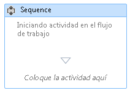
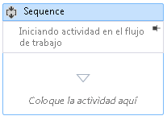

# Agregar comentarios a un flujo de trabajo en el Diseñador de flujo de trabajo

Para facilitar la creación de flujos de trabajo más grandes y complejos, .NET Framework 4,5 permite al desarrollador agregar anotaciones a los siguientes tipos de elemento en el diseñador:

- <xref:System.Activities.Activity>

- <xref:System.Activities.Statements.State>

- <xref:System.Activities.Statements.Transition>

- Clases derivadas de <xref:System.Activities.Statements.FlowNode>.

- <xref:System.Activities.Variable>

- <xref:System.Activities.Argument>

> [!IMPORTANT]
> El contenido de una anotación se guarda como texto sin formato en el archivo XAML asociado al flujo de trabajo y podrían leerlo otras personas. Tenga cuidado al especificar información confidencial en una anotación.

## Agregar una anotación a una actividad en el diseñador

1. En el diseñador de flujo de trabajo, haga clic con el botón derecho en un elemento en el diseñador de flujo de trabajo y seleccione **anotaciones**, **Agregar anotación**.

1. Agregue el texto de la anotación en el espacio proporcionado.

   El elemento muestra un icono de anotación. Al mantener el puntero sobre el icono de anotación se muestra el texto de la anotación.

## Mostrar una anotación en el diseñador de una actividad

1. Con un diseñador de actividad que tiene una anotación que se muestra fuera de la actividad, haga clic en el icono de **anclaje** en el adorno de anotación.

   La anotación se muestra en el diseñador de la actividad. En la captura de pantalla siguiente, la anotación "Iniciando actividad en el flujo de trabajo" se muestra en el diseñador de la actividad.

   

2. Para mostrar la anotación fuera del diseñador de la actividad, mantenga el mouse sobre el área de anotación en el diseñador de la actividad y haga clic en el icono **desanclar** .

   

## Mostrar u ocultar todas las anotaciones

1. Haga clic con el botón secundario en una actividad que tiene una anotación. Seleccione **anotaciones** y **muestre todas las anotaciones**.

   Todas las anotaciones se muestran en los diseñadores de la actividad.

1. Para mostrar todas las anotaciones fuera de los diseñadores de la actividad, haga clic con el botón derecho en la actividad y seleccione **anotaciones**, **ocultar todas las anotaciones**.

## Editar o eliminar una anotación para una actividad

1. Haga clic con el botón secundario en una actividad que tiene una anotación.

1. Seleccione **anotaciones**, **Editar** anotación o **eliminar anotación**.

   La anotación se abre para su edición o eliminación.

1. Para eliminar todas las anotaciones al mismo tiempo, haga clic con el botón secundario en el diseñador de flujo de trabajo y seleccione **anotación**, **eliminar todas las anotaciones**.

## Agregar, editar y eliminar una anotación para una variable o argumento

1. Haga clic con el botón secundario en una variable o argumento y seleccione Agregar anotación.

1. Escriba el texto de la anotación. La variable o argumento muestra un icono de anotación.

1. Haga clic con el botón secundario en una variable o argumento que tiene una anotación. Seleccione Editar anotación.

   La anotación se abre para su edición.

1. Haga clic con el botón secundario en una variable o argumento que tiene una anotación. Seleccione Eliminar anotación.

   Se elimina la anotación.
