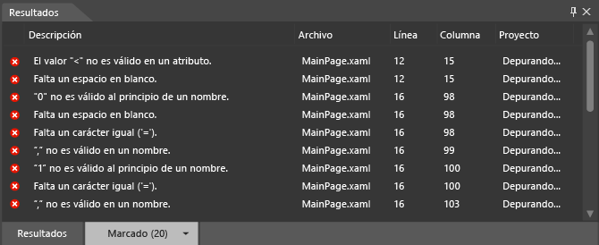
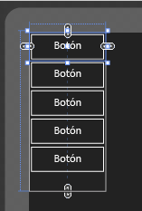

# <a name="debug-xaml-in-blend"></a>Depurar XAML en Blend

Puede usar las herramientas de Blend para Visual Studio para depurar el XAML en la aplicación. Al compilar un proyecto, los errores se muestran en el panel **Resultados**. Haz doble clic en un error para buscar el marcado relacionado con el error. Si necesita más espacio para trabajar, puede ocultar el panel **resultados** presionando **F12**.

## <a name="syntax-errors"></a>Errores de sintaxis

Los errores de sintaxis se producen cuando el código XAML o los archivos de código subyacente no cumplen las reglas de formato del lenguaje. La descripción del error puede ayudarte a solucionarlo. La lista especifica también el nombre del archivo y el número de línea en que se produce el error. Los errores de XAML se muestran en la pestaña **Marcado** en el panel **Resultados**.

> [!TIP]
> XAML es un lenguaje de marcado basado en XML y sigue las reglas sintácticas de XML.

Entre las causas comunes de errores de sintaxis de XAML, figuran las siguientes:

- Una palabra clave tiene errores ortográficos o el uso de las mayúsculas no es correcto.

- Faltan las comillas en atributos o cadenas de texto.

- A un elemento XAML le falta una etiqueta de cierre.

- Un elemento XAML está en una ubicación no permitida.

Para obtener más información sobre la sintaxis común de XAML, consulte [Guía de sintaxis XAML básica](/windows/uwp/xaml-platform/xaml-syntax-guide).

También puede identificar y resolver errores simples de sintaxis de código subyacente, errores de compilación y errores en tiempo de ejecución en Blend. Pero puede que te resulte más fácil identificar y resolver los errores del código subyacente en Visual Studio.

### <a name="debugging-sample-xaml-code"></a>Depurar código XAML de ejemplo

En el ejemplo siguiente se le guiará a través de una sesión de depuración XAML simple en Blend.

#### <a name="to-create-a-project"></a>Para crear un proyecto

1. En Blend, abra el menú **archivo** y, a continuación, haga clic en **nuevo proyecto**.

    En el cuadro de diálogo **Nuevo proyecto**, aparece a la izquierda una lista de tipos de proyecto. Cuando hagas clic en un tipo de proyecto, las plantillas de proyecto asociadas a ese tipo aparecerán a la derecha.

2. En la lista de tipos de proyecto, haga clic en **Windows universal**.

3. En la lista de plantillas de proyecto, haga clic en **aplicación vacía (Windows universal)**.

4. En el cuadro de texto **nombre** , escriba `DebuggingSample` .

5. En el cuadro de texto **Ubicación**, compruebe la ubicación del proyecto.

6. En la lista **Lenguaje**, haga clic en **Visual C#** y después en **Aceptar** para crear el proyecto.

7. Haga clic con el botón derecho en la superficie de diseño y haga clic en **Ver código fuente** para cambiar a la vista **Dos paneles**.

8. Copie el código siguiente haciendo clic en el vínculo **Copiar** situado en la esquina superior derecha del código.

   ```xml
   <Grid HorizontalAlignment="Left" Height="222" VerticalAlignment="Top>
        <Button content="Button" x:Mame="Home" HorizontalAlignment="Left" VerticalAlignment="Top"/>
        <Button Content="Button" HorizontalAlignment="Left" VerticalAlignment="Top" Margin="0,38,0,0">
        <Button Content="Button" HorizontalAlignment="Left" VerticalAlignment="Top" Margin="0,75,0,0"/>
        <Button Content="Button" HorizontalAlignment="Left" VerticalAlignment="Top" Margin="0,112,0,0"/>
        <Button Content="Button" HorizontalAlignment="Left" VerticalAlignment="Top Margin="0,149,0,0"/>
   </Grid>
   ```

9. Busque la **cuadrícula** predeterminada y pega el código entre las etiquetas de apertura y cierre de la **cuadrícula**. Cuando termines, el código debe tener un aspecto similar al siguiente:

    ```xml
    <Grid Background="{ThemeResource ApplicationPageBackgroundThemeBrush}">
         <Grid HorizontalAlignment="Left" Height="222" VerticalAlignment="Top>
              <Button content="Button" x:Mame="Home" HorizontalAlignment="Left" VerticalAlignment="Top"/>
              <Button Content="Button" HorizontalAlignment="Left" VerticalAlignment="Top" Margin="0,38,0,0">
              <Button Content="Button" HorizontalAlignment="Left" VerticalAlignment="Top" Margin="0,75,0,0"/>
              <Button Content="Button" HorizontalAlignment="Left" VerticalAlignment="Top" Margin="0,112,0,0"/>
              <Button Content="Button" HorizontalAlignment="Left" VerticalAlignment="Top Margin="0,149,0,0"/>
         </Grid>
    </Grid>
    ```

10. Presione **Ctrl** + **MAYÚS** + **B** para compilar el proyecto.

    Aparece un mensaje de error para avisarle de que el proyecto no se puede compilar, y el panel **Resultados** con los errores aparece en la parte inferior de la aplicación.

    

### <a name="resolve-xaml-errors"></a>Resolver errores de XAML

Cuando se detectan errores de XAML, la superficie de diseño muestra una alerta de que el proyecto contiene marcado no válido. La lista de errores del panel **Resultados** se actualiza conforme resuelves los errores. Cuando haya resuelto todos los errores, se habilitará la superficie de diseño y su aplicación se mostrará en ella.

#### <a name="to-resolve-the-xaml-errors"></a>Para resolver los errores de XAML

1. Haz doble clic en el primer error de la lista. La descripción es "el valor ' < ' no es válido en un atributo". Al hacer doble clic en el error, el puntero busca la ubicación correspondiente en el código. El elemento `<` que aparece delante de `Button` es válido, y no es un atributo como se indica en el mensaje de error. Si examinas la línea de código anterior, observarás que faltan las comillas de cierre del atributo `Top`. Escribe las comillas de cierre. Observe que la lista de errores del panel **Resultados** se actualiza para reflejar los cambios.

2. Haga doble clic en la descripción "' 0 ' no es válido al principio de un nombre". `Margin="0,149,0,0"` parece ser correcto. De todos modos, observa que la codificación de color de `Margin` no coincide con las demás instancias de `Margin` en el código. Como faltan las comillas de cierre del par de nombre-valor anterior (`VerticalAlignment="Top`), `Margin="` se interpreta como parte del valor del atributo anterior y 0, como el principio de un par nombre-valor. Escribe las comillas de cierre de `Top`. La lista de errores del panel **Resultados** se actualiza para reflejar los cambios.

3. Haz doble clic en el otro error: "La etiqueta XML de cierre 'Button' no tiene una etiqueta de apertura correspondiente". El puntero se coloca en la etiqueta **Cuadrícula** de cierre (`</Grid>`), lo que sugiere que el error está dentro del objeto `Grid`. Observa que al segundo objeto `Button` le falta la etiqueta de cierre. Cuando agregue la `/` de cierre, la lista del panel **Resultados** se actualizará. Ahora que se han resuelto estos errores iniciales, se han identificado dos errores más.

4. Haz doble clic en "No se reconoce o no se puede tener acceso al miembro 'content'". La c `c` de `content` debería estar en mayúsculas. Sustituye la "c" minúscula por una "c" mayúscula.

5. Haga doble clic en "la propiedad ' MAME ' no existe en el `http://schemas.microsoft.com/winfx/2006/xaml` espacio de nombres". La "M" de "Mame" debería ser una "N". Sustituye la "M" por una "N". Ahora que se puede analizar el código XAML, la aplicación aparece en la superficie de diseño.

    

    Presione **Ctrl** + **MAYÚS** + **B** para compilar el proyecto y confirmar que no hay ningún error restante.

## <a name="debug-in-visual-studio"></a>Depurar en Visual Studio

Puede abrir proyectos de Blend en Visual Studio para depurar más fácilmente el código en la aplicación. Para abrir un proyecto de Blend en Visual Studio, haga clic con el botón derecho en el proyecto en el panel **proyectos** y, después, haga clic en **Editar en Visual Studio**. Una vez finalizada la sesión de depuración en Visual Studio, presione Ctrl + Mayús + S para guardar todos los cambios y, a continuación, cambie de nuevo a Blend. Se te preguntará si deseas recargar el proyecto. Haga clic en **sí a todo** para seguir trabajando en Blend.

Para obtener más información sobre cómo depurar la aplicación, vea [depurar aplicaciones para UWP en Visual Studio](../debugger/debugging-windows-store-and-windows-universal-apps.md).

## <a name="get-help"></a>Obtener ayuda

Si necesita más ayuda para depurar la aplicación de Blend, puede buscar en los foros de la [comunidad de aplicaciones para UWP](https://social.msdn.microsoft.com/Forums/windowsapps/home?category=windowsapps) los comentarios relacionados con su problema o publicar una pregunta.
