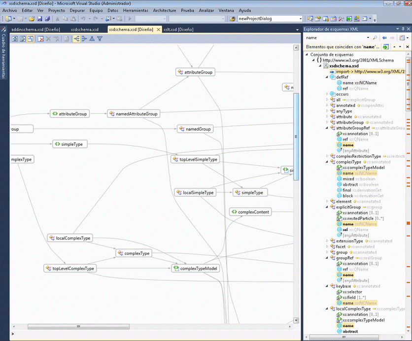
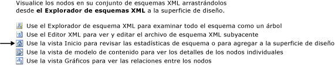

# Vista de gráfico

La vista Gráfico proporciona una representación gráfica de los nodos de esquema globales y de las relaciones entre ellos. Tenga en cuenta que la vista Gráfico no le permite modificar el diseño del conjunto de esquemas en la superficie de diseño. La vista Gráfico también incluye la barra de herramientas del Diseñador de esquemas XML y la barra de ruta de navegación.

 La imagen siguiente muestra la vista Gráfico con seis nodos globales en su superficie de diseño.

 

## Superficie de diseño

 La superficie de diseño de la vista gráfico muestra el contenido de la [área de trabajo de diseñador de esquemas XML](../xml-tools/xml-schema-designer-workspace.md). Si el área de trabajo contiene nodos globales del conjunto de esquemas, dichos nodos se muestran en la superficie de diseño de la vista Gráfico y se dibujan flechas entre los nodos que tienen relaciones.

 Haga doble clic en un nodo en la vista Gráfico para mostrar el Editor XML.

 Para eliminar los nodos seleccionados del área de trabajo, use la barra de herramientas del diseñador XSD o **eliminar** clave.

 Si la superficie de diseño está en blanco, el Editor XML, el **Explorador de esquemas XML**, y se muestran la marca de agua. El *marca de agua* es una lista de vínculos a todas las vistas del diseñador XSD.

 

 Si el conjunto de esquemas tiene errores, se muestra el texto siguiente al final de la lista: "Use la lista de errores para ver y corregir los errores en el conjunto de esquemas".

## Barra de ruta de navegación

 La barra de ruta de navegación situada en la parte inferior de la vista Gráfico muestra la ubicación del nodo seleccionado en el conjunto de esquemas. Si se han seleccionado varios elementos, la barra de ruta de navegación estará en blanco.

## Menú contextual

 En la tabla siguiente se describen las opciones disponibles para todos los nodos existentes en la superficie de diseño de la vista Gráfico.

|Opción|Descripción|
|------------|-----------------|
|**Mostrar en Explorador de esquemas XML**|Coloca el foco en el Explorador de esquemas y resalta el nodo del conjunto de esquemas.|
|**Mostrar en vista de gráfico**|Cambia a la vista Gráfico (deshabilitado).|
|**Generar XML de ejemplo**|Disponible solo para los elementos globales. Genera un archivo XML de ejemplo para el elemento global.|
|**Borrar área de trabajo**|Borra el área de trabajo y la superficie de diseño.|
|**Quitar del área de trabajo**|Quita los nodos seleccionados del área de trabajo y de la superficie de diseño.|
|**Quitar todo salvo la selección de área de trabajo**|Quita los nodos que no están seleccionados del área de trabajo y de la superficie de diseño.|
|**Exportar diagrama como imagen**|Guarda la superficie de diseño en un archivo XPS.|
|**Seleccionar todo**|Selecciona todos los nodos de la superficie de diseño.|
|**Ver código**|Abre el archivo que contiene el nodo seleccionado en el Editor XML. El elemento seleccionado en el **Explorador de esquemas XML** también está seleccionada en el Editor XML.|
|**Propiedades (ventana)**|Se abre la **propiedades** ventana (si no está ya abierto). Esta ventana muestra información sobre el nodo.|

 Además de las opciones comunes descritas anteriormente, el menú contextual para los elementos globales también tiene las opciones siguientes:

|Opción|Descripción|
|------------|-----------------|
|**Agregar definición de tipo**|Agrega el tipo base al diagrama.|
|**Agregar todas las referencias**|Agrega todos los nodos que hacen referencia al elemento y dibuja flechas para indicar las relaciones entre ellos.|
|**Agregar a miembros del grupo de sustitución**|Agrega todos los miembros del grupo de sustitución. Esta opción aparece en la vista si el elemento es el encabezado o un miembro de un grupo de sustitución.|
|**Generar XML de ejemplo**|Genera un archivo XML de ejemplo para el elemento global.|

 Además de las opciones comunes descritas anteriormente, el menú contextual para los tipos simples y complejos globales también tiene las opciones siguientes:

|Opción|Descripción|
|------------|-----------------|
|**Agregar tipo Base**|Si el tipo seleccionado se deriva de un tipo global, agrega el tipo base del tipo seleccionado.|
|**Agregar todas las referencias**|Agrega todas las referencias del tipo seleccionado. Incluye elementos y atributos del tipo seleccionado, así como los tipos derivados de este.|
|**Agregar todos los tipos derivados**|Agrega todos los tipos derivados directa o indirectamente del tipo seleccionado.|
|**Agregar todos los antecesores**|Agrega todos los tipos primarios (base).|

 Además de las opciones comunes descritas anteriormente, el menú contextual para los grupos globales y los grupos de atributos también tiene las opciones siguientes:

|Opción|Descripción|
|------------|-----------------|
|**Agregar todas las referencias**|Agrega todos los nodos que hacen referencia al grupo y dibuja flechas para indicar las relaciones entre ellos.|
|**Agregar todos los miembros**|Agrega todos los miembros del grupo y dibuja flechas para indicar las relaciones entre ellos.|

 Además de las opciones comunes descritas anteriormente, el menú contextual para los atributos globales también tiene las opciones siguientes:

|Opción|Descripción|
|------------|-----------------|
|**Agregar todas las referencias**|Agrega todos los nodos que hacen referencia al grupo y dibuja flechas para indicar las relaciones entre ellos.|

## Propiedades (ventana)

 Use el menú contextual para abrir inicialmente la **propiedades** ventana. De forma predeterminada, el **propiedades** ventana aparece en la esquina inferior derecha de Visual Studio. Al hacer clic en un nodo que se presenta en la vista de modelo de contenido, las propiedades de ese nodo se mostrará en el **propiedades** ventana.

## Barra de herramientas XSD

 Cuando está activa la vista Gráfico, los botones siguientes de la barra de herramientas de XSD están habilitados.

 

|Opción|Descripción|
|------------|-----------------|
|**Mostrar vista inicio**|Se activa en el [iniciar vista de](../xml-tools/start-view.md). Puede obtener acceso a esta vista usando el método abreviado de teclado: **Ctrl**+**1**.|
|**Mostrar vista modelo de contenido**|Se activa en el [vista del modelo de contenido](../xml-tools/content-model-view.md). Puede obtener acceso a esta vista usando el método abreviado de teclado: **Ctrl**+**2**.|
|**Mostrar vista Gráfico**|Se activa en el [vista gráfica](../xml-tools/graph-view.md). Puede obtener acceso a esta vista usando el método abreviado de teclado: **Ctrl**+**3**.|
|**Borrar área de trabajo**|Borra el área de trabajo y la superficie de diseño.|
|**Quitar del área de trabajo**|Quita los nodos seleccionados del área de trabajo y de la superficie de diseño.|
|**Quitar todo salvo la selección de área de trabajo**|Quita los nodos que no están seleccionados del área de trabajo y de la superficie de diseño. Esta opción está habilitada en las vistas Modelo de contenido y Gráfico.|
|**Izquierda a derecha**|Cambia el diseño de la vista Gráfico a una representación jerárquica de nodos mostrados de izquierda a derecha. Puede tener acceso a esta opción mediante el método abreviado de teclado: **Alt**+**flecha derecha**.|
|**De derecha a izquierda**|Cambia el diseño de la vista Gráfico a una representación jerárquica de nodos mostrados de derecha a izquierda. Puede tener acceso a esta opción mediante el método abreviado de teclado: **Alt**+**flecha izquierda**.|
|**Arriba a abajo**|Cambia el diseño de la vista Gráfico a una representación jerárquica de nodos mostrados de arriba abajo. Puede tener acceso a esta opción mediante el método abreviado de teclado: **Alt**+**flecha abajo**.|
|**En orden descendente**|Cambia el diseño de la vista Gráfico a una representación jerárquica de nodos mostrados de abajo arriba. Puede tener acceso a esta opción mediante el método abreviado de teclado: **Alt**+**arriba**.|

## Panorámica/desplazamiento

 Puede desplazar la superficie de diseño mediante el uso de las barras de desplazamiento o manteniendo presionada la **Ctrl** clave mientras hace clic y arrastre el mouse. Cuando se obtiene una panorámica de la superficie de diseño usando el método de hacer clic y arrastrar, el cursor cambiará a cuatro flechas en cruz que señalan en cuatro direcciones.

## Deshacer/rehacer

 La función de deshacer/rehacer está habilitada en la vista Gráfico para las siguientes acciones:

-   Agregar un nodo único arrastrándolo y colocándolo.

-   Agregar varios nodos de la ventana de resultados de la búsqueda de las consultas del Explorador de esquemas o de la vista Inicio.

-   Eliminar uno o varios nodos.

## Zoom

 El zoom está disponible en la esquina inferior derecha de la vista Gráfico.

 El zoom se puede controlar de las maneras siguientes:

-   Manteniendo la **Ctrl** clave y girando el mouse wheel cuando se mantiene el mouse sobre la superficie de la vista de gráfico.

-   Usando el control deslizante. El control deslizante muestra el nivel de zoom actual.

El control deslizante del Zoom es opaco al seleccionarlo, mantenga el mouse sobre él o usar **Ctrl** con la rueda del mouse para hacer zoom; en el resto del tiempo, es transparente.

## Integración del editor XML

 Puede cambiar entre la vista Gráfico y el Editor XML haciendo clic en un nodo y usando el menú contextual de Ver código.

 Si realiza modificaciones en el conjunto de esquemas en el Editor XML, dichas modificaciones se sincronizarán en la vista Gráfico. Para obtener más información, consulte [integración con el editor XML](../xml-tools/integration-with-xml-editor.md).

## Vea también

- [Superficie de diseño](../xml-tools/xml-schema-designer-workspace.md)