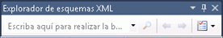
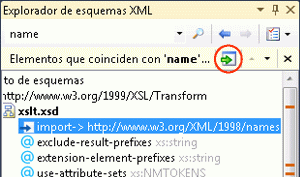

# C&#243;mo: Agregar nodos de resultados de b&#250;squeda del conjunto de esquemas al &#225;rea de trabajo
[!INCLUDE[vs2017banner](../code-quality/includes/vs2017banner.md)]

En este tema se explica cómo agregar nodos que están resaltados en el Explorador de esquemas XML como el resultado de una búsqueda de palabras claves en el área de trabajo.  
  
> [!NOTE]
>  Solo se pueden agregar nodos globales al [espacio de trabajo](../xml-tools/xml-schema-designer-workspace.md).  
  
 En este ejemplo se utiliza el ejemplo [Esquema de pedido de compra](../Topic/Sample%20XSD%20File:%20Purchase%20Order%20Schema.md).  
  
### Para agregar nodos de resultados del conjunto de esquemas  
  
1.  Siga los pasos del procedimiento descrito en [Cómo: Crear y editar un archivo de esquema XSD](../xml-tools/how-to-create-and-edit-an-xsd-schema-file.md).  
  
2.  Escriba "purchaseOrder" en el cuadro de texto de búsqueda de la barra de herramientas del [Explorador de esquemas XML](../xml-tools/xml-schema-explorer.md) y haga clic en el botón de búsqueda.  
  
       
  
     Los resultados de la búsqueda se resaltan en el Explorador de esquemas XML y se marcan en la barra de desplazamiento vertical.  
  
3.  Agregue los resultados de la búsqueda al área de trabajo; para ello, haga clic en el botón **Agregar nodos resaltados al área de trabajo** en el panel de resumen de resultados.  
  
       
  
     Los nodos `purchaseOrder` y `PurchaseOrderType` aparecen uno al lado del otro en la superficie de diseño de la [vista Gráfico](../xml-tools/graph-view.md).Dado que los dos nodos están relacionados \(el elemento `purchaseOrder` es del tipo `PurchaseOrderType`\), se dibuja una flecha entre ellos.