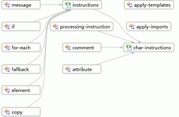

# Procedimiento Obtenga información general sobre un conjunto mediante la vista Gráfico de esquemas

Este tema describe cómo usar el [vista gráfico](../xml-tools/graph-view.md) para ver una visión general de los nodos de un conjunto de esquemas y las relaciones entre los nodos.

## Para crear un nuevo archivo XSD y mostrar el elemento raíz en el vista Modelo de contenido

1. Cree un nuevo archivo de esquema XML y guarde el archivo como *Relationships.xsd*.

2. Haga clic en el **editor XML de uso para ver y editar el archivo de esquema XML subyacente** vínculo en la vista inicio.

3. Copie el código de ejemplo de esquema XML de [esquema XML de muestra: relaciones](../xml-tools/sample-xsd-file-relationships.md) y péguelo para reemplazar el código que se ha agregado el nuevo archivo XSD de forma predeterminada.

4. Haga clic en cualquier lugar en el editor XML y seleccione **Diseñador de vistas**.

5. Seleccione la vista de gráfico desde el **barra de herramientas XSD**.

6. Seleccione **del conjunto de esquemas** nodo en el **Explorador de esquemas XML** y arrastre el nodo a la superficie de diseño de la vista gráfico. Debería ver todos los nodos globales y las flechas que conectan los nodos que tienen relaciones.

     

7. Haga clic en cualquier nodo de la superficie de diseño y busque en la barra de ruta de navegación dónde se encuentra el nodo seleccionado dentro del conjunto de esquemas.

8. Haga clic en cualquier nodo de elemento de la superficie de diseño y seleccione **generar XML de ejemplo** para ver el documento de instancia XML.