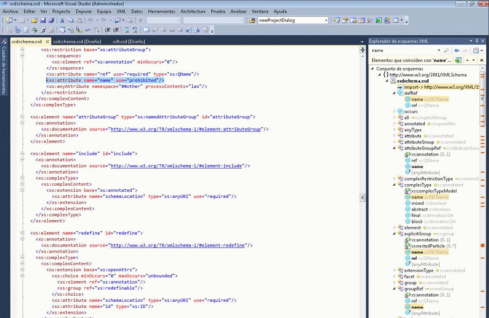

# Integración de los literales XML con el Explorador de esquemas XML

Visual Basic admite literales XML, lo que significa que se pueden incorporar directamente fragmentos XML en el código de Visual Basic. Para más información, consulte [Información general sobre literales XML](/dotnet/visual-basic/programming-guide/language-features/xml/xml-literals-overview).

## Cómo

Si un archivo XSD del proyecto de Visual Basic incluye un literal XML, puede ver el conjunto de esquemas XML en el **Explorador de esquemas XML**. Para ver el conjunto de esquemas asociado con un literal XML, haga clic con el botón derecho en un nodo XML de un literal XML o de una importación de espacios de nombres XML y seleccione **Mostrar en el Explorador de esquemas XML**.

Esto abre el **Explorador de esquemas XML** en paralelo con el archivo de Visual Basic.

## Vea también

- [Cómo: Uso del diseñador de esquemas XML con literales XML](../xml-tools/how-to-use-the-xml-schema-designer-with-xml-literals.md)
