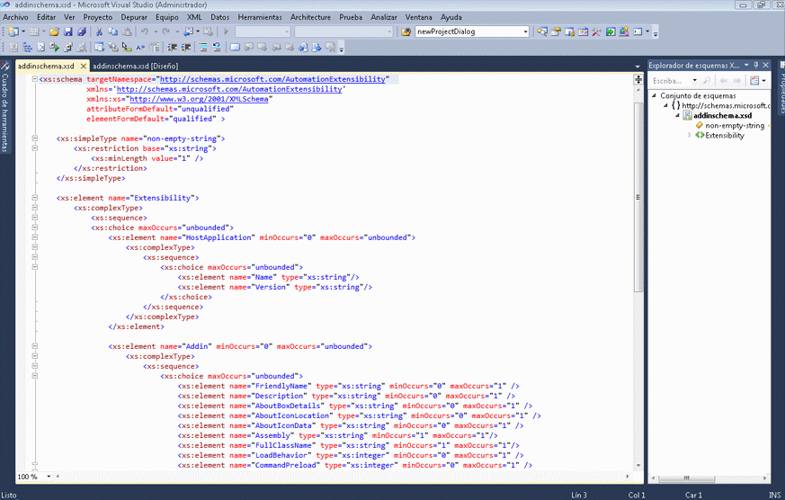
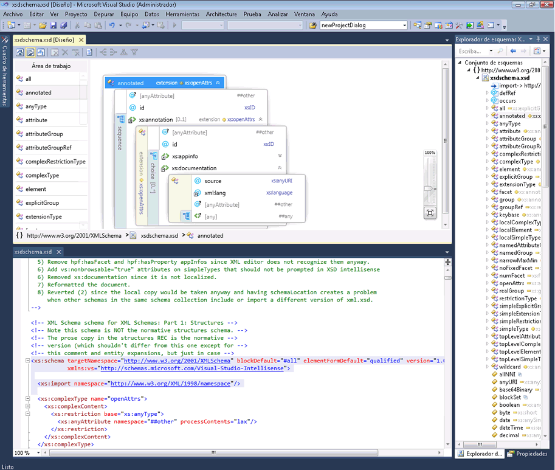

# Integración con el editor XML

El Diseñador de esquemas XML está integrado con el Editor XML. Si modifica un archivo XSD en el Editor XML, el cambio se reflejará en la [Explorador de esquemas XML](../xml-tools/xml-schema-explorer.md). Si tiene la [vista gráfico](../xml-tools/graph-view.md) o [vista modelo de contenido](../xml-tools/content-model-view.md) abierto, el cambio también se reflejará no existe. Puede navegar entre el Diseñador de esquemas XML y el Editor XML de las maneras siguientes:

-   En el Editor de XML, haga clic en un nodo y seleccione **mostrar en Explorador de esquemas XML**.

-   En la vista gráfico y la **Explorador de esquemas XML**, haga doble clic en un nodo, o haga clic en un nodo y seleccione **ver código**. En la vista de modelo de contenido, haga clic en un nodo y seleccione **ver código**.

Captura de pantalla siguiente muestra un esquema XML que se abre en el **Explorador de esquemas XML**. El **Explorador de esquemas XML** muestra el esquema especificado en una vista de árbol. El Editor XML muestra la vista de texto del nodo que está activo actualmente en el **Explorador de esquemas XML**.

A veces resulta útil ver el código en el Editor XML y en el diseñador gráfico en paralelo. Para ver ambos archivos al mismo tiempo, haga clic en cualquier lugar en el Editor XML y seleccione **Diseñador de vistas**. En el menú de Windows de Visual Studio, seleccione **nueva Horizontal (o Vertical) del grupo de pestañas**.

## Vea también

- [Explorador de esquemas XML](../xml-tools/xml-schema-explorer.md)