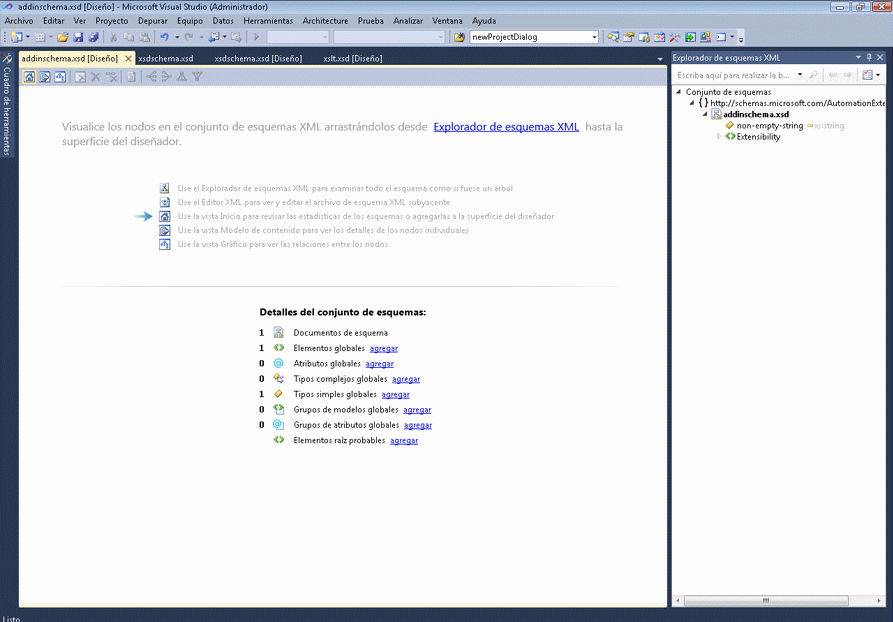

# Vista Inicio

La vista Inicio es el punto de lanzamiento del Diseñador de esquemas XML (XSD). Al crear un archivo XSD, verá la vista Inicio en primer lugar.

La vista inicio contiene dos secciones principales, el *marca de agua* y **detalles del conjunto de esquemas** panel. También incluye la barra de herramientas, que está disponible en todas las vistas del Diseñador XSD.

## Marca de agua

El panel de la marca de agua contiene una lista de vínculos a todas las vistas de diseñador XSD, el Editor XML, y **Explorador de esquemas XML**. Si el conjunto de esquemas tiene errores, se mostrará el texto siguiente al final de la lista: "Usar la lista de errores para ver y corregir los errores en el conjunto".

## Detalles del conjunto de esquemas

El **detalles del conjunto de esquemas** panel se enumeran los tipos de nodo de esquema globales y muestra el número de instancias de cada tipo hay en el esquema. Puede usar el **agregar** vínculos junto a los tipos de nodo para agregar nuevos nodos al área de trabajo.

## Barra de herramientas

Puede navegar entre la vista inicio, la [vista modelo de contenido](../xml-tools/content-model-view.md) y [vista gráfico](../xml-tools/graph-view.md) desde la barra de herramientas del Diseñador de esquemas XML.

Los siguientes botones están habilitados en la barra de herramientas del Diseñador XML cuando está activa la vista Inicio:

|Opción|Descripción|
|-|-----------------|
|**Mostrar vista inicio**|Cambia a la vista Inicio. Esta vista puede obtenerse mediante el método abreviado de teclado: **Ctrl**+**1**.|
|**Mostrar vista modelo de contenido**|Cambia a la vista Modelo de contenido. Esta vista puede obtenerse mediante el método abreviado de teclado: **Ctrl**+**2**.|
|**Mostrar vista Gráfico**|Cambia a la vista Gráfico. Esta vista puede obtenerse mediante el método abreviado de teclado: **Ctrl**+**3**.|

## Vea también

- [Explorador de esquemas XML](../xml-tools/xml-schema-explorer.md)
- [Vista de gráfico](../xml-tools/graph-view.md)
- [Vista Modelo de contenido](../xml-tools/content-model-view.md)
- [Editor XML](../xml-tools/xml-editor.md)