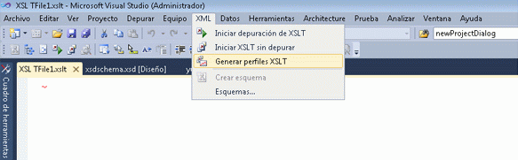

# Generador de perfiles XSLT
El generador de perfiles XSLT es una herramienta de generador de perfiles de análisis de rendimiento que ayuda a desarrollar y depurar documentos XSLT. Este generador de perfiles permite a los programadores de software medir y evaluar los problemas relacionados con el rendimiento en el código XSLT mediante la creación de informes de rendimiento de XSLT detallados. El generador de perfiles XSLT incluye sugerencias útiles para la optimización de la hoja de estilos XSL y XSLT, que son esenciales para las aplicaciones basadas en XSLT que exigen el máximo rendimiento.  
  
El generador de perfiles XSLT forma parte de Visual Studio y está disponible en la **XML** menú.  
  

  
> [!NOTE]
>  Apariencia de algunas pantallas quizá sea distinta de la versión de Visual Studio lo hacen en estos temas, dado que algunos elementos visuales han cambiado desde que se capturaron estas capturas de pantalla.  
  
## Vea también  
[Tutorial: Generador de perfiles XSLT](../xml-tools/walkthrough-xslt-profiler.md)