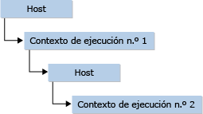

# <a name="targeting-edge-vs-legacy-engines-in-jsrt-apis"></a>Compatibilidad con motores de borde o motores heredados en las API de JsRT
A partir de Windows 10, uno de los cambios que hemos realizado en Chakra (el motor de JavaScript), en la misma línea que la estrategia del explorador de Windows 10 de admitir un nuevo motor de representación Edge, consiste en admitir dos motores de Chakra diferentes:  
  
-   El antiguo motor de Chakra (también denominado *motor heredado* o jscript9.dll debajo), que se incluye con Internet Explorer 11 y es compatible con este explorador. Este motor está congelado en el tiempo y no cambiará en esencia a partir de la versión Win8.1/IE11.  
  
-   El nuevo motor de Chakra (también denominado el *motor perimetral* o chakra.dll a continuación) que se incluye con el nuevo explorador de Windows 10, Microsoft Edge, y es compatible con él. Este motor se actualizará continuamente y admitirá un motor [Edge](http://blogs.msdn.com/b/ie/archive/2014/11/11/living-on-the-edge-our-next-step-in-interoperability.aspx) "vivo". Un motor perimetral vivo implica que, a diferencia del motor heredado, el motor perimetral no llevaría adelante ninguna forma de funcionalidad de script de control de versiones a la que optar.  
  
 Al crear una aplicación con la API de Hospedaje en tiempo de ejecución de JavaScript (JsRT), puede elegir como destino el motor heredado o el perimetral.  
  
-   Si necesita ofrecer compatibilidad con versiones anteriores de las aplicaciones existentes, elija como destino el motor heredado.  
  
-   Si desea que su aplicación mire hacia delante y sea compatible con las nuevas funciones de JavaScript a medida que estas se vayan publicando (como ECMAScript 6), elija como destino el motor perimetral.  
  
 Este tema incluye detalles que describen cómo elegir como destino los diferentes motores.  
  
## <a name="target-your-preferred-version"></a>Elegir como destino la versión preferida  
 Al crear una aplicación, puede seleccionar la versión de la JsRT que admite el motor perimetral o el heredado. Puede elegir la versión de JsRT siguiendo las directrices indicadas anteriormente. Para dar cabida a estas diferencias, se han realizado los siguientes cambios en `JsCreateRuntime`, `JsCreateContext`y `JsStartDebugging`.  
  
 Para `JsCreateRuntime`:  
  
-   Cuando se elige como destino el motor heredado, el valor de enumeración `JsRuntimeVersionEdge` queda obsoleto y se muestra un mensaje que recomendará usar el valor `JsRuntimeVersionInternetExplorer11` en su lugar.  
  
-   Al elegir como destino el motor perimetral, se omite el parámetro de versión de la función `JsCreateRuntime` .  
  
    ```cpp  
    JsErrorCode JsCreateRuntime(JsRuntimeAttributes attributes, JsThreadServiceCallback callback, _Out_ JsRuntimeHandle* runtime);  
    ```  
  
 Para `JsCreateContext` y `JsStartDebugging`:  
  
-   Cuando se elige como destino el motor heredado, la interfaz `IDebugApplication` se usa para proporcionar sus propios métodos de depuración no remota. Para la depuración, las funciones `JsCreateContext` y `JsStartDebugging` toman `IDebugApplication` como parámetro.  
  
-   Al elegir como destino el motor perimetral, la interfaz `IDebugApplication` queda obsoleta. El motor Chakra habilita funcionalidades de depuración nativa y de script con el depurador de Visual Studio sin necesidad de que el usuario implemente `IDebugApplication` . Como resultado, la interfaz ya no es un parámetro para `JsCreateContext` y `JsStartDebugging` .  
  
 Las firmas de las API precedentes en el motor heredado son las siguientes:  
  
```cpp  
JsErrorCode JsCreateRuntime(JsRuntimeAttributes attributes, JsRuntimeVersion version, JsThreadServiceCallback callback, _Out_ JsRuntimeHandle* runtime);  
  
JsErrorCode JsCreateContext(JsRuntimeHandle runtime, IDebugApplication *debugApplication, JsContextRef *newContext);  
  
JsErrorCode JsStartDebugging(IDebugApplication *debugApplication);  
```  
  
 Las firmas de las API precedentes en el motor perimetral son las siguientes:  
  
```cpp  
JsErrorCode JsCreateRuntime(JsRuntimeAttributes attributes, JsThreadServiceCallback callback, _Out_ JsRuntimeHandle* runtime);  
  
JsErrorCode JsCreateContext(JsRuntimeHandle runtime, JsContextRef *newContext);  
  
JsErrorCode JsStartDebugging();  
```  
  
## <a name="compile-for-your-preferred-version-using-visual-c"></a>Compilar para su versión preferida mediante Visual C++  
 Cuando utilice Visual C++, importe la API de JsRT incluido el encabezado jsrt.h y asegúrese de que jsrt.lib esté incluido en la lista de archivos de entrada del vinculador:  
  
```cpp  
#include <jsrt.h>  
```  
  
   
  
 Si desea elegir como destino los binarios del motor perimetral, tendrá que definir la macro `USE_EDGEMODE_JSRT` antes de incluir jsrt.h, y en lugar de vincular frente a jsrt.lib, debe vincular frente a chakrart.lib:  
  
```cpp  
#define USE_EDGEMODE_JSRT  
#include <jsrt.h>  
```  
  
   
  
 Si está empezando con una nueva aplicación, ya puede comenzar a escribir código contra la API de JsRT.  
  
## <a name="compile-for-your-preferred-version-using-net"></a>Compilar para su versión preferida mediante .NET  
 Si usa .NET y P/Invoke, debe cambiar las declaraciones de la API de JsRT [DllImport] para que se importe chakra.dll en lugar de jscript9.dll. Además, cambie la definición de `JsCreateRuntime` para que quite el parámetro `JsRuntimeVersion` y la definición de `JsCreateContext` y `JsStartDebugging` para que quite el parámetro `IDebugApplication` .  
  
 Para el motor heredado, utilice el código indicado a continuación.  
  
```c#  
[DllImport("jscript9.dll")]  
public static extern JsErrorCode JsCreateRuntime(  
    JsRuntimeAttributes attributes,  
    JsRuntimeVersion version,  
    JsThreadServiceCallback callback,  
    out JsRuntimeSafeHandle runtime  
);  
  
[DllImport("jscript9.dll")]  
public static extern JsErrorCode JsCreateContext(  
    JsRuntimeSafeHandle runtime,  
    IDebugApplication debugApplication,  
    out JsContextRef newContext  
);   
  
[DllImport("jscript9.dll")]  
public static extern JsErrorCode JsStartDebugging(  
    IDebugApplication debugApplication,  
);  
```  
  
 Para el motor perimetral, utilice el código indicado a continuación.  
  
```c#  
[DllImport("chakra.dll")]  
public static extern JsErrorCode JsCreateRuntime(  
    JsRuntimeAttributes attributes,  
    JsThreadServiceCallback callback,  
    out JsRuntimeSafeHandle runtime  
);  
  
[DllImport("chakra.dll")]  
public static extern JsErrorCode JsCreateContext(  
    JsRuntimeSafeHandle runtime,  
    out JsContextRef newContext  
);   
  
[DllImport("chakra.dll")]  
public static extern JsErrorCode JsStartDebugging();  
```  
  
> [!CAUTION]
>  Si está calculando manualmente la referencia del puntero de función (por ejemplo, mediante LoadLibrary/GetProcAddress), es fundamental que no se mezclen las declaraciones del método o, de lo contrario, se desequilibrará la pila, lo que dará lugar a un comportamiento imprevisible, como puede ser que se bloquee la aplicación. El mismo problema se producirá si lleva a cabo una operación de búsqueda y reemplazo global de instancias de jscript9.dll en el código de importación, ya que no se dará cuenta de que se ha omitido el parámetro `version`.  
  
## <a name="summary"></a>Resumen  
 En Windows 10, las API de hospedaje en tiempo de ejecución de JavaScript se dividen en dos. Estas API admiten ahora un motor Edge "vivo", cuyas características de lenguaje se alinearán con el motor Edge "vivo" de Microsoft Edge. Puede aprovechar estas capacidades desde sus aplicaciones de escritorio o Tienda para crear nuevas y emocionantes maneras de ampliar su aplicación y de aprovechar los modernos conocimientos sobre la web en su base de código existente. Sin embargo, dado que existen diferencias sutiles entre las versiones anteriores, debe tener en cuenta los siguientes puntos al elegir como destino el motor perimetral o el heredado.  
  
-   La aplicación solo puede admitir una versión de JsRT por proceso.  
  
     Por ejemplo, no puede crear un entorno de ejecución de motor Edge y luego uno de motor heredado y esperar que se ejecuten correctamente en el mismo proceso. Esto no se admite y podría dar lugar a un comportamiento no documentado, como un error al cargar la segunda DLL.  
  
-   Cuando se elige como destino el motor perimetral, la aplicación podría adquirir inesperadamente nuevas características cuando se actualiza automáticamente la plataforma subyacente.  
  
     Por ejemplo, el modo Internet Explorer 11 del tiempo de ejecución heredado admite declaraciones de variables de ámbito de bloque, como `let` y `const`. Si el comportamiento de control de versiones automático del motor perimetral hubiese sido el estándar previamente, el código que había funcionado en el modo Internet Explorer 10, que no tenía reglas de ámbito de bloque, podría haber comenzado a fallar al actualizarse la plataforma automáticamente. Esto debe tenerse en cuenta al elegir qué modelo de tiempo de ejecución se va a utilizar. Aunque creemos que debe elegir como destino el motor perimetral siempre que sea posible, debe tener cuidado al usar estructuras de código de JavaScript que puedan acabar siendo no válidas en el futuro.  
  
-   JsRT para la Tienda Windows solo admite el motor perimetral (chakra.dll). Las aplicaciones que intenten vincular frente a cualquier API de JsRT en jscript9.dll obtendrán un error de certificación.  
  
-   Es muy importante que no confunda la declaración de `JsCreateRuntime`, `JsCreateContext`y `JsStartDebugging` entre jscript9.dll y chakra.dll, ya que se produciría un desequilibrio en la pila.  
  
     Al usar C y C++, recibirá un error del vinculador si intenta utilizar la declaración incorrecta, siempre y cuando no esté haciendo algo como llamar a `LoadLibrary` y luego a `GetProcAddress`. Puede que los desarrolladores de .NET no encuentren este problema tan fácilmente, así que repase dos veces el código cuando utilice esta característica.  
  
## <a name="see-also"></a>Vea también  
 [Hospedaje de tiempo de ejecución de JavaScript](../chakra-hosting/javascript-runtime-hosting.md)